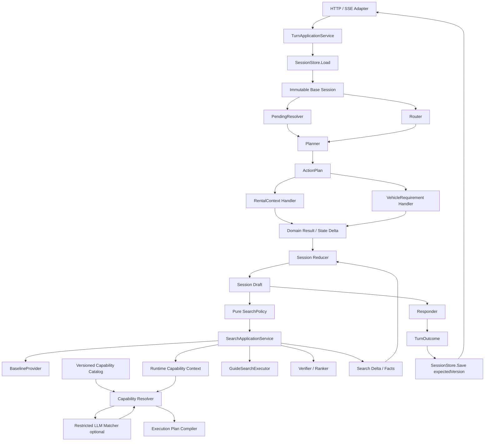

# 租车 Agent 架构改进与迁移方案

## 1. 文档状态

- 状态：待评审
- 适用范围：当前仓库中的 WebChat、Orchestrator、Session、Pending、车辆诉求与搜车链路
- 改进方式：保持模块化单体，按阶段迁移，不一次性重写
- 优先目标：先解决状态一致性和职责边界，再优化性能、持久化与模型调用成本

本文是现有实现到目标架构之间的迁移方案，不替代以下文档：

- `rental-guide-agent-technical-design.md`：描述完整目标能力和长期约束；
- `search-pipeline-refactoring-plan.md`：描述搜车 Pipeline V3 的业务拆分和搜索语义。

本文重点回答：

1. 当前代码中哪些架构问题必须优先解决；
2. 一轮对话中的状态应如何计算、提交、失败和重试；
3. Orchestrator、Planner、Handler、Reducer、SearchPolicy、Store 的边界是什么；
4. 如何在不中断现有功能的情况下逐步迁移；
5. 哪些替代架构现在不采用，以及未来在什么条件下重新评估。

### 1.1 Capability Resolver 补充方案合并结论

本文已合并“开放需求与 Capability Resolver 修改方案”的主要方向：

- Requirement 支持已知标准类型和开放语义；
- 增加版本化 Capability Catalog；
- Resolver 按 Canonical、Rule、Alias、候选 Matcher、代码校验的顺序执行；
- LLM 只能从有限候选中选择，不能创建执行能力；
- 搜索使用包含 RemoteFilter、RemoteSort、LocalFilter、LocalRank 和 Unresolved 的 Execution Plan；
- hard/soft 未解析需求使用不同处理策略。

同时对补充方案做以下约束增强：

- `Value any` 改为带 Kind 的类型化 RequirementValue；
- “语义相关”不等于“条件已满足”，相关候选必须再经过确定性执行校验；
- 场景型需求默认不能直接变成 hard filter；
- Requirement 持久化，Resolution 和 Execution Plan 按运行时能力重新计算；
- CatalogVersion、Menu/ResultSchema 指纹进入 PlanHash 和分页有效性判断；
- hard 未解析只有在存在精确、可回答且能改变计划的问题时才创建 Pending；
- Capability LLM 失败或返回非法 ID 时转为 Unresolved，不影响其他已确认需求。

## 2. 当前架构结论

当前实现属于条件化串行 Pipeline：

```text
HTTP / SSE
  → WebChat Service
  → LLM Router
  → Orchestrator
  → RentalContext Handler
  → VehicleRequirement Handler
  → SearchPolicy
  → SearchCar Handler
  → GeneralReply Handler
  → Response Formatter
  → MemoryStore
```

该方向适合当前业务规模，应继续保持以下设计：

- 外部服务隔离在 `api/maps`、`api/guide`、`api/llm`；
- Router 只判断用户表达的 Action 和原文证据；
- 地点 ID、Guide code、`context_id` 和报价引用只来自外部服务；
- 车辆诉求按提取、归一、编译、执行的顺序处理；
- 一个 Session 同时只保留一个 Active Pending；
- 同一 Session 的用户回合串行处理；
- FilterPlan 明确区分可筛选、可验证、可排序和不可执行的诉求。

当前主要问题不是包数量不足，而是状态所有权不清晰：

- WebChat Service 持有正式 Session；
- Orchestrator 直接把正式 Session 传给各 Handler；
- RentalContext、VehicleRequirement、SearchCar 和 SearchPolicy 都可以直接修改 Session；
- 后置步骤失败时，前置步骤的修改不会被统一回滚或明确提交；
- Version、History、`request_id` 和最终回复只在整轮成功后保存。

因此，当前实现存在“接口返回失败，但 Session 已经部分改变”的风险。

## 3. 改进目标与非目标

### 3.1 改进目标

- 正式 Session 在一轮执行期间保持不可变；
- 所有状态变化通过类型化 Delta 表达；
- Reducer 是一轮执行期间唯一修改 Draft 的组件；
- 一轮只执行一次正式 Session 提交；
- 明确定义全部提交、受控部分提交和不提交的条件；
- Handler 不负责保存 Session、跨领域排序或最终回复；
- SearchPolicy 成为无副作用的确定性决策；
- Store 支持幂等请求和基于 Version 的条件保存；
- Pending 的解析、状态迁移和 DeferredAction 重规划形成闭环；
- 已知枚举以外的开放语义需求可以进入 Session，不因当前系统不支持而丢失；
- 用户语义、标准需求、运行时能力解析和搜索执行计划分层，不互相覆盖；
- Capability Resolver 可以使用受限 LLM 辅助候选匹配，但代码拥有最终执行权；
- hard/soft 未解析需求有明确的阻断、澄清和降级规则；
- Session 核心模型不依赖 `api/guide` DTO 和具体 FilterPlan 实现；
- 保留当前串行执行语义，同时为未来多实例和持久化留出接口。

### 3.2 当前非目标

- 不拆分微服务；
- 不引入通用 DAG 或工作流引擎；
- 不把核心搜车流程改成自由循环的 ReAct Agent；
- 不在第一阶段引入 Event Sourcing；
- 不在状态边界完成之前并行执行领域 Handler；
- 不在本文中修改 Maps、Guide 和 LLM 的外部契约；
- 不在本次改进中增加订单、支付、保险等外部写操作。
- 不引入向量数据库、全量 Capability RAG 或在线自动注册 Capability；
- 不允许 LLM 创建 Capability ID、业务字段、FilterCode 或业务阈值；
- 不把场景相关性直接当成车辆满足该场景的事实。

## 4. 核心架构决策

### 4.1 保持模块化单体

租赁条件、车辆诉求、Pending 和搜车生命周期共享一个强一致 Session。当前拆为微服务会引入：

- 跨服务版本冲突；
- 分布式事务或补偿；
- 更多网络延迟；
- 更复杂的幂等和故障恢复；
- 更难复现的一轮多意图问题。

因此，领域边界先通过 Go package、接口和数据所有权隔离，而不是通过独立进程隔离。

### 4.2 使用 Functional Core / Imperative Shell

确定性业务逻辑尽量实现为纯函数：

- Planner：根据候选 Action 和依赖生成 ActionPlan；
- Reducer：根据 Base/Draft 和 Delta 生成新 Draft；
- SearchPolicy：根据最终 Draft 和事实生成搜索决策；
- Pending 状态机：根据当前状态和事件生成下一状态；
- CanonicalNormalizer：把明确的已知表达归一为稳定标准需求；
- CapabilityResolver：根据语义需求、能力目录和运行时字段生成可校验 Resolution；
- ExecutionPlanCompiler：只根据已校验 Resolution 生成搜索执行计划。

外部副作用集中在应用层：

- 调用 LLM；
- 调用 Maps；
- 调用 Guide；
- 读取和保存 Session；
- 发送 SSE 进度与最终回复。

### 4.3 使用显式 Draft 和单次提交

一轮开始时加载 Base Session，并创建 Draft。所有 Handler 返回 Delta，Reducer 将 Delta 应用到 Draft。执行结束后，Store 以 `expectedVersion` 条件保存。

正式 Session 不得在 Router、Handler、SearchPolicy 或 Responder 中被直接修改。

### 4.4 使用小型 Planner，不引入通用工作流

当前 Action 数量有限，依赖关系固定：

```text
PendingResolution
  → ModifyRentalContext
  → UpdateVehicleRequirements
  → EvaluateSearchPolicy
  → ExecuteVehicleSearch
  → GeneralReply
```

Planner 只需要：

- 校验 Router 候选；
- 合并 Pending 回答；
- 去重；
- 按固定依赖排序；
- 确保一轮最多执行一次搜索；
- 登记被 Pending 阻断的 DeferredAction。

不需要动态 DAG、并行调度和通用补偿框架。

## 5. 目标架构



## 6. 模块职责

| 模块 | 负责 | 不负责 |
|---|---|---|
| TurnApplicationService | 一轮生命周期、加载、调用、提交、幂等、错误分类 | 领域字段判断 |
| Router | 判断 Action、定位原文证据 | 生成业务 ID、修改状态、决定搜索是否自动执行 |
| PendingResolver | 解析取消、选项、确认等 Pending 回答假设 | 直接修改 Session、绕过领域校验 |
| Planner | 去重、排序、依赖、阻断、DeferredAction 重规划 | 自然语言理解、外部调用 |
| Domain Handler | 提取和校验本领域事实，返回 Delta/PendingProposal | 保存 Session、最终回复、跨领域决策 |
| Reducer | 校验并应用 Delta，维护派生状态失效规则 | 调用外部服务、生成自然语言 |
| SearchPolicy | 决定 search/ask/wait/skip 和操作类型 | 修改 Session、解析通用自然语言 |
| CanonicalNormalizer | 将已知表达归一为稳定类型和值 | 判断 Guide 本轮是否可执行 |
| CapabilityCatalog | 定义允许执行的能力、所需字段和受控别名 | 根据线上未知输入自动增长 |
| CapabilityResolver | 把 Requirement 解析成 Resolution，验证候选和运行时数据 | 修改持久化 Requirement、创建能力或接口字段 |
| SemanticMatcher | 必要时从给定候选中选择语义相关能力 | 自由生成 Capability、决定阈值和执行方式 |
| ExecutionPlanCompiler | 把已验证 Resolution 编译成远程/本地执行步骤 | 重新理解用户原文 |
| SearchApplicationService | 组织 Baseline、能力解析、计划编译、Guide 查询、验证、排序和分页 | 提取车辆诉求、生成最终回复 |
| Responder | 根据已批准事实生成整轮结构化回复和文案 | 修改 Session、调用业务外部服务 |
| SessionStore | 加载、条件保存、删除、幂等结果 | 领域逻辑和回复拼装 |

## 7. 一轮执行模型

### 7.1 TurnContext

每轮创建一次 TurnContext，统一保存本轮稳定输入：

```go
type TurnContext struct {
    RequestID  string
    ClientSeq  int64
    UserID     string
    SessionID  string
    SourceText string
    ReceivedAt time.Time
    BaseVersion int64
}
```

本轮所有相对时间解析、Pending TTL 判断、搜索快照时间和历史消息时间都基于同一个 `ReceivedAt` 或同一个注入 Clock，避免同一轮不同组件使用不同时间基准。

### 7.2 ActionPlan

```go
type ActionType string

const (
    ActionResolvePending            ActionType = "resolve_pending"
    ActionModifyRentalContext       ActionType = "modify_rental_context"
    ActionUpdateVehicleRequirements ActionType = "update_vehicle_requirements"
    ActionEvaluateSearch            ActionType = "evaluate_search"
    ActionExecuteVehicleSearch      ActionType = "execute_vehicle_search"
    ActionGeneralReply              ActionType = "general_reply"
)

type PlannedAction struct {
    ID             string
    Type           ActionType
    EvidenceText   string
    DependsOn      []string
    BlockedBy      string
    BaseVersion    int64
}

type ActionPlan struct {
    Actions []PlannedAction
}
```

第一版仍按固定顺序串行执行，不实现通用拓扑排序器。

### 7.3 DomainResult

```go
type DomainResult struct {
    Status          DomainStatus
    Deltas          []StateDelta
    Facts           []Fact
    PendingProposal *PendingProposal
    Warnings        []Warning
}
```

Handler 返回事实和变更意图，不返回整轮最终文案。用户可见的错误可以返回稳定的 ReasonCode 和必要事实，由 Responder 统一表达。

### 7.4 开放语义 Requirement

Requirement 表示“用户表达了什么”，不能被当前 Guide 能力反向限制。已知需求和开放需求使用同一个持久化模型：

```go
type RequirementCategory string

const (
    RequirementCategoryVehicle       RequirementCategory = "vehicle"
    RequirementCategoryPrice         RequirementCategory = "price"
    RequirementCategoryConfiguration RequirementCategory = "configuration"
    RequirementCategoryPreference    RequirementCategory = "preference"
    RequirementCategoryUsageScenario RequirementCategory = "usage_scenario"
    RequirementCategoryUnknown       RequirementCategory = "unknown"
)

type RequirementValueKind string

const (
    RequirementValueNone   RequirementValueKind = "none"
    RequirementValueText   RequirementValueKind = "text"
    RequirementValueNumber RequirementValueKind = "number"
    RequirementValueRange  RequirementValueKind = "range"
    RequirementValueEntity RequirementValueKind = "entity"
)

type RequirementValue struct {
    Kind   RequirementValueKind
    Text   string
    Number *float64
    Range  *NumberRange
    Entity *VehicleEntityRef
    Unit   string
}

type Requirement struct {
    ID string

    RawText       string
    SemanticLabel string
    Category      RequirementCategory
    CanonicalType string
    Value         RequirementValue

    Operation  RequirementOperation
    Importance RequirementImportance
    Confidence float64
}
```

这里不采用补充方案中的 `Value any`。开放语义不代表关闭类型校验；用带 `Kind` 的受控联合值，可以区分文本、数字、区间和车辆实体，避免把运行时类型错误推迟到 Compiler。

约束：

- 明确属于已知标准字段时填写 `CanonicalType`；
- 无法匹配已知字段时，`CanonicalType` 为空，但必须保留 `RawText`、Category 和可选 SemanticLabel；
- 第一版 CanonicalType 复用现有稳定 Facet，例如 `price_preference`、`vehicle_type`、`seat_num`，不同时引入 `price_max`、`body_type` 等第二套同义枚举；
- CanonicalType 非空时必须通过服务端枚举和对应 ValueKind 校验；
- 未知 CanonicalType 不会动态注册，也不会降级成业务 Key；
- SemanticLabel 只用于检索和分析，不能直接作为 FilterCode；
- Confidence 表示提取置信度，不单独决定是否执行；
- Provider ID、车辆实体 ID 仍只能来自目录或外部响应。

Extractor 输出后先执行 Schema Validator，再生成 RequirementDelta。非法的 CanonicalType、ValueKind、operation、importance 或 confidence 必须拒绝或转为结构化 Unresolved，不能进入执行计划。

### 7.5 Requirement 身份与合并

开放需求不能只依赖 SemanticLabel 去重，因为 LLM 可能为相同原文生成不同标签。建议：

- ID 由服务端生成，不接受 LLM 提供的最终 ID；
- 已知需求使用 `CanonicalType + CanonicalValue + Operator` 生成规范指纹；
- 开放需求使用 `Category + 规范化原文 + Operator` 生成语义指纹；
- Replace 先按明确目标或同 CanonicalType 处理，不能按相似 SemanticLabel 猜测替换；
- Remove 无法唯一定位时进入澄清，不批量删除相似开放需求；
- 原始文本始终保留，便于反馈、审计和未来重新解析；
- Capability Resolution 变化不改变 Requirement ID。

Requirement 是用户语义的持久化事实；Capability Resolution 和 Execution Mode 是某次搜索在特定运行时能力下的派生结果，不得写回覆盖 Requirement。

## 8. SessionDraft、Delta 与 Reducer

### 8.1 Draft

```go
type SessionDraft struct {
    Base             *AgentSession
    State            AgentSession
    ConfirmedDeltas  []StateDelta
    TentativeDeltas  []StateDelta
    Warnings         []Warning
}
```

约束：

- `Base` 在本轮内不可修改；
- `State` 只能由 Reducer 更新；
- 已确认和暂定变化必须分开；
- Pending 候选、未确认地点、未确认时间不得进入正式字段；
- 外部响应失败时，不得把半成品缓存或搜索快照写入 Draft。

### 8.2 类型化 Delta

第一阶段不采用 `Field string + OldValue any + NewValue any` 作为业务更新协议。建议按领域定义受控 Delta：

```go
type StateDelta interface {
    DeltaType() DeltaType
}

type RentalContextDelta struct {
    Location   Optional[LocationRef]
    PickupTime Optional[time.Time]
    ReturnTime Optional[time.Time]
}

type RequirementDelta struct {
    Operations []RequirementOperation
}

type PendingDelta struct {
    Event PendingEvent
}

type SearchLifecycleDelta struct {
    DirtyReason string
    Snapshot    *SearchSnapshot
    ResultRefs  []VehicleResultRef
}
```

若暂时不使用 Go 泛型，可为 Optional 定义显式的 `Set`、`Clear` 字段，避免使用 nil 同时表达“不修改”和“清空”。

### 8.3 Reducer 统一维护派生状态

以下规则只能在 Reducer 中维护：

- 地点或时间变化后，当前 SearchSnapshot 失效；
- 车辆诉求变化后，RequirementVersion 增加，SearchSnapshot 失效；
- Baseline 是否失效只由租赁指纹和有效期决定；
- Pending 终态进入有界 History；
- 一轮同一个 Delta 不重复应用；
- `StateChanges` 如继续保留，应由 Reducer 从已提交 Delta 生成。

RentalContext Handler、VehicleRequirement Handler 和 SearchPolicy 不再各自执行 `ActiveSearch = nil`。

## 9. Session 状态分层

当前 SearchState 同时包含语义状态、Provider 缓存、执行状态和展示状态。目标上拆分为：

```go
type AgentSession struct {
    SessionID string
    Version   int64

    Conversation ConversationState
    Rental       RentalContextState
    Requirements RequirementState
    Pending      PendingState
    Search       SearchLifecycleState
}

type SearchLifecycleState struct {
    Status             SearchStatus
    RentalFingerprint  string
    RequirementVersion int64
    CapabilityVersion  string
    ActiveSnapshot     *SearchSnapshot
    LastResultRefs     []VehicleResultRef
}
```

Guide Baseline、报价页和 FilterPlan 属于搜索运行状态，不应让 `internal/session` 直接依赖 `api/guide` 和 `internal/searchplan`。

RequirementState 保存用户语义和当前有效版本；可以保存最近一次 ResolutionSummary 用于向用户解释，但不得持久化 RemoteFilter、LocalRank 等具体执行对象。能力目录、Guide 菜单或结果字段变化后，同一个 Requirement 可以在下一次搜索中得到不同 Resolution，这是重新解析而不是修改用户需求。

可采用以下两种过渡方式：

1. 在 `internal/searchruntime` 定义持久化模型和转换器；
2. Session 只保存必要的不透明值，例如 context token、plan hash、分页位置和结果引用，大对象放入独立 SearchCache。

第一阶段可先采用方式 1，避免同时引入新的缓存基础设施。

## 10. 提交与错误语义

### 10.1 TurnOutcome

```go
type CommitMode string

const (
    CommitNone      CommitMode = "none"
    CommitConfirmed CommitMode = "confirmed"
    CommitAll       CommitMode = "all"
)

type TurnOutcome struct {
    CommitMode    CommitMode
    NextSession   *AgentSession
    Response      TurnResponse
    FailedActions []FailedAction
    Warnings      []Warning
}
```

### 10.2 提交矩阵

| 场景 | 提交策略 | 说明 |
|---|---|---|
| Router 或领域提取失败，尚无确认事实 | CommitNone | 正式 Session 不变 |
| 地点候选存在歧义 | CommitConfirmed | 可提交独立且已确认的时间，地点只进入 Pending |
| 地点和诉求确认成功，Guide 调用失败 | CommitConfirmed | 保留用户确认条件，将搜索标记为 Dirty |
| 开放软需求无法解析 | CommitConfirmed | 保留 Requirement，继续其他条件并记录 Unresolved |
| 开放硬需求存在可回答歧义 | CommitConfirmed | 保留 Requirement，创建 PendingProposal，暂不搜索 |
| 开放硬需求不受支持或数据不足 | CommitConfirmed | 保留 Requirement，默认阻断；用户明确删除或降级后才继续 |
| Matcher 输出非法 Capability | CommitConfirmed | 不执行非法能力，Resolution 记为 Unresolved |
| FilterPlan 判断硬条件不可执行 | CommitConfirmed | 保留诉求及 Resolution，不伪装为搜索成功 |
| GeneralReply 失败 | CommitConfirmed 或确定性兜底 | 不应因闲聊失败丢失已确认业务条件 |
| Store Version 冲突 | CommitNone | 丢弃旧 Draft，加载最新状态后最多重规划一次 |
| 最终保存成功 | CommitAll | 同时保存 Session、History 和 CompletedRequest |

受控部分提交必须由 TurnOutcome 明确声明，不能依赖 Handler 已经修改了共享指针。

## 11. Store、幂等与并发

### 11.1 Store 接口

```go
type SessionStore interface {
    Create(ctx context.Context, userID string) (*AgentSession, error)
    Load(ctx context.Context, userID, sessionID string) (*SessionEnvelope, error)
    Save(ctx context.Context, value *SessionEnvelope, expectedVersion int64) error
    Delete(ctx context.Context, userID, sessionID string) error
    List(ctx context.Context, userID string) ([]SessionSummary, error)
}
```

```go
type SessionEnvelope struct {
    State       AgentSession
    History     []Message
    LatestSeq   int64
    Completed   []CompletedRequest
    UpdatedAt   time.Time
}
```

MemoryStore 和未来 RedisStore 实现同一接口。

### 11.2 CompletedRequest

```go
type CompletedRequest struct {
    RequestID      string
    RequestHash    string
    ClientSeq      int64
    BaseVersion    int64
    ResultVersion  int64
    Response       TurnResponse
    CompletedAt    time.Time
}
```

规则：

- 相同 `request_id` 和相同 RequestHash：返回已保存结果；
- 相同 `request_id` 但 RequestHash 不同：返回请求身份冲突；
- `client_seq <= latest_seq` 且没有 CompletedRequest：返回过期请求；
- Session、History、latest_seq 和 CompletedRequest 必须在同一次 Store Save 中提交；
- Version 只有保存成功后才增加。

### 11.3 并发策略

第一阶段继续保留同 Session 串行，避免同时修改业务语义。改进后可选择：

- 单机阶段：每 Session 互斥锁，但只对 Load/Save 和队列状态加锁；
- 多实例阶段：基于 Store CAS，版本冲突时最多重规划一次；
- 高并发阶段：评估 Session Actor 或按 SessionID 分区的任务队列。

在 Draft 落地前，不应为了缩短锁时间直接把当前 Handler 放到锁外执行，否则会放大共享状态并发问题。

## 12. Pending 生命周期改进

### 12.1 PendingResolver

PendingResolver 只产生假设：

```go
type PendingResolution struct {
    PendingID       string
    Event           PendingEvent
    SelectedOption  string
    ResidualText    string
    EvidenceText    string
}
```

选中的地点仍必须交给 RentalContext Handler 校验，Resolver 不直接提交 LocationRef。

### 12.2 状态机

```text
active
  → resolved
  → cancelled
  → expired
  → superseded
  → suspended
```

所有迁移通过 PendingEvent 和 PendingReducer 完成。只有真实的 `not_addressed` 用户回合才增加 MissedUserTurns；外部服务失败或版本冲突不计入。

### 12.3 DeferredAction 闭环

当前 Active Pending 结束后，Planner 必须：

1. 找出受该 Pending 阻断的 DeferredAction；
2. 使用最新 Draft 和本轮完整输入重新校验；
3. 已在本轮完成的 Action 删除；
4. 仍然有效的 Action 重新加入 ActionPlan；
5. 已失效或依赖指纹变化的 Action 删除；
6. 不复用旧问题、旧候选列表或旧 FilterPlan。

`RevalidateActions` 不应只作为 TurnResult 中无人消费的字段存在。

## 13. Capability Resolver 与搜车链路

### 13.1 四层模型

开放需求接入后，必须保持以下四层相互独立：

```text
Semantic Requirement
  用户表达的完整语义，可已知、未知或场景型，持久化

Canonical Requirement
  对已知类型和值的确定性归一，仍属于用户语义，持久化

Requirement Resolution
  当前 Capability Catalog 和运行时数据能否执行，派生

Search Execution Plan
  本次搜索如何远程筛选、远程排序、本地过滤和本地排序，临时
```

禁止以下反向污染：

- Execution Mode 不写回 Requirement；
- Guide FilterCode 不写回 Requirement；
- 一次 LLM Matcher 结果不自动变成 CanonicalType；
- 当前 Unsupported 不删除用户需求；
- Catalog 更新不静默改写历史用户语义。

### 13.2 Capability Catalog

Capability Catalog 由代码或受版本控制的配置维护：

```go
type CapabilityDefinition struct {
    ID          string
    Name        string
    Description string
    Version     string

    CanonicalTypes []string
    Categories     []RequirementCategory
    Aliases        []string
    Examples       []string

    RemoteFilter *RemoteFilterDefinition
    RemoteSort   *RemoteSortDefinition
    LocalFilter  *LocalFilterDefinition
    LocalRank    *LocalRankDefinition
}
```

定义必须声明：

- 支持的 CanonicalType 和 Category；
- 允许的 RequirementValueKind 和单位；
- 允许的 operator；
- 所需 Guide 菜单 Facet、报价字段或车辆目录字段；
- hard/soft 下允许的 Execution Mode；
- 确定性转换规则；
- 缺少数据时的 ReasonCode。

Catalog 第一版只增加少量高频能力，但“配置了场景名称”不等于场景可执行。例如 `elderly_friendly` 可以用于检索候选能力，却不能仅凭与 `rear_seat_space` 相关就声称车辆适合老人。

Catalog 不得：

- 在线根据未知输入自动注册能力；
- 保存 LLM 生成的代码或阈值；
- 在定义中写死未经服务契约确认的 Guide FilterCode；
- 用主观标签替代缺失的车辆事实。

### 13.3 运行时能力上下文

```go
type RuntimeCapabilityContext struct {
    Menu          MenuSnapshot
    ResultSchema  ResultSchema
    CatalogVersion string
    RentalFingerprint string
}
```

`MenuSnapshot` 必须包含来源 context、租赁指纹、接收时间和有效期；`ResultSchema` 表示当前响应真实存在且已确认语义的字段。Catalog 声明某能力，并不代表本轮一定可执行，Resolver 仍需检查运行时菜单和字段。

### 13.4 Resolution

```go
type ResolutionStatus string

const (
    ResolutionResolved          ResolutionStatus = "resolved"
    ResolutionPartiallyResolved ResolutionStatus = "partially_resolved"
    ResolutionAmbiguous         ResolutionStatus = "ambiguous"
    ResolutionUnsupported       ResolutionStatus = "unsupported"
    ResolutionInsufficientData  ResolutionStatus = "insufficient_data"
)

type MatchMethod string

const (
    MatchCanonical MatchMethod = "canonical"
    MatchRule      MatchMethod = "rule"
    MatchAlias     MatchMethod = "alias"
    MatchLLM       MatchMethod = "llm_candidate"
)

type RequirementResolution struct {
    RequirementID string
    Status        ResolutionStatus
    MatchMethod   MatchMethod
    CapabilityIDs []string
    Executions    []CapabilityExecution

    ResolvedPart   string
    UnresolvedPart string
    ReasonCode     string
    Reason         string
    Confidence     float64
}
```

`partially_resolved` 必须明确指出已执行和未执行的语义片段，不能只给一个模糊状态。例如“适合老人并且后排宽敞”可以只解析明确的“后排宽敞”；“适合老人”仍然保留为 Unresolved。

Resolution 顺序：

```text
1. CanonicalType 精确匹配
2. 确定性 Normalizer / Rule
3. Catalog Alias
4. Catalog 候选检索
5. 必要时让受限 LLM 在候选中匹配
6. 代码验证候选、关系、Value、operator 和运行时字段
7. 生成 Resolution
8. 无法证明可执行时返回 Unresolved
```

### 13.5 “语义相关”与“可执行”的边界

LLM 或 Alias 只能证明 Requirement 与某 Capability 语义相关，不能单独证明执行成立。

执行至少需要同时满足：

1. Capability ID 来自当前 Catalog；
2. Requirement Value 和 operator 满足定义；
3. 语义到执行参数的转换由代码或 Catalog 的确定性规则定义；
4. 本轮 Menu 或 ResultSchema 提供所有 RequiredFields；
5. hard/soft 允许使用该 Execution Mode；
6. 没有使用 LLM 自行补出的阈值、FilterCode 或车辆事实。

例如：

- “300 元以内”可以在金额口径确认且字段存在时生成 LocalFilter 或 RemoteFilter；
- “后排空间至少 900mm”只有字段和单位口径都存在时才能 LocalFilter；
- “适合老人出行”通常只是与空间、上下车便利性等能力相关，缺少完整评价模型时应保持 Unresolved/Advisory；
- “必须放三个儿童座椅”不得自动转换成 `seat_count >= 5`。

### 13.6 受限 LLM Semantic Matcher

只有同时满足以下条件才调用 Matcher：

```text
CanonicalType 为空
且确定性 Rule/Alias 未命中
且 Catalog 检索得到 2～10 个候选
```

输入只包含 Requirement 和候选 Capability 的 ID、描述、支持模式。输出只能引用候选 ID：

```json
{
  "matches": [
    {
      "capability_id": "rear_seat_space",
      "relation": "relevant",
      "confidence": 0.82
    }
  ]
}
```

代码必须校验：

- CapabilityID 在本次候选集合中；
- relation 属于固定枚举；
- confidence 范围合法；
- 候选仍满足 CatalogVersion 和 RuntimeCapabilityContext；
- `relevant` 关系本身不能生成任何 Execution；只有 Catalog 另有确定性转换并通过运行时校验时才能执行；
- 没有候选时直接 Unresolved，不让 LLM 自由创造候选。

LLM 禁止创建 Capability、FilterCode、接口字段、阈值、单位换算和车辆事实。非法输出转为带 ReasonCode 的 Unresolved，不执行。

### 13.7 SearchExecutionPlan

当前 FilterPlan 演进为更完整的 SearchExecutionPlan：

```go
type SearchExecutionPlan struct {
    RequirementVersion int64
    CapabilityVersion  string
    RuntimeFingerprint string

    RemoteFilters []CapabilityExecution
    RemoteSorts   []CapabilityExecution
    LocalFilters  []CapabilityExecution
    LocalRanks    []CapabilityExecution
    Resolutions   []RequirementResolution
    Unresolved    []RequirementResolution

    PlanHash string
}
```

Execution Mode：

```go
const (
    ExecutionRemoteFilter ExecutionMode = "remote_filter"
    ExecutionRemoteSort   ExecutionMode = "remote_sort"
    ExecutionLocalFilter  ExecutionMode = "local_filter"
    ExecutionLocalRank    ExecutionMode = "local_rank"
)
```

PlanHash 至少覆盖：

- RequirementVersion；
- CatalogVersion；
- Menu/ResultSchema 指纹；
- 每个 Resolution 和 Execution；
- Server filter/sort；
- 本地过滤和排序参数。

Session 的 ActiveSnapshot 只保存 PlanHash、版本、context token、分页和必要结果引用，不持久化整个执行对象。翻页前必须重新确认 PlanHash 依赖仍有效。

### 13.8 hard/soft 决策

| Requirement | 可用能力 | 行为 |
|---|---|---|
| hard | RemoteFilter | 远程严格筛选 |
| hard | LocalFilter 且字段可靠 | 搜索后本地严格过滤 |
| hard | 只有 Sort/Rank | 不得当成满足；进入 Unresolved |
| hard | Ambiguous 且存在可回答的精确问题 | 提交 PendingProposal，阻断搜索 |
| hard | Unsupported/InsufficientData | 默认阻断并说明限制；用户明确删除或降级后重新规划 |
| soft | RemoteSort | 远程排序 |
| soft | LocalRank 且字段可靠 | 当前候选集内排序 |
| soft | 只有相关能力但无法验证 | 保留 Unresolved，继续其他条件 |
| soft | Unsupported/InsufficientData | 继续搜索，最终明确未参与严格筛选 |

hard 未解析不必一律追问。只有问题有明确选项、答案能改变执行计划且不会诱导用户时才创建 Pending；否则直接说明能力限制并阻断本次搜索。系统不得自行把 hard 改成 soft，也不得继续返回看似满足该 hard 条件的结果。

### 13.9 搜车应用服务

目标调用关系：

```text
SearchApplicationService
  → ValidateSearchContext
  → BaselineProvider.GetOrFetch
  → Build RuntimeCapabilityContext
  → CapabilityResolver.ResolveAll
  → Handle Hard Unresolved / PendingProposal
  → ExecutionPlanCompiler.Compile
  → GuideSearchExecutor.Search
  → LocalFilter.Apply
  → LocalRank.Apply
  → SearchResultReducer.BuildDelta
```

建议接口：

```go
type CapabilityResolver interface {
    Resolve(context.Context, Requirement, RuntimeCapabilityContext) RequirementResolution
}

type ExecutionPlanCompiler interface {
    Compile([]RequirementResolution, RuntimeCapabilityContext) SearchExecutionPlan
}

type BaselineProvider interface {
    GetOrFetch(context.Context, SearchContext) (*Baseline, error)
}

type SearchExecutor interface {
    Execute(context.Context, SearchExecutionPlan) (*SearchExecutionResult, error)
}

type ResultProcessor interface {
    Process(*SearchExecutionResult, SearchExecutionPlan) ProcessedSearchResult
}
```

SearchApplicationService 负责组织步骤，但不提取或改写 Requirement、不生成最终回复、不直接保存 Session。

迁移期间可保留当前 `searchplan.Compiler` 作为 Canonical Capability 和 ExecutionPlanCompiler 的内部适配器。新增 Facet 或场景能力频繁后，再拆成 CapabilityHandler 注册表，避免第一阶段同时重写所有搜索规则。

### 13.10 建议包结构

```text
internal/
  requirement/
    model.go
    validator.go
    normalizer.go
    merge.go

  capability/
    catalog.go
    resolver.go
    matcher.go
    resolution.go
    runtime.go

  searchplan/
    execution.go
    compiler.go
    hash.go

  domain/
    vehiclerequirement/
      extractor.go
      handler.go

    searchcar/
      service.go
      baseline.go
      executor.go
      processor.go
```

`requirement` 不依赖 Guide；`capability` 可以依赖稳定的运行时抽象，但不依赖 WebChat；`searchplan` 只接收已验证 Resolution；`searchcar` 负责外部执行和结果处理。若为降低迁移成本暂不移动现有类型，也应先通过接口保持同样的依赖方向。

## 14. SearchPolicy 改进

目标签名：

```go
type SearchPolicy interface {
    Evaluate(SearchPolicyInput) SearchDecision
}

type SearchPolicyInput struct {
    State                   SearchPolicyState
    ExplicitSearchRequested bool
    RequestedOperation      SearchOperation
    AppliedDeltas           []StateDeltaSummary
    HadPreviousSearch       bool
    ReceivedAt              time.Time
}

type SearchDecision struct {
    Type      SearchDecisionType
    Operation SearchOperation
    Deltas    []StateDelta
    Reason    string
}
```

Policy 不再直接设置：

- `ActiveSearch = nil`；
- `NoPreference = true`；
- `PreferenceAskCount++`；
- `LastAskedAt`。

这些变化作为 Delta 返回，由 Reducer 统一应用。

“都行”“没要求”等语言解析优先由 Router/TurnUnderstanding 输出结构化信号；Policy 不维护不断扩大的中文短语表。保留少量确定性快路径时，也应放入独立 Normalizer 并有表格测试。

## 15. Responder 与最终结果

Domain Handler 返回 ReasonCode、Facts、Warnings 和结构化结果。Responder 统一输出：

```go
type ResponseFacts struct {
    RentalChanges   []RentalFact
    Requirements    []RequirementFact
    Vehicles        []VehicleView
    Pending         *PendingView
    Warnings        []Warning
    FailedActions   []FailedAction
    Conversation    *ConversationContent
}
```

Responder 的约束：

- 不修改 Session；
- 不生成 provider ID 或车辆事实；
- 不把 API 错误描述成正常空结果；
- 不把不可验证诉求描述成已经满足；
- 多领域结果只生成一份无冲突的最终回复；
- LLM Responder 失败时可使用确定性模板兜底。

为了保证幂等，最终结构化回复和文案在 Store Save 前生成，并与 CompletedRequest 一起保存；只有保存成功后才向客户端发送最终成功事件。

## 16. 分阶段迁移计划

### 阶段 0：建立行为基线

目标：在修改架构前固定当前可接受行为。

工作项：

- 增加一轮多意图顺序测试；
- 增加每个后置步骤失败时的 Session 状态测试；
- 增加相同 `request_id` 不同请求体测试；
- 增加 Pending 回答同时修改车辆诉求测试；
- 增加 Guide 失败与正常空结果区分测试；
- 增加已知、开放 soft、开放 hard 需求的行为基线；
- 增加未知 Requirement 不被当前枚举静默丢弃的测试；
- 记录当前公开响应结构，避免迁移时无意破坏前端。

完成标准：

- 能用测试稳定复现当前“正式 Session 被提前修改”的问题；
- 所有不依赖远程服务的测试可独立运行；
- 远程集成测试有明确的运行条件和失败说明。

### 阶段 1：Draft 保护正式 Session

目标：先消除幽灵状态提交，不立即重写所有 Handler。

工作项：

- 增加可靠的 Session 深拷贝；
- Orchestrator 只接收工作副本；
- 成功后用副本替换正式状态；
- 错误时丢弃副本；
- 对 Guide 失败保留已确认条件的需求，先通过显式 TurnOutcome 实现；
- 一轮统一使用 ReceivedAt。

注意：深拷贝必须覆盖 slice、map、指针、Pending Options、SearchSnapshot、报价和 FilterPlan，不能只做结构体浅拷贝。

完成标准：

- 任一未声明部分提交的失败都不会改变正式 Session；
- Version、History 和 CompletedRequest 只在保存成功后变化；
- 现有 API 响应保持兼容。

### 阶段 2：引入 Delta 和 Reducer

目标：从“在副本上直接修改”迁移为“返回 Delta”。

迁移顺序：

1. SearchPolicy；
2. VehicleRequirement Handler；
3. RentalContext Handler；
4. Pending 生命周期；
5. SearchResult 和 SearchSnapshot。

工作项：

- 定义类型化 Delta；
- 引入 Semantic Requirement、Category 和受控 RequirementValue；
- 为旧 SearchRequirementStateItem 增加迁移适配器；
- 增加 Extractor Schema Validator，未知 CanonicalType 不得进入标准字段；
- 定义开放需求 ID、指纹、Add/Replace/Remove 规则；
- 实现 Reducer 和联合校验；
- 集中搜索失效规则；
- 统一生成 StateChanges；
- 删除 Handler 内的直接状态写入。

完成标准：

- 除 Reducer 外，没有领域组件直接写 SessionDraft；
- 已知和开放需求都能通过 RequirementDelta 保存；
- `Value any`、未知 CanonicalType 和 LLM 生成的 Requirement ID 不进入 Session；
- 同一 Delta 重放不会重复增加版本、历史或 Pending；
- Reducer 具备完整表格测试。

### 阶段 3：Capability Resolver 与 Execution Plan

目标：在不丢失开放需求的前提下，由代码控制本轮实际执行能力。

工作项：

- 新增版本化 Capability Catalog；
- 将现有 Canonical Facet 和 `searchplan.Compiler` 接入 Catalog/Compiler 适配层；
- 定义 RuntimeCapabilityContext；
- 实现 Canonical、Rule、Alias 的确定性解析；
- 实现 RequirementResolution 和 SearchExecutionPlan；
- 实现 hard/soft Unresolved 决策矩阵；
- 增加受限 LLM Semantic Matcher，但只允许在候选集合内选择；
- PlanHash 加入 Requirement、Catalog 和 Runtime 指纹；
- Responder 展示已执行、部分执行和未执行需求。

完成标准：

- 未知需求不会因为枚举不完整而丢失；
- Requirement 不保存 Execution Mode、FilterCode 或 Matcher 临时结果；
- 语义相关但不可验证的能力不会进入 Filter/Rank；
- hard 未解析不会自动降级为 LocalRank；
- soft 未解析不会阻断其他有效条件；
- 非法 CapabilityID、阈值或字段不能进入 SearchExecutionPlan；
- 现有品牌、价格、车型、能源、变速箱和条件删除/替换行为保持兼容。

### 阶段 4：Planner 与 Pending 闭环

目标：将编排规则从 Orchestrator 中移出。

工作项：

- 实现 PendingResolver；
- 定义 ActionPlan；
- 将取消、选项选择、残余文本、阻断和重验证移入 Resolver/Planner；
- 将 hard Ambiguous Resolution 转换为受控 PendingProposal；
- Planner 消费 DeferredAction；
- Orchestrator 收缩为执行循环。

完成标准：

- Orchestrator 不包含领域字符串解析；
- 一轮最多执行一次搜索；
- 只有能够通过回答改变执行计划的 hard 歧义才进入 Pending；
- Active Pending 结束后，DeferredAction 被执行、删除或重新阻断，不会无人消费。

### 阶段 5：Store 抽象与 CAS

目标：让 MemoryStore 和未来持久化 Store 使用相同语义。

工作项：

- 定义 SessionStore 接口；
- MemoryStore 实现 expectedVersion；
- CompletedRequest 增加 RequestHash；
- 原子保存 Session、History、latest_seq 和响应；
- 增加 VersionConflict 和最多一次重规划；
- 明确 Delete 与正在执行请求的顺序语义。

完成标准：

- 相同 request_id 不同内容返回身份冲突；
- CAS 冲突不会写回旧 Pending、旧报价或旧 context；
- 可在不改应用层的情况下替换 Store 实现。

### 阶段 6：拆分搜索运行时

目标：降低 SearchCarHandler 的职责和 Session 对 provider DTO 的耦合。

工作项：

- 抽出 BaselineProvider；
- 抽出 CapabilityResolver 和 ExecutionPlanCompiler；
- 抽出 SearchExecutor；
- 抽出 ResultProcessor；
- Session 不再直接保存 `guide.VehRate` 和 `searchplan.FilterPlan`；
- SearchApplicationService 只组织搜索步骤；
- 根据实际维护成本决定是否引入 FacetCompiler 注册表。

完成标准：

- `internal/session` 不依赖 `api/guide` 和 `internal/searchplan`；
- Baseline、Resolution、ExecutionPlan、分页和结果处理可以分别测试；
- Guide DTO 变化只影响 adapter/searchruntime 层。

### 阶段 7：性能和扩展优化

前置条件：状态提交边界已经稳定。

可选工作：

- Pending 取消、选项、翻页使用确定性快路径；
- 合并 Router 和领域理解为一次结构化 TurnUnderstanding 实验；
- 根据 Unknown/Unresolved 指标离线补充 CanonicalType 或 Catalog，禁止在线自动注册；
- 对独立的 Rental/Requirement 提取并行执行，再确定性合并 Delta；
- 引入持久化 Store；
- 按 SessionID 分区执行或采用 Session Actor；
- 增加 shadow compare 和灰度开关。

不得以降低延迟为理由绕过领域校验、Reducer 或 CAS。

## 17. 测试策略

### 17.1 纯逻辑测试

- Planner：Action 去重、顺序、依赖和最多一次搜索；
- Reducer：Delta 应用、冲突、清空字段和派生状态失效；
- SearchPolicy：所有状态与 Action 组合；
- PendingReducer：全部合法和非法状态迁移；
- Requirement Validator：已知/未知类型、ValueKind、operation、importance 和 confidence；
- Requirement Merge：开放需求 Add/Replace/Remove、身份和指纹；
- CapabilityResolver：Canonical、Rule、Alias、LLM 候选、运行时字段和 hard/soft；
- ExecutionPlanCompiler：远程/本地执行模式、Unresolved、冲突和 PlanHash；
- Responder：事实组合、警告和失败动作。

Capability Resolver 至少覆盖：

```text
已知需求：
  特斯拉
  300 元以内
  SUV
  自动挡

未知 soft：
  适合带老人出行
  → Requirement 保留
  → 无可靠字段时 Unresolved
  → 不阻断其他条件

未知 hard：
  必须能放三个儿童座椅
  → 不得转成 seat_count >= 5
  → 无可靠能力时阻断或解释

非法 Matcher：
  capability_id = luxury_level
  → 不在候选/Catalog 时不执行
  → 转为带 ReasonCode 的 Unresolved
```

### 17.2 故障注入测试

每个外部步骤都应覆盖失败：

```text
Router failure
Rental extractor failure
Maps failure
Requirement extractor failure
Capability semantic matcher failure
Guide baseline failure
Guide filtered search failure
GeneralReply failure
Store version conflict
Store save failure
```

每个测试必须断言：

- 正式 Session 是否变化；
- Version 是否变化；
- Pending 是否变化；
- History 是否写入；
- CompletedRequest 是否存在；
- 重试是否重复执行或返回已完成结果。

### 17.3 属性测试

适合增加以下不变量：

- 一次提交 Version 只增加 1；
- 同一 Session 最多一个 Active Pending；
- 同一 request_id 的成功结果稳定；
- 未确认 Provider ID 永远不进入正式 Session；
- 未知 Requirement 不会因 CanonicalType 为空而丢失；
- Requirement 永远不包含 FilterCode 和 Execution Mode；
- Matcher 只能返回本次候选集合中的 CapabilityID；
- `relevant` 关系不能单独生成任何 Execution；
- hard Requirement 不会自动降级成 LocalRank；
- SearchExecutionPlan 的每个执行项都能追溯到 Requirement 和 Catalog 定义；
- RentalFingerprint 或 RequirementVersion 变化后旧 SearchSnapshot 不再 Active；
- CatalogVersion 或 RuntimeFingerprint 变化后旧执行计划不能继续翻页；
- Reducer 对同一个有 ID 的 Delta 重放保持幂等；
- 保存失败后不会暴露尚未提交的成功回复。

### 17.4 集成测试

按照仓库约束，Maps、Guide、LLM 集成测试继续使用 `conf/dev.yaml` 和真实服务。单元测试不以远程服务可用为前提；远程测试需要在可访问相应网络的环境单独运行。

### 17.5 后续观测项

本轮架构整改不以日志建设为阻塞项，但应预留以下稳定指标，供 Catalog 离线演进：

```text
unknown_requirement_count
unresolved_requirement_count
semantic_match_llm_count
invalid_capability_output_count
capability_resolution_count{status,match_method}
```

这些指标只用于发现高频未知语义和错误匹配。高频 Unknown 需要经过离线评审、数据契约确认、Catalog 版本发布和回归测试后才能成为新 CanonicalType 或 Capability，不能在线自动学习。

## 18. 备选架构评估

| 方案 | 优点 | 缺点 | 当前决策 |
|---|---|---|---|
| 模块化单体 + Draft/Reducer/CAS | 状态一致、迁移可控、容易测试 | 需要逐步改造 Handler 合同 | 采用 |
| 全量状态机 | Pending 生命周期清晰 | 多意图和搜索组合会造成状态爆炸 | 仅 Pending 采用 |
| Session Actor | 天然串行、锁模型简单 | 多实例路由和 Actor 恢复复杂 | 高并发后评估 |
| Event Sourcing/CQRS | 审计、回放、重建能力强 | 事件版本和查询模型成本高 | 当前不采用 |
| DAG/工作流引擎 | 长事务、重试和补偿表达清楚 | 当前短链路过度设计 | 下单/支付后评估 |
| ReAct 工具 Agent | 工具扩展灵活 | 不确定、成本高、难保证幂等 | 只用于非核心探索 |
| 单次大模型统一理解 | 降低模型调用次数和延迟 | Schema 更大、领域耦合更强 | 状态改造后实验 |
| 版本化 Catalog + 受限 Matcher | 保留开放语义且代码掌握执行权 | 需要维护 Catalog、Schema 和回归集 | 采用 |
| 自由 Schema / LLM 动态能力 | 接入新说法快 | 无法保证字段、阈值和执行安全 | 不采用 |
| 向量 Capability RAG | 大目录下召回效率高 | 数据、评估和运维成本高 | Catalog 规模明显增长后评估 |

## 19. 迁移风险与控制

### 19.1 深拷贝遗漏

第一阶段的过渡 Draft 可能因 map、slice 或嵌套指针浅拷贝而继续污染 Base。必须为 Clone 增加独立测试，并尽快迁移到 Delta/Reducer。

### 19.2 新旧提交语义不一致

Guide 失败时是否保留已确认条件必须通过 TurnOutcome 明确编码，并增加回归测试，不能由不同 Handler 自行决定。

### 19.3 响应兼容性

内部 Responder 重构不应立即改变前端依赖的 `message`、`pending`、`vehicles` 和 `state` 结构。需要先保持 DTO 兼容，再单独升级 API 版本。

### 19.4 远程测试不稳定

远程服务不可用不能阻止纯业务架构重构。核心逻辑应由纯单元测试覆盖，远程测试负责验证真实契约，不替代本地行为测试。

### 19.5 过度抽象

只为已经出现的变化点建立接口：

- Store 有明确的内存与持久化替换需求；
- Search 执行包含明确的 Baseline、Compile、Execute、Process 阶段；
- Pending 有独立生命周期。

不为单一实现提前增加通用插件系统、反射注册或动态工作流 DSL。

### 19.6 开放语义错误执行

开放需求最大的风险不是“无法匹配”，而是把语义相关误判为可验证事实。控制方式：

- Matcher 只做候选相关性，不拥有执行权；
- Catalog 必须声明确定性转换和 RequiredFields；
- RuntimeCapabilityContext 必须验证本轮真实数据；
- 场景型 Capability 默认 Advisory/Unresolved；
- hard 需求没有严格能力时不得降级为 Rank；
- 最终回复区分已筛选、已验证、仅排序和未执行。

### 19.7 Capability Catalog 漂移

Catalog、Guide 菜单和结果 Schema 可能独立变化。控制方式：

- Catalog 必须版本化；
- PlanHash 包含 CatalogVersion 和 RuntimeFingerprint；
- ActiveSnapshot 保存依赖版本；
- 翻页和重试检查依赖版本；
- Catalog 发布前执行已知需求回归和 shadow compare；
- 不在运行时自动学习或注册能力。

## 20. 总体验收标准

- 一轮执行期间正式 Session 不被直接修改；
- 失败不会产生未声明的部分提交；
- Guide 失败可以按明确规则保留已确认条件并保持 Search Dirty；
- Session、History、Version、latest_seq 和 CompletedRequest 原子保存；
- Handler 只返回 Delta、Fact、PendingProposal 和领域状态；
- Reducer 是 Draft 状态变化的唯一入口；
- 已知和开放语义 Requirement 都能持久化，未知需求不被静默丢弃；
- Requirement 使用类型化 Value，不保存 FilterCode、Execution Mode 或临时 Matcher 输出；
- Capability Catalog 版本化，不能在线自动注册；
- LLM Matcher 只能从受控候选中选择，代码校验最终执行能力；
- 语义相关但缺少确定性规则或运行时字段的需求保持 Unresolved；
- hard Unresolved 不自动降级成 Sort/Rank，soft Unresolved 不阻断其他有效条件；
- SearchExecutionPlan 区分远程筛选、远程排序、本地过滤、本地排序和未解析项；
- PlanHash 覆盖 RequirementVersion、CatalogVersion 和 RuntimeFingerprint；
- SearchPolicy 无副作用；
- Orchestrator 只负责执行 ActionPlan，不解析领域字符串；
- DeferredAction 有明确消费者和终态；
- `internal/session` 不依赖 Guide DTO 或具体 FilterPlan；
- 同 request_id 不同请求体可被检测；
- CAS 冲突不会回写旧 Pending、旧菜单、旧 context 或旧报价；
- 核心行为不依赖远程服务即可测试；
- 不改变所有 Provider ID 和事实必须来源于真实响应的安全边界。
