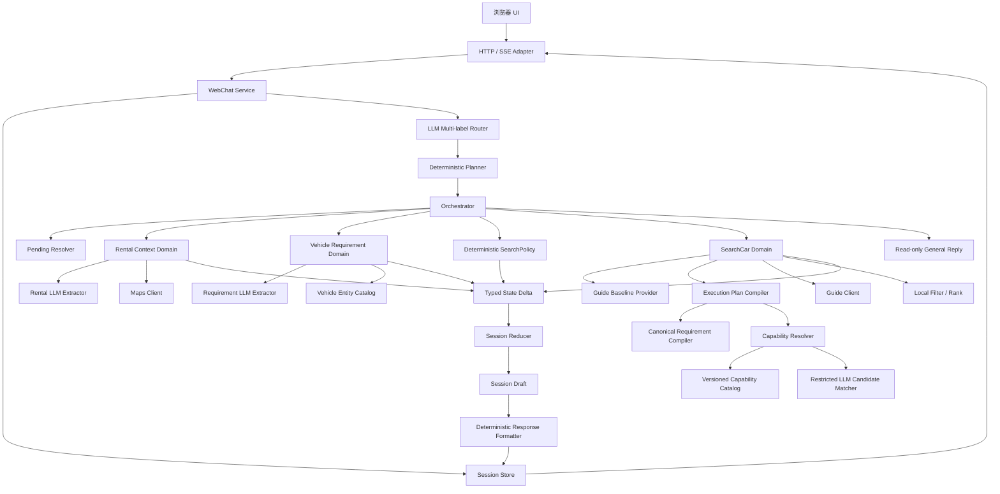
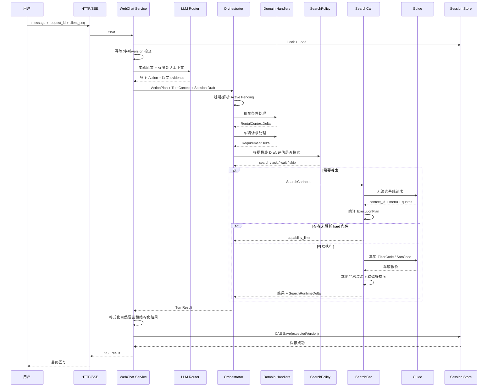
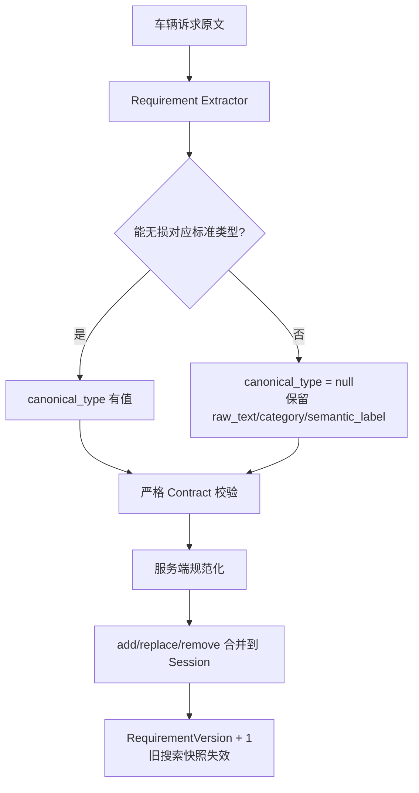
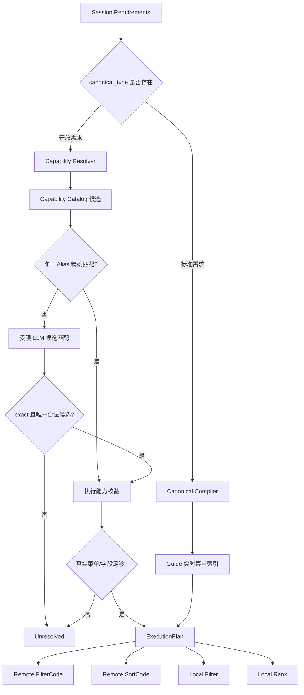

# 租车导购 Agent：当前架构与处理流程说明

## 1. 文档定位

- 文档类型：当前实现说明（As-Is），不是未来改造方案。
- 核对日期：2026-07-29。
- 核对范围：HTTP/WebChat、Router、Planner、Orchestrator、Session、Pending、租车条件、车辆诉求、Capability Resolver、SearchPlan、Guide 搜索和最终回复。
- 代码基线：以本文生成时仓库中的实际代码为准。
- 核心问题：系统如何理解用户、如何保存需求、如何把需求变成可执行条件、何时生成 `FilterCode`、何时拒绝或降级，以及 Prompt、Context、Harness 工程分别在哪里。

本文中的 Harness 工程不是仓库中的一个同名 package，而是指包裹在 LLM 外围的确定性执行框架和护栏。

## 2. 一句话结论

当前系统是一个“模块化单体 + 受限 LLM 理解 + 确定性业务编排”的租车导购 Agent：

```text
LLM 负责理解和提取语义
    ↓
服务端代码负责校验、规范化、状态合并、能力判断和执行
    ↓
FilterCode 只允许来自 Guide 实时返回的菜单
    ↓
无法可靠执行的需求不会被假装满足
```

它不是以下架构：

- 不是 LLM 自由循环调用工具的 ReAct Agent；
- 不是 LLM 直接生成 `FilterCode`、地点 ID、车辆 ID 或 `context_id`；
- 不是把所有用户表达强行映射到固定 Requirement 枚举；
- 不是遇到软诉求无法执行就中止整个搜索；
- 不是微服务或分布式工作流。

## 3. 当前总体架构

### 3.1 分层结构



### 3.2 模块职责

| 层/模块 | 当前职责 | 明确不负责 |
|---|---|---|
| `internal/httphandler` | HTTP 路由、请求校验、SSE 进度和响应 | 需求理解、搜索决策 |
| `internal/webchat` | 单轮生命周期、幂等、Session 锁、CAS 保存、输入/输出适配 | 领域规则 |
| `internal/router` | 多标签识别本轮要执行的 Action，并引用原文证据 | 提取完整需求、生成业务参数 |
| `internal/planner` | Action 去重、固定排序、建立依赖 | 语言理解、外部调用 |
| `internal/orchestrator` | 串行执行领域步骤、处理 Pending、应用 Delta、错误分类 | 自己解析车辆条件或生成筛选码 |
| `internal/domain/rentalcontext` | 提取并校验地点、取还时间；调用 Maps 解析地点 | 车辆条件、Guide 搜索 |
| `internal/domain/vehiclerequirement` | 提取开放/标准车辆诉求，规范化并合并进 Session | 判断 Guide 当前能否执行 |
| `internal/searchpolicy` | 确定何时搜、何时问偏好、何时等待 Pending | 调用 Guide |
| `internal/capability` | 把开放语义需求解析为受约束的执行能力 | 创建未知能力、编造字段或阈值 |
| `internal/searchplan` | 把标准需求和已验证能力编译为远程筛选、远程排序、本地过滤、本地排序 | 读取/修改 Session |
| `internal/domain/searchcar` | 获取 Guide 基线、编译计划、执行搜索、过滤、排序和分页 | 重新解释用户语言 |
| `internal/session` | 领域状态、Pending、搜索快照、类型化 Delta 和 Reducer | 外部服务调用 |
| `api/*` | LLM、Maps、Guide 的传输隔离 | Agent 业务编排 |

应用装配入口见 [`cmd/http/main.go`](../cmd/http/main.go)；HTTP 入口见 [`internal/httphandler/handler.go`](../internal/httphandler/handler.go)。

## 4. 一轮消息的完整处理流程

### 4.1 主流程



### 4.2 WebChat 入口的确定性控制

[`internal/webchat/service.go`](../internal/webchat/service.go) 在调用任何领域逻辑前完成：

1. 校验 `message`、`request_id`、正数 `client_seq`；
2. 获取同一 Session 的回合锁，避免同会话并发执行；
3. 用用户、Session、请求 ID、序列和文本生成请求哈希；
4. 如果相同 `request_id` 已完成：
   - 哈希相同：直接重放原响应；
   - 哈希不同：返回请求身份冲突；
5. 拒绝过期的 `client_seq`；
6. 整轮只生成一个 `ReceivedAt`，版本冲突重试时继续复用；
7. 在 Session 克隆 Draft 上执行；
8. 完成后把 State、History、LatestSeq、CompletedResponse 一起 CAS 保存；
9. 版本冲突最多重新规划一次；
10. 保存失败时不对外暴露 Draft。

当前 Store 是内存实现，进程重启后会话丢失。其并发和版本语义见 [`internal/webchat/store.go`](../internal/webchat/store.go)。

### 4.3 Router 到 Planner

Router 可以同时返回：

- `modify_rental_context`
- `update_vehicle_requirements`
- `request_vehicle_search`
- `general_reply`

例如“后天下午虹桥取，想要 7 座 SUV，直接搜”会被拆为三个 Action，而不是只保留一个意图。

Router 输出必须引用 `source_text` 中真实存在的连续原文。服务端严格检查：

- Action 只能来自固定枚举；
- 同一 Action 不能重复；
- `evidence_text` 必须是用户原文子串；
- 置信度必须在 0～1；
- 至少有一个 Action；
- 禁止额外 JSON 字段和多个 JSON 对象。

Planner 随后按固定顺序执行：

```text
修改租车条件
  → 更新车辆诉求
  → 执行车辆搜索
  → 通用回复
```

同一 Action 会被去重，一轮最多正式执行一次搜索。实现见 [`internal/router`](../internal/router) 和 [`internal/planner/planner.go`](../internal/planner/planner.go)。

## 5. Prompt 工程用在哪里

当前共有五类 LLM Prompt。

| LLM 调用 | 代码位置 | 输入 | 输出 | 作用边界 |
|---|---|---|---|---|
| 顶层 Router | [`internal/router/router.go`](../internal/router/router.go) | 原文、当前租车摘要、需求摘要、Pending 展示信息、最近 6 条消息 | Action 列表、原文证据、未分配文本 | 只路由，不提取业务 JSON |
| 租车条件提取 | [`internal/domain/rentalcontext/extractor.go`](../internal/domain/rentalcontext/extractor.go) | 原文、当前地点/时间、同领域最近 2 条、当前时间、时区 | 地点查询词、取还时间及明确性 | 不生成地点 ID、城市 ID、坐标 |
| 车辆诉求提取 | [`internal/domain/vehiclerequirement/extractor.go`](../internal/domain/vehiclerequirement/extractor.go) | 原文、当前语义需求、同领域最近 2 条 | 本轮 Requirement 增量 | 不判断执行能力，不生成 FilterCode/ID |
| Capability 候选匹配 | [`internal/capability/matcher.go`](../internal/capability/matcher.go) | 一个开放 Requirement、服务端给出的 2～10 个候选 | 最多一个候选和 `exact/relevant` | 只能选择候选，不能创建能力 |
| 通用回复 | [`internal/domain/generalreply/handler.go`](../internal/domain/generalreply/handler.go) | 原文、最近 6 条消息、只读 Session 摘要 | 自然语言回复 | 不修改状态、不声称执行外部操作 |

### 5.1 当前 Prompt 使用的主要技术

1. **角色收窄**：每个 Prompt 只负责单一领域，避免一个模型输出同时承担路由、解析、执行和回复。
2. **显式非目标**：反复声明不能生成 ID、FilterCode、菜单 code、`context_id`、车辆是否满足某条件等。
3. **固定输出契约**：结构化调用要求固定 JSON key、固定枚举和值类型。
4. **正反例约束**：明确给出混合输入、搜索控制、开放需求、地点/车辆边界等例子。
5. **原文证据约束**：Router 和 Requirement 都保留用户原文，降低语义扩写。
6. **禁止场景推断**：例如“老人出行”不能自动推成舒适、SUV、大空间；“三个儿童座椅”不能自动推成五座以上。
7. **已知/开放双轨**：能无损对应标准类型才填写 `canonical_type`，否则保留开放语义。
8. **候选集约束**：Capability Matcher 只能从代码给出的候选中选一个。
9. **JSON 模式提示**：结构化 LLM 调用使用 `response_format=json_object`。

Prompt 只是第一层约束；它的输出仍被服务端严格校验，不能因为 Prompt 写了规则就直接信任模型。

## 6. Context 工程用在哪里

当前 Context 工程的核心不是把完整会话全部塞给 LLM，而是按领域投影、限制长度、隐藏敏感或高权限字段。

### 6.1 单轮执行上下文

`TurnContext` 包含：

- `request_id`
- `client_seq`
- `user_id`
- `session_id`
- 本轮完整原文
- 固定的 `received_at`
- `base_version`

这些信息用于幂等、时间解释、版本绑定和一致性控制，不直接交给每个 LLM。

### 6.2 Router Context

Router 看到：

- 当前地点名、取车时间、还车时间；
- 已有需求的展示类型、展示值、重要性和状态；
- Active Pending 的类型、问题和展示文字；
- 最近 6 条对话；
- 是否有过搜索结果。

Router 看不到：

- Pending option ID；
- 地点/车辆 provider ID；
- Guide `context_id`；
- FilterCode；
- 完整搜索快照。

### 6.3 租车条件 Context

租车条件提取器只看到：

- 本轮相关原文；
- 当前已确认地点名和取还时间；
- 最近 2 条租车条件领域历史；
- 本轮固定的当前时间；
- `Asia/Shanghai` 时区。

这样既能理解“提前一天”“还是晚上”，又避免把全部聊天历史引入时间解析。

### 6.4 车辆诉求 Context

车辆诉求提取器看到：

- 本轮相关原文；
- 当前已有 Requirement 的语义视图；
- 最近 2 条车辆需求领域历史。

它看不到 Guide 菜单和 FilterCode，因此不能为了迎合当前菜单而扭曲用户需求。

### 6.5 Capability Runtime Context

能力解析阶段使用的不是对话历史，而是运行时事实：

- Guide 当前无筛选菜单的指纹；
- Guide 当前真实菜单 code 集合；
- 当前代码确认可用的车辆结果字段集合；
- Capability Catalog 版本；
- 地点和时间组成的租赁指纹。

这一步解决的是“现在是否能执行”，而不是“用户说了什么”。

### 6.6 搜索和分页 Context

Session 保存：

- Guide 基线返回的真实 `context_id`；
- provider-neutral 的菜单和报价缓存；
- RequirementVersion；
- CapabilityVersion；
- RuntimeFingerprint；
- FilterPlanHash；
- 分页位置、已看报价和车辆；
- 安全过期时间。

继续搜索前会重新编译计划并核对所有指纹。地点、时间、需求、能力目录或菜单发生变化时，旧分页上下文不会继续使用。

### 6.7 通用回复 Context

通用回复只看到：

- 最近 6 条消息；
- 地点和时间展示值；
- 需求展示值、重要性和状态；
- 当前 Pending 问题；
- 上次展示过的车辆名。

Prompt 明确说明这些车辆不是实时库存，不能把旧结果说成当前报价。

## 7. Harness 工程用在哪里

Harness 工程是 LLM 外围的“确定性外壳”。当前主要包括以下部分。

### 7.1 输出契约护栏

- JSON Decoder 使用 `DisallowUnknownFields`；
- 要求所有必要 key 出现；
- 禁止多个 JSON 值；
- 检查枚举、类型、范围和字段组合；
- 检查 `domain_matched` 与数组是否一致；
- 检查 RFC3339 时间；
- 检查 Router 证据是否来自原文；
- 拒绝 LLM 输出的车辆实体 ID。

### 7.2 服务端 ID 和外部事实护栏

- Requirement ID 由服务端规范指纹生成；
- 品牌/车系/车型 ID 来自服务端静态实体目录；
- 地点 ID、城市 ID、经纬度来自 Maps 响应；
- FilterCode 和 SortCode 来自 Guide 基线菜单；
- `context_id`、报价引用和车辆 code 来自 Guide 响应；
- LLM 不能创建上述值。

### 7.3 编排护栏

- Planner 固定 Action 顺序并去重；
- PendingResolver 用代码识别“第一个”“取消”等回答；
- 一次只允许一个 Active Pending；
- Pending 有 TTL、BaseVersion、DependencyFingerprint 和 BlockingActions；
- SearchPolicy 用确定性规则决定搜索、询问、等待或跳过；
- Orchestrator 串行应用类型化 Delta；
- Reducer 是 Draft 的统一状态写入口。

### 7.4 搜索执行护栏

- 先无筛选调用 Guide，取得真实菜单和字段上下文；
- 编译器不维护可直接发送的固定 FilterCode 表；
- hard 条件无法可靠执行时阻断搜索；
- soft 条件无法执行时保留并标记，不能当成已满足；
- 本地 hard 过滤只使用 Guide 真实返回字段；
- 本地排序只影响已获取候选集，并向用户说明范围；
- PlanHash 和多类指纹保护分页一致性；
- 本地过滤连续扫描最多 3 页，防止第一页被过滤空就误报无车；
- 按报价 ID/车辆 code 去重。

### 7.5 会话一致性护栏

- 同 Session 回合锁；
- `request_id` 幂等缓存；
- `client_seq` 防旧消息覆盖；
- Session Clone/Draft；
- Version CAS；
- 原子保存 State、History 和最终响应；
- 外部搜索失败与“没有满足条件的车辆”被区分处理。

因此，当前系统对 LLM 的信任模型是：

```text
允许 LLM 提出受限假设
    ↓
代码验证格式、来源、枚举和候选范围
    ↓
代码决定能否转成业务事实和执行动作
```

## 8. LLM 如何提取车辆需求

### 8.1 Requirement 数据模型

每个提取结果包含：

| 字段 | 含义 |
|---|---|
| `raw_text` | 用户本轮原文中的连续诉求片段 |
| `semantic_label` | 开放需求的简短语义标签，只供候选检索 |
| `category` | `vehicle / price / configuration / preference / usage_scenario / unknown` |
| `canonical_type` | 可无损映射时使用标准类型，否则为 `null` |
| `value` | `none / text / number / range` 类型化值 |
| `operation` | `add / replace / remove` |
| `operator` | `eq / not_eq / gt / gte / lt / lte / in / not_in / contains` |
| `importance` | `hard / soft` |
| `confidence` | 提取置信度，不表示执行能力 |
| `entity_context` | 品牌/车系提示，不含 ID |

标准类型当前包括：

- `seat_num`
- `vehicle_type`
- `price_preference`
- `car_age`
- `comfort_preference`
- `energy_type`
- `transmission`
- `brand`
- `vehicle_series`
- `vehicle_model`
- `custom`

### 8.2 标准需求和开放需求



例子：

| 用户表达 | 提取方向 |
|---|---|
| “300 元以内” | 标准 `price_preference`，number=300，unit=`total_CNY`，`lte`，通常 hard |
| “最好便宜一点” | 标准 `price_preference`，soft |
| “SUV” | 标准 `vehicle_type` |
| “必须 7 座” | 标准 `seat_num`，hard |
| “适合老人出行” | 开放 `usage_scenario`，不能改成舒适性或大空间 |
| “必须放三个儿童座椅” | 开放 `usage_scenario`，不能改成 `seat_num>=5` |
| “品牌不限” | `brand` 的 remove 操作 |
| “直接搜/换一批” | 不是 Requirement，由搜索控制链路处理 |

### 8.3 提取后的服务端处理

提取成功后，[`internal/domain/vehiclerequirement/handler.go`](../internal/domain/vehiclerequirement/handler.go) 会：

1. 规范化标准值，例如“电车”→“纯电”，“自动波”→“自动挡”；
2. 把预算规范化为带范围和单位的稳定值，例如 `total<=300CNY`；
3. 对品牌、车系、车型使用服务端实体目录解析；
4. 由服务端生成稳定 Requirement ID；
5. 执行本轮 `add/replace/remove`；
6. 处理品牌、车系、车型的父子替换关系；
7. 把语义 Requirement 写入 Session；
8. Requirement 变化时递增版本、清除旧搜索快照并标记 `requirements_changed`。

开放需求的 ID 基于类别、规范化原文和操作符生成，不依赖 LLM 自由生成的 `semantic_label`。

此时还没有 FilterCode，也没有判定需求已经可执行。

## 9. Requirement 如何映射到 FilterCode

### 9.1 总体路径



### 9.2 FilterCode 的唯一来源

FilterCode 不由 LLM 生成，也不由 Requirement 自己携带。

搜索前，系统先向 Guide 发出无筛选请求，取得：

- `context_id`
- `menu_group`
- 基线报价

编译器遍历 `menu_group.items`，只接收 Guide 返回的 `item_code`，并按 code 前缀建立运行时索引：

| Guide code 前缀 | 内部标准维度 |
|---|---|
| `filter/car_age/` | `car_age` |
| `filter/seat_num/` | `seat_num` |
| `filter/transmission/` | `transmission` |
| `filter/fuel/` | `energy_type` |
| `filter/vehcle_choice/` | `vehicle_type` |
| `filter/total_fee/`、`filter/price/` | `price_preference` |
| `sort_` | 按菜单名称索引的排序项 |

随后按“维度 + 规范化菜单名称”找到真实 `item_code`。找不到就不能生成远程筛选码。

### 9.3 当前标准需求的执行方式

| Requirement | hard 当前处理 | soft 当前处理 |
|---|---|---|
| 座位数 | 优先匹配 Guide 菜单；其他数字比较使用 `vehicle.seats` 本地严格过滤 | 按 `vehicle.seats` 与目标值本地排序 |
| 车辆类型 | `eq/in` 且菜单有对应项时使用真实 FilterCode | 当前不做不可靠的车辆类型本地排序 |
| 能源类型 | `eq/in` 且菜单有对应项时使用真实 FilterCode | 当前枚举值未确认，不做本地排序 |
| 变速箱 | `eq/in` 且菜单有对应项时使用真实 FilterCode | 当前枚举值未确认，不做本地排序 |
| 车龄 | 支持代码中已实现的 1～3 年菜单映射 | 没有可比较的返回车龄字段，不能排序 |
| 总价预算 | 特定菜单可直接筛选；其他明确总价范围用 `total_charge.total_amount` 本地严格过滤 | “便宜优先”先用 Guide“总价最低”排序，否则按总价本地排序 |
| 日租预算 | 只有能被当前菜单无损表达的特定值可远程筛选 | 其他值没有可靠日租比较契约 |
| 品牌 | 用 `vehicle.brand_name` 本地严格过滤 | 按品牌字段本地排序 |
| 车系/车型 | 用 `vehicle.vehicle_name` 本地严格过滤 | 按车辆名称字段本地排序 |
| 舒适性 | 缺少可验证字段 | 缺少可验证字段 |
| `custom` | 当前菜单和返回字段不能可靠执行 | 同左 |

几个具体规则：

- `7 座 eq`：如果 Guide 菜单存在“7座”，使用该菜单真实 FilterCode；
- `>=8 座`：如果菜单存在“8座及以上”，使用该 FilterCode；
- 其他 hard 数字座位条件：使用 Guide 返回的 `vehicle.seats` 本地过滤；
- `total<=300CNY`：若菜单有“￥300以下”则远程筛选，否则用订单总价本地过滤；
- `daily<=100CNY`：若菜单有“￥100以下”则远程筛选；
- 品牌/车型没有 Guide 菜单时不会伪造 FilterCode，而是对真实返回字段做本地验证。

### 9.4 开放需求的 Capability 解析

当前默认 Capability Catalog 包含：

- `budget_friendly`
- `elderly_friendly`
- `family_trip`
- `beginner_friendly`
- `large_space`
- `long_distance`
- `winter_driving`
- `large_luggage`

但“目录里有定义”不等于“当前可以执行”。

当前默认目录中，真正定义并被代码允许执行的开放能力只有：

- `budget_friendly`：soft 时，基于 `total_charge.total_amount` 执行本地低价排序。

其他场景能力当前只有名称、描述、类别、别名和示例，没有可靠的过滤/排序字段或模型，因此会进入 `insufficient_data`，不会被当成车辆已满足。

Capability Resolver 的顺序是：

1. 按 Category 取最多 10 个服务端候选；
2. 唯一 Alias 精确匹配时直接选定；
3. 否则只有在有 2～10 个候选时才调用 LLM Matcher；
4. LLM 只能返回候选中的一个 ID；
5. `relevant` 只表示相关，不能执行；
6. 只有 `exact` 才继续检查执行定义；
7. 再检查当前 Guide 菜单、返回字段和 CatalogVersion；
8. hard 只接受严格 Filter 能力，不能把 Rank 降格冒充 Filter；
9. soft 才可以使用排序能力。

## 10. 没有映射的需求如何处理

“没有映射”在当前系统里分成多种原因，而不是统一丢弃。

| 状态 | 含义 | hard 行为 | soft 行为 |
|---|---|---|---|
| `resolved` | 有可靠执行方式 | 执行 | 执行 |
| `partially_resolved` | 只有部分语义可处理或是冗余建议 | 当前实现会阻断 | 搜索继续并标记 partial |
| `ambiguous` | 无法确定唯一能力/实体 | 阻断搜索 | 搜索继续，标记未解析 |
| `unsupported` | 当前执行模型明确不支持 | 阻断搜索 | 搜索继续，标记未解析 |
| `insufficient_data` | 缺少可靠字段、菜单或场景模型 | 阻断搜索 | 搜索继续，标记未验证 |

未映射 Requirement 仍保留在 Session 中，并记录：

- 原始诉求；
- hard/soft；
- 当前状态；
- `reason_code`；
- 可读原因；
- 已使用的执行模式（如果有）。

它不会被：

- 删除；
- 自动改成别的 Requirement；
- 当作已满足；
- 交给 LLM 编造筛选参数；
- 因为当前 Guide 菜单不支持就覆盖用户原意。

### 10.1 hard 未映射

只要存在第一个未可靠解析的 hard 条件，搜索在发送带条件的 Guide 请求前停止，返回：

```text
当前无法可靠执行硬条件：<用户原始诉求>。<具体原因>
```

例如：

- “必须适合老人出行”；
- “必须放三个儿童座椅”；
- “必须后排空间大”；
- 当前存在互相冲突的 hard 品牌/车型；
- hard 需求使用 Guide 不支持的否定菜单条件；
- 车辆实体存在多个候选；
- 菜单找不到对应选项且没有真实字段可本地验证。

### 10.2 soft 未映射

soft 条件不阻断搜索。系统仍按其他可执行条件搜索，但结果状态为 `partial`，自然语言回复包含：

```text
其中有部分诉求当前无法验证，未当作已经满足的筛选条件。
```

API 的 `requirement_resolutions` 还会返回每个具体诉求的状态、原因和执行方式。

当前前端自然语言只给出上述汇总提示，没有逐条念出每个 soft 诉求的具体失败原因；具体原因已在结构化响应中提供，但当前 `web` 页面没有单独展示该字段。这是当前“后端已解释、前端展示不足”的现状。

## 11. 哪些诉求会告知用户当前无法满足

下面列出当前实现中主要会触发“无法可靠执行/无法验证”的诉求。

| 诉求类型或情况 | 典型 reason_code | 当前原因 |
|---|---|---|
| 老人、家庭、新手、长途、冬季等综合场景 | `scenario_model_unavailable` / `hard_requirement_data_missing` | 没有足够事实判断车辆是否满足综合场景 |
| 空间大、后排宽敞 | `scenario_model_unavailable` | 没有确定性空间阈值和可靠字段 |
| 行李多、大件行李 | `scenario_model_unavailable` | 没有行李容量字段和执行规则 |
| 三个儿童座椅 | `capability_match_ambiguous` 或场景数据不足 | 不能安全等价为座位数 |
| 舒适性偏好 | `missing_comfort_data` | Guide 当前没有可验证的舒适性字段 |
| 未标准化 custom | `custom_not_executable` | 当前菜单和车辆字段无法可靠处理 |
| soft 车辆类型 | `vehicle_type_rank_not_supported` | 只有筛选语义，没有可靠排序模型 |
| soft 能源/变速箱 | `enum_rank_not_confirmed` | 返回枚举尚未确认，不能可靠本地排序 |
| 不受支持的车龄范围/比较 | `car_age_not_supported` | 当前只实现特定菜单语义 |
| “更新一点”的车龄 soft 表达 | `car_age_rank_not_supported` | Guide 没有可比较车龄字段 |
| 菜单中不存在的车辆类型/能源/变速箱 | `menu_item_not_found` | 不能伪造 FilterCode |
| 否定或其他不支持的菜单比较 | `negative_menu_filter_not_supported` | Guide 菜单不能表达该比较方式 |
| 任意无法无损表达的日租/预算范围 | `price_range_not_supported` | 缺少可靠菜单或本地比较契约 |
| 无效座位数字 | `invalid_seat_num` | 不是可比较正整数 |
| 不支持的座位操作符 | `seat_operator_not_supported` | 当前没有对应执行语义 |
| 品牌/车型实体有多个候选 | `vehicle_entity_ambiguous` | 不能静默选第一个 |
| 品牌/车系/车型操作符不支持 | `vehicle_entity_operator_not_supported` | 返回字段无法可靠执行该比较 |
| 同一 hard 维度出现不同值 | `conflicting_requirements` | 未确认 OR 语义，直接 AND 会误导 |
| 同时要求和排除同一值 | `conflicting_requirements` | 条件自相矛盾 |
| 品牌、车系、车型父子关系冲突 | `conflicting_requirements` | 实体目录确认它们不属于同一层级 |
| Capability 目录版本不一致 | `catalog_version_mismatch` | 防止旧解析规则与新运行时混用 |
| 只有语义相关而非等价 | `semantic_relation_not_executable` | 相关性不能证明车辆满足诉求 |

告知方式取决于重要性：

- hard：明确指出第一个阻断诉求和具体原因，不返回假搜索结果；
- soft：搜索继续，回复“部分诉求无法验证”，详细原因放入结构化 resolution；
- 本地 hard 过滤后，连续扫描最多 3 页仍无可验证结果，但 Guide 原始候选不为空：回复“当前已获取的候选车辆中没有能够验证全部硬条件的结果；系统没有把未验证条件当作已满足。”；
- Guide 原始结果本身为空：回复“当前条件下暂时没有找到可用车辆”，这是无结果，不是能力无法映射；
- Guide/Maps/LLM 外部调用失败：按服务失败处理，不伪装为“不满足需求”。

## 12. Pending 如何参与流程

当前 Pending 主要用于地点和时间澄清：

- Maps 返回多个地点候选；
- 取车时间或还车时间仍模糊。

一个 Session 同时只有一个 Active Pending。它包含：

- 类型和问题；
- 真实候选的展示信息；
- TTL；
- BaseVersion；
- 依赖指纹；
- 会阻断的 Action；
- 延后后需要重规划的 DeferredAction。

PendingResolver 用代码处理：

- “第一个/选 2”；
- 候选名称或地址；
- “取消/算了/不用了/先不搜了”；
- 回答后的剩余文本。

用户可以在回答 Pending 的同一句中继续增加车辆需求，例如“第一个，每天预算 300”。地点选择会被验证，预算不会丢失；搜索等被阻断的动作会基于最新 Session 重新规划。

开放 hard Requirement 当前不会自动创建一个没有可靠答案空间的假 Pending。只有能提出精确、可回答、回答后确实会改变计划的问题，才适合进入 Pending。

## 13. 搜索执行、结果验证和分页

### 13.1 Fresh Search

1. 校验地点、取车时间、还车时间；
2. 获取或复用同租赁指纹的 Guide 基线；
3. 基线必须有 `context_id` 和菜单；
4. 基于当前 RequirementVersion、CatalogVersion、菜单和字段编译 ExecutionPlan；
5. 写回每个 Requirement 的 resolution；
6. 若有 hard 未解析，返回 capability limit；
7. 否则把真实 FilterCode/SortCode 发给 Guide；
8. 对返回报价执行本地 hard 过滤；
9. 必要时最多继续扫描 3 页；
10. 对 soft 需求本地排序；
11. 去重并生成 ActiveSearchSnapshot；
12. 返回车辆、自然语言消息和结构化 Requirement resolutions。

### 13.2 分页

“换一批/下一页/上一批/刷新”先由 Router 识别为搜索 Action，再由确定性 [`turnnormalizer`](../internal/turnnormalizer/search.go) 解析具体操作。

继续分页前必须同时满足：

- SearchSnapshot 仍 active/exhausted；
- 租赁指纹未变；
- RequirementVersion 未变；
- CapabilityVersion 未变；
- RuntimeFingerprint 未变；
- `context_id` 未过安全 TTL；
- 重新编译的 PlanHash 与快照一致。

任意条件不满足，就不沿用旧分页计划，而是重新 fresh search。

## 14. 最终回复如何生成

最终业务回复不是由一个总控 LLM 自由编写，而是由 [`internal/webchat/format.go`](../internal/webchat/format.go) 按 TurnResult 确定性拼装：

- 地点/时间修改成功；
- 车辆需求已更新；
- 缺少哪些租车条件；
- 是否需要询问车辆偏好；
- 找到多少车辆；
- 是否有未验证 soft 诉求；
- 本地排序是否只作用于已获取候选；
- 是否存在 capability limit；
- 搜索外部服务是否失败；
- Requirement 提取是否失败；
- 当前 Pending 问题。

只有 `general_reply` 内容由只读 LLM 生成，而且它不能改变业务状态。

响应同时提供：

- `message`
- `pending`
- `vehicles`
- `requirement_resolutions`
- 当前 `state`

这使前端既可以展示自然语言，也可以按结构化状态做更细的交互。

## 15. 三个典型端到端示例

### 15.1 “明天虹桥取，300 元以内的 SUV，适合老人，直接搜”

```text
Router
  ├─ modify_rental_context: “明天虹桥取”
  ├─ update_vehicle_requirements: “300 元以内的 SUV，适合老人”
  └─ request_vehicle_search: “直接搜”

Rental Handler
  ├─ LLM 提取时间和地点词
  ├─ Maps 返回真实地点
  └─ 写入地点/时间 Delta

Requirement Handler
  ├─ total<=300CNY, hard, canonical
  ├─ SUV, hard, canonical
  └─ elderly_friendly, soft, open

Search Compiler
  ├─ 预算：Guide 菜单 FilterCode 或总价本地过滤
  ├─ SUV：Guide 菜单真实 FilterCode
  └─ 老人友好：没有场景模型，insufficient_data

结果
  ├─ 搜索继续
  ├─ 不声称车辆满足老人友好
  └─ 返回 partial 和“部分诉求当前无法验证”
```

### 15.2 “必须能放三个儿童座椅，直接搜”

```text
Requirement Extractor
  └─ 开放 usage_scenario + hard
     不改写为 seat_num>=5

Capability Resolver
  └─ 没有可验证的儿童座椅容量能力

Search
  └─ hard unresolved，阻断

用户回复
  └─ 当前无法可靠执行硬条件：必须能放三个儿童座椅。<具体解析原因>
```

### 15.3 “最好便宜一点，换一批”

```text
Requirement
  └─ price_preference, soft

Search control
  └─ next_batch

Execution
  ├─ Guide 有“总价最低” → 使用真实 SortCode
  └─ 否则按 total_charge.total_amount 对当前候选本地排序

分页保护
  └─ 重新编译 PlanHash，一致后才继续使用旧 context_id
```

## 16. 当前实现的关键边界和局限

1. **当前是模块化单体**：适合共享强一致 Session，但不支持多实例共享内存会话。
2. **MemoryStore 不持久化**：进程重启会丢失会话、幂等缓存和分页状态。
3. **车辆实体目录较小且静态**：只覆盖代码中列出的少量品牌/车系/车型。
4. **Capability Catalog 覆盖有限**：多数开放场景只有语义定义，没有可执行模型。
5. **开放能力当前只有低价排序真正可执行**：目录结构已经支持更多模式，但代码有白名单校验，不会因目录误配自动执行。
6. **soft 未解析的自然语言解释不够细**：后端返回逐项结构化原因，但当前 UI 未展示。
7. **Guide 字段语义决定本地验证上限**：没有可靠字段时系统宁可不执行，也不推测。
8. **本地过滤/排序只覆盖已获取候选**：系统会说明排序范围，并为 hard 过滤最多扫描 3 页，但不是全量离线检索。
9. **通用回复是只读 LLM**：不会负责统一重写业务结果，因此回复可控，但表达灵活性有限。
10. **LLM 失败仍会影响本轮理解**：系统能保留已经确认的其他变化并分类提示，但没有规则引擎完全替代所有语言提取。
11. **hard 的 `partially_resolved` 也会阻断**：当前统一阻断规则把所有“非 resolved 的 hard Resolution”都视为不可搜索；因此包括“更具体车型已覆盖父级品牌”这类冗余建议在内，也可能触发 capability limit，需要后续单独评估是否应把“安全冗余”和“真实未解析”分开。
12. **车龄提示与实际映射有一处不一致**：错误原因文字声称菜单支持“半年、一年、两年或三年”，但当前编译代码只实现了 1～3 年的整数映射，半年并没有可执行分支。

## 17. 代码索引

| 关注点 | 主要代码 |
|---|---|
| 应用装配 | [`cmd/http/main.go`](../cmd/http/main.go) |
| HTTP/SSE | [`internal/httphandler`](../internal/httphandler) |
| 单轮生命周期和幂等 | [`internal/webchat/service.go`](../internal/webchat/service.go) |
| Session Store | [`internal/webchat/store.go`](../internal/webchat/store.go) |
| Router Prompt/Contract | [`internal/router`](../internal/router) |
| Action Planner | [`internal/planner`](../internal/planner) |
| Orchestrator | [`internal/orchestrator/orchestrator.go`](../internal/orchestrator/orchestrator.go) |
| Pending | [`internal/pendingresolver`](../internal/pendingresolver)、[`internal/session/pending.go`](../internal/session/pending.go) |
| 租车条件 | [`internal/domain/rentalcontext`](../internal/domain/rentalcontext) |
| 车辆诉求 | [`internal/domain/vehiclerequirement`](../internal/domain/vehiclerequirement) |
| Requirement 语义模型 | [`internal/requirement/model.go`](../internal/requirement/model.go) |
| 车辆实体目录 | [`internal/vehiclecatalog/catalog.go`](../internal/vehiclecatalog/catalog.go) |
| Capability Catalog/Resolver | [`internal/capability`](../internal/capability) |
| 搜索计划编译 | [`internal/searchplan`](../internal/searchplan) |
| SearchPolicy | [`internal/searchpolicy/policy.go`](../internal/searchpolicy/policy.go) |
| 搜索执行 | [`internal/domain/searchcar`](../internal/domain/searchcar) |
| Session/Reducer | [`internal/session`](../internal/session) |
| 最终回复 | [`internal/webchat/format.go`](../internal/webchat/format.go) |
