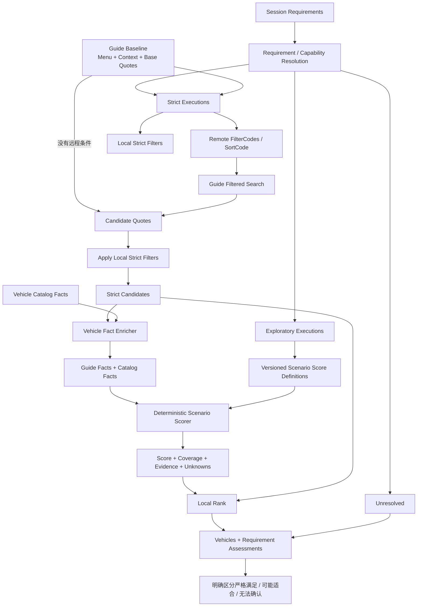

# 探索性诉求加权评分与可解释 Local Rank 技术方案

## 1. 文档定位

- 文档类型：目标架构与实施方案。
- 核对日期：2026-07-30。
- 适用范围：车辆 Requirement、Capability Resolver、Guide 搜索、Local Filter、车型库补全、Local Rank 和最终用户解释。
- 本文只提出方案，不包含本轮代码实现。

本文讨论的目标流程是：

```text
严格、可执行的需求
    → 映射 Guide FilterCode 或 Local Filter
    → 调用 Guide 搜车并严格验证

探索性诉求
    → 结合 Guide 返回字段和车型库事实
    → 计算版本化加权得分
    → Local Rank
    → 明确告诉用户“为什么可能适合”和“哪些方面尚未确认”
```

## 2. 结论

该方案可行，也有必要实施，但必须遵守以下原则：

1. 探索性得分只用于排序，不能冒充 hard 条件验证；
2. 用户明确表达的 hard 诉求仍然保持 hard，不能在 Session 中自动改成 soft；
3. hard 探索性诉求只有在用户同意或产品策略明确允许时，才能进入探索性搜索；
4. 不是所有非探索性需求都能直接映射 FilterCode，无法用 Guide 菜单无损表达但能用真实结果字段验证的条件仍要使用 Local Filter；
5. FilterCode 必须来自 Guide 当前 Baseline 菜单或经过当前菜单验证的 Provider Binding；
6. 评分因子必须来自真实字段和版本化规则，不能由 LLM 临时生成权重、阈值或车辆事实；
7. 数据覆盖率不足时不生成场景得分；
8. 输出必须分别说明严格满足、可能适合、无法确认和明确不满足；
9. “可能适合”不是概率，也不是安全认证；
10. Local Rank 只作用于已获取候选集，必须说明排序范围。

推荐的结果语义是：

```text
严格匹配结果：
  已验证满足所有可执行 hard 条件

探索性排序：
  在严格候选中，根据可验证的场景因子重新排序

探索性备选：
  有 hard 场景条件当前无法严格验证，经用户同意后按其他条件检索
  不代表已经满足该 hard 场景条件
```

## 3. 当前实现与目标差异

### 3.1 当前流程

当前搜车大致是：

```text
Requirement
    ↓
标准需求 → SearchPlan Compiler
开放需求 → Capability Resolver
    ↓
RemoteFilter / RemoteSort / LocalFilter / LocalRank / Unresolved
    ↓
Guide Search
    ↓
Local Filter
    ↓
Local Rank
```

当前已经具备：

- Guide Baseline 菜单；
- FilterCode 运行时映射；
- hard Local Filter；
- soft 价格、座位、品牌、车型 Local Rank；
- 开放 Requirement；
- Capability Catalog；
- Capability Resolution；
- `resolved/ambiguous/unsupported/insufficient_data`；
- RequirementVersion、CatalogVersion、RuntimeFingerprint 和 PlanHash；
- partial 结果提示。

当前缺少：

- “严格需求”和“探索性需求”的显式执行分类；
- 车型库场景事实；
- 版本化 Scenario Score Definition；
- 因子级得分和数据覆盖率；
- 多个探索性诉求的组合评分；
- hard 探索性诉求的探索模式和用户同意；
- “为什么可能适合”的结构化证据；
- 未知因子和数据来源说明；
- 评分版本进入 PlanHash；
- 探索性评分离线评测。

### 3.2 当前车型库能力

现有 [`internal/vehiclecatalog`](../internal/vehiclecatalog) 主要负责：

- 品牌、车系、车型名称统一；
- Alias；
- EntityID；
- 品牌、车系、车型父子关系；
- 消歧和冲突判断。

它目前没有：

- ISOFIX 数量；
- 后排空间；
- 行李厢容积；
- 车门开口；
- 上下车高度；
- 安全配置；
- 舒适性；
- 驱动形式；
- 轮胎和冬季能力；
- 事实来源、更新时间和置信度。

因此当前数据只能支持有限的价格、座位、品牌、车型排序，不能立即生成可信的“老人小孩友好分数”。

## 4. 设计目标和非目标

### 4.1 设计目标

- 严格召回与探索排序明确分层；
- 能用 Guide FilterCode 的 hard 条件优先远程筛选；
- 不能用菜单但能用真实字段验证的 hard 条件继续使用 Local Filter；
- 探索性诉求由 Capability Catalog 映射到确定性 Score Definition；
- Guide 报价和车型库事实合并为统一 VehicleFacts；
- 每个因子返回 match、no_match 或 unknown；
- 评分同时输出 score、coverage、confidence 和 evidence；
- 多个探索性诉求可以组合，但防止相关因子重复计分；
- hard 探索性诉求不静默降级；
- 用户能看到严格条件和探索性条件的不同状态；
- ScoringVersion、VehicleFactVersion 进入 PlanHash 和分页有效性判断；
- 支持离线评测和版本回放。

### 4.2 非目标

- 不让 LLM 直接给车辆打分；
- 不让 LLM 生成权重和阈值；
- 不根据车型名称常识猜测车辆配置；
- 不把 SUV 自动等价为老人友好；
- 不把 MPV 自动等价为儿童友好；
- 不把座位多自动等价为空间大；
- 不使用缺失字段证明车辆满足条件；
- 不把探索性分数作为 hard filter；
- 不把分数描述成安全认证或满足概率；
- 不在首版支持任意用户自定义评分公式；
- 不因评分服务失败而丢弃已经严格匹配的车辆。

## 5. 需求分类

`importance=hard/soft` 和“能否探索评分”是两个不同维度。

建议在运行时 Resolution 中增加：

```go
type ExecutionIntent string

const (
    IntentStrictFilter    ExecutionIntent = "strict_filter"
    IntentStrictVerify    ExecutionIntent = "strict_verify"
    IntentExploratoryRank ExecutionIntent = "exploratory_rank"
    IntentUnresolved      ExecutionIntent = "unresolved"
)
```

Requirement 本身继续保存用户语义；ExecutionIntent 每次根据运行时菜单、字段、车型库和 Catalog 重新计算。

### 5.1 严格可远程筛选

例如：

- Guide 菜单中的 7 座；
- Guide 菜单中的 SUV；
- Guide 菜单中的纯电；
- Guide 菜单中的自动挡；
- Guide 菜单能无损表达的预算。

执行：

```text
IntentStrictFilter
    → RemoteFilterCode
```

### 5.2 严格可本地验证

例如：

- `vehicle.seats >= 6`；
- `total_charge.total_amount <= 500`；
- 品牌等于特斯拉；
- 具体车型包含 Model Y。

执行：

```text
IntentStrictVerify
    → Local Filter
```

### 5.3 探索性 soft 诉求

例如：

- 最好适合老人；
- 优先考虑小孩乘坐；
- 空间大一点；
- 长途舒服一些；
- 行李多，希望装载方便。

执行：

```text
IntentExploratoryRank
    → Scenario Score
    → Local Rank
```

### 5.4 探索性 hard 诉求

例如：

- 必须适合老人；
- 必须方便儿童乘坐；
- 必须适合冬季驾驶。

这些诉求如果没有严格事实模型，不能直接改为 soft。

建议 Resolution：

```text
importance = hard
status = insufficient_data
degradation_policy = ask_user | exploratory_allowed | block
```

可能的执行方式：

```text
block：
  不搜索，要求用户调整或补充

ask_user：
  询问是否按其他严格条件搜索备选

exploratory_allowed：
  进入探索模式，但结果明确标记不代表满足该hard诉求
```

### 5.5 无法评分

如果：

- 没有 Score Definition；
- 车型事实字段不足；
- Coverage 低于最小阈值；
- 车辆实体无法解析；
- 数据版本不兼容；

则：

```text
IntentUnresolved
```

不能为了让所有诉求都有分数而使用弱代理。

## 6. 总体目标流程



## 7. 详细执行时序

### 7.1 Requirement 提取

LLM 继续负责提取：

- raw_text；
- canonical_type；
- category；
- typed value；
- operator；
- importance；
- semantic_label。

LLM 不负责：

- 判断是否可评分；
- 决定评分因子；
- 决定权重；
- 创建车型事实；
- 输出 FilterCode；
- 输出最终车辆分数。

### 7.2 获取 Guide Baseline

由于 FilterCode 来自 Guide 运行时菜单，仍然先执行无筛选 Baseline：

```text
地点 + 时间
    → Guide Baseline
    → context_id + menu + base quotes
```

### 7.3 编译严格执行计划

严格需求按照以下顺序：

```text
1. Remote Filter 能否无损表达
2. Remote Prefilter + Local Verifier
3. Local Filter
4. Unresolved
```

不能强制所有严格需求都变成 FilterCode。

例如：

```text
总价 <= 450
```

Guide 没有“450元以下”菜单，但有真实订单总价字段，因此使用 Local Filter。

### 7.4 调用 Guide 搜车

如果存在 FilterCode 或 SortCode：

```text
Guide Search(
  context_id,
  filter_codes,
  sort_code
)
```

否则直接使用 Baseline Quotes。

### 7.5 执行严格 Local Filter

Guide 返回的车辆先经过严格验证：

```text
Remote Candidates
    → seat / price / brand / model Local Filter
    → Strict Candidates
```

探索评分不能发生在严格过滤之前，否则不满足 hard 条件的车辆可能因为场景得分高而进入结果。

### 7.6 车型事实补全

对 Strict Candidates 构建统一 VehicleFacts：

```text
Guide Quote Facts
    +
Vehicle Catalog Facts
    =
VehicleFacts
```

事实补全必须使用确定性实体解析。

推荐关联优先级：

```text
1. Guide VehicleCode ↔ Catalog ProviderBinding
2. Guide ProviderEntityID ↔ Catalog EntityID
3. 品牌 + 车系 + 车型 CanonicalName 精确匹配
4. 唯一 Alias 精确匹配
5. 无法唯一匹配则不补全
```

不能使用 LLM 自由判断某条报价属于哪个车型实体。

### 7.7 计算探索性分数

每个探索性 Requirement 分别计算：

- factor assessments；
- raw score；
- coverage；
- confidence；
- final rank score；
- positive evidence；
- negative evidence；
- unknown factors。

### 7.8 组合 Local Rank

在 Strict Candidates 内排序：

```text
FinalRankScore =
    Σ(requirement_weight × scenario_rank_score)
```

如果还存在普通 soft RankFactor，例如价格低、座位接近目标、偏好品牌，也进入统一 RankComposer。

### 7.9 生成解释

最终输出必须分别列出：

- 严格远程筛选条件；
- 严格本地验证条件；
- 探索性评分诉求；
- 未达到评分覆盖率的诉求；
- hard 但未验证的诉求；
- 每辆车用于评分的主要证据；
- 尚未确认的关键因子。

## 8. 严格条件的 FilterCode 与 Local Filter

建议保留以下执行层：

```text
RemoteFilter
RemotePrefilter
LocalVerifier
LocalFilter
LocalRank
```

### 8.1 RemoteFilter

Guide 菜单和用户语义完全等价。

例如：

```text
7座 → Guide“7座”
SUV → Guide“SUV”
纯电 → Guide“纯电动”
```

### 8.2 RemotePrefilter + LocalVerifier

Guide 菜单只能缩小范围，不能完整证明条件。

例如：

```text
至少9座
    → Guide“8座及以上”预筛
    → vehicle.seats >= 9 本地验证
```

同一个 Requirement 可以产生两个 Execution，不能再限制为二选一。

### 8.3 LocalFilter

没有远程菜单，但 Guide 返回字段能严格证明。

例如：

```text
total_amount <= 450
brand_name == 特斯拉
vehicle_name contains Model Y
```

### 8.4 ExploratoryRank

不能作为严格条件证明，但有多个可靠因子可以表达相对适合程度。

例如：

```text
适合老人
适合儿童
长途舒适
装载方便
```

## 9. VehicleFacts 设计

建议新增 provider-neutral 事实模型：

```go
type VehicleFacts struct {
    VehicleCode string
    CatalogID   string
    BrandID     string
    SeriesID    string

    Seats             Fact[int]
    FuelType          Fact[string]
    Transmission      Fact[string]
    TotalAmount       Fact[int64]
    BodyType          Fact[string]
    ISOFIXCount       Fact[int]
    TrunkLiters       Fact[int]
    RearLegroomMM     Fact[int]
    StepInHeightMM    Fact[int]
    DoorOpeningDegree Fact[float64]
    ChildLock         Fact[bool]
    SafetyRating      Fact[float64]
    RideComfortGrade  Fact[float64]
}
```

每个 Fact 必须携带：

```go
type Fact[T any] struct {
    Value       T
    Available   bool
    Source      string
    SourceID    string
    Version     string
    UpdatedAt   time.Time
    Confidence  float64
}
```

这样评分器不仅知道值，还知道：

- 数据是否存在；
- 来自 Guide 还是车型库；
- 使用哪个版本；
- 数据是否过期；
- 是否允许用于 hard 验证；
- 是否只允许用于探索评分。

### 9.1 当前 Guide 可提供的事实

当前 DTO 明确包含：

- vehicle name；
- vehicle code；
- brand name；
- group name；
- seats；
- fuel type；
- transmission type；
- total amount；
- deduction amount；
- reference ID。

其中 FuelType 和 TransmissionType 当前是整数枚举，只有在枚举契约明确后才能转换成稳定语义。

### 9.2 车型库需要增加的事实

如果要支持老人、小孩、行李、冬季和长途场景，至少需要评估增加：

- 车身类型；
- 座椅布局；
- ISOFIX 数量和位置；
- 儿童锁；
- 后排腿部空间；
- 后排头部空间；
- 行李厢容积；
- 后排放倒能力；
- 上下车高度；
- 车门开口宽度/角度；
- 安全评分；
- 主被动安全配置；
- ADAS；
- 座椅舒适等级；
- 悬架/乘坐舒适等级；
- 驱动形式；
- 冬季轮胎或雪地能力；
- 最小离地间隙。

每个字段需要数据字典和来源，不应由名称猜测。

## 10. Scenario Score Definition

建议扩展 Capability Catalog，而不是另建一套不关联 Requirement 的评分目录。

```go
type ScoreDefinition struct {
    ID              string
    Version         string
    Category        string
    MinimumCoverage float64
    MinimumConfidence float64
    Factors         []ScoreFactorDefinition
    Explanation     string
}

type ScoreFactorDefinition struct {
    ID              string
    FactKey         string
    Operation       string
    Target          ScoreTarget
    Curve           string
    Weight          float64
    Group           string
    Required        bool
    MinimumFactConfidence float64
    PositiveText    string
    NegativeText    string
    UnknownText     string
}

type ScoreTarget struct {
    Kind   string
    Text   string
    Number *float64
    Min    *float64
    Max    *float64
    Bool   *bool
    Unit   string
}
```

### 10.1 权重来源

权重来源必须是：

- 产品定义；
- 车辆专家；
- 业务规则；
- 用户研究；
- 离线标注数据；
- 后续真实选择反馈。

LLM 只能帮助把用户语义匹配到有限 ScoreDefinition，不能生成权重。

### 10.2 老人友好示例

以下仅是数据模型示例，不是可直接上线的最终权重：

```text
elderly_friendly/v1

上下车高度             0.25
后排腿部空间           0.20
车门开口               0.15
乘坐舒适性             0.15
安全辅助               0.15
行李空间               0.10
```

不能仅使用：

```text
SUV + 自动挡
```

推断老人友好。

### 10.3 儿童友好示例

```text
child_friendly/v1

ISOFIX数量              0.25
后排座位和空间          0.20
儿童锁                  0.15
安全评分                0.20
行李空间                0.10
侧气帘/安全配置         0.10
```

“三个儿童座椅”如果是 hard，必须有可靠 ISOFIX/座椅布局事实才能验证；不能只根据 child_friendly 得分处理。

## 11. 因子计算模型

### 11.1 因子状态

每个 Factor 返回：

```go
type FactorStatus string

const (
    FactorPositive FactorStatus = "positive"
    FactorNegative FactorStatus = "negative"
    FactorUnknown  FactorStatus = "unknown"
)
```

结果：

```go
type FactorAssessment struct {
    FactorID     string
    Status       FactorStatus
    Score        float64
    Weight       float64
    Contribution float64
    FactSource   string
    Observed     string
    Explanation  string
}
```

### 11.2 单因子分数

所有因子标准化到：

```text
0.0 ～ 1.0
```

示例：

```text
布尔满足：
  true  → 1
  false → 0

区间：
  使用版本化分段或单调函数

类别：
  使用固定映射表

未知：
  不参与质量均值，但降低Coverage
```

禁止直接在代码中散落匿名魔法数。曲线和阈值属于 ScoreDefinition。

### 11.3 Coverage

```text
available_weight =
    所有事实可用且置信度达标的因子权重之和

total_weight =
    全部因子权重之和

coverage =
    available_weight / total_weight
```

如果：

```text
coverage < MinimumCoverage
```

则：

```text
status = insufficient_data
不生成ScenarioRankScore
```

### 11.4 Quality Score

```text
quality_score =
    Σ(weight_i × factor_score_i)
    / available_weight
```

Quality Score 表示已知事实中的相对适合程度，不代表完整满足概率。

### 11.5 Confidence

```text
confidence =
    coverage
    × 数据源置信度聚合
    × 实体匹配置信度
```

如果车型实体只通过弱名称包含匹配，不应产生高 Confidence。

### 11.6 Rank Score

推荐首版：

```text
rank_score =
    quality_score × confidence
```

也可以使用向中性值收缩的公式，但必须版本化并通过离线评测选择，不能上线后随意更改。

### 11.7 分数展示

内部可以使用 0～1，前端如果展示百分制，应称为：

```text
探索匹配分
场景参考分
```

不能称为：

```text
满足概率
安全评分
认证分
```

首版甚至可以不展示具体数字，只展示：

- 较适合；
- 一般；
- 信息不足。

这样比给出看似精确的 87 分更稳妥。

## 12. 多个探索性诉求组合

用户可能同时提出：

```text
带老人和小孩
希望空间大
行李比较多
```

每个诉求先独立评分：

```text
elderly_friendly score
child_friendly score
large_space score
large_luggage score
```

然后由 RankComposer 组合：

```text
final_exploration_score =
    Σ(requirement_weight × scenario_rank_score)
    / Σ(requirement_weight)
```

### 12.1 Requirement Weight

默认：

```text
普通soft = 1.0
用户明确“更看重” = 允许提升到受限范围
```

用户明确 hard 的探索性诉求不能通过简单提高权重来替代严格验证。

### 12.2 防止重复计分

多个 Scenario 可能共享：

- 后排空间；
- 座位数；
- 行李空间；
- 安全配置。

如果每个场景都完整累计，可能重复放大同一个事实。

建议 Factor 定义带 Group：

```text
space
safety
accessibility
child_restraint
comfort
cost
```

RankComposer 对同 Group 设置：

- contribution cap；
- max 聚合；
- 或归一化。

具体策略必须版本化。

## 13. hard 探索性诉求处理

### 13.1 不修改 Requirement

例如：

```text
必须适合老人
```

Session 中继续保存：

```text
importance = hard
```

不能变成：

```text
importance = soft
```

### 13.2 搜索模式

建议新增：

```go
type SearchMode string

const (
    SearchModeStrict      SearchMode = "strict"
    SearchModeExploratory SearchMode = "exploratory"
)
```

Strict：

```text
所有hard都必须有严格执行或验证方式
```

Exploratory：

```text
部分hard场景条件当前无法严格验证
按其他严格条件召回
探索性得分只用于排列备选
```

### 13.3 用户同意

建议：

- 高风险 hard：搜索前必须询问；
- 低风险、无安全后果的场景 hard：可以按产品策略自动展示备选，但必须在结果前显著说明；
- 用户同意写入 Session，绑定 RequirementVersion 和 DependencyFingerprint；
- Requirement 变化后同意失效；
- 翻页沿用同一探索模式，但继续展示标识。

### 13.4 不允许自动探索的条件

- 必须 7 座；
- 必须安装三个儿童座椅；
- 无障碍上下车；
- 明确禁止某能源类型；
- 明确预算绝对上限；
- 品牌/车型歧义；
- hard 条件冲突；
- 法律、安全和实际乘坐容量约束。

## 14. 结构化评分结果

建议返回：

```go
type RequirementAssessment struct {
    RequirementID string
    RawText       string
    Importance    string
    Assessment    string
    ExecutionMode string

    Score      *float64
    Coverage   float64
    Confidence float64

    PositiveFactors []FactorAssessment
    NegativeFactors []FactorAssessment
    UnknownFactors  []FactorAssessment

    ReasonCode string
    Reason     string
}
```

Assessment：

```text
strictly_satisfied
strictly_not_satisfied
likely_suitable
possibly_suitable
insufficient_data
unverified_hard
```

注意：

```text
likely_suitable / possibly_suitable
```

只允许用于探索性诉求。

## 15. 用户回复设计

### 15.1 回复顺序

建议固定为：

```text
1. 明确严格满足的条件
2. 明确未验证的hard条件
3. 说明探索排序依据
4. 说明未知的重要方面
5. 展示车辆
6. 说明Local Rank范围
```

### 15.2 示例

用户：

```text
想要7座、总价500元以内，带老人和小孩，最好行李空间大
```

可能回复：

```text
以下车辆已按“7座”和“总价不超过500元”进行严格筛选。

“适合老人和小孩”“行李空间大”目前不能作为已确认条件；
系统只根据车型库中可验证的后排空间、儿童座椅接口、
车门开口和行李厢数据对当前候选进行了参考排序。

排名靠前的车辆可能更适合这些场景，但不代表已经完整满足。
其中部分车辆缺少上下车高度和乘坐舒适性数据，建议预订前进一步确认。
```

单车解释：

```text
车辆A可能更适合：
- 已知有3个ISOFIX接口；
- 后排腿部空间较充足；
- 行李厢容积较大。

尚未确认：
- 老人上下车高度；
- 实际乘坐舒适性。
```

### 15.3 禁止措辞

不能说：

```text
车辆A满足老人和小孩出行要求
车辆A一定适合老人
车辆A有87%的概率适合
```

除非对应条件已经有严格、可验证的业务定义。

## 16. SearchPlan 改造

建议扩展：

```go
type SearchExecutionPlan struct {
    RemoteFilters []Execution
    RemoteSorts   []Execution

    RemotePrefilters []Execution
    LocalVerifiers   []Execution
    LocalFilters     []Execution

    StandardRanks    []Execution
    ExploratoryRanks []ExploratoryExecution

    UnverifiedHard []Resolution
    Unresolved     []Resolution

    SearchMode SearchMode

    RequirementVersion int64
    CapabilityVersion  string
    ScoringVersion     string
    VehicleFactVersion string
    RuntimeFingerprint string
    PlanHash           string
}
```

探索执行：

```go
type ExploratoryExecution struct {
    RequirementID   string
    CapabilityID    string
    ScoreDefinition string
    Weight          float64
    MinimumCoverage float64
    RequiredFacts   []string
}
```

## 17. Capability Catalog 改造

当前 Capability Definition 支持：

- RemoteFilter；
- RemoteSort；
- LocalFilter；
- LocalRank。

建议增加：

```go
type Definition struct {
    ...
    ExploratoryScore *ScoreDefinition
    DegradationPolicy DegradationPolicy
}
```

Resolver 流程：

```text
开放Requirement
    ↓
有限候选匹配
    ↓
exact语义
    ↓
查找ExploratoryScore Definition
    ↓
检查VehicleFacts Schema
    ↓
生成ExploratoryExecution
```

`relevant` 仍然不能执行评分。相关不代表等价。

## 18. SearchCar Pipeline 改造

建议将当前 processor 拆为：

```text
GuideSearchExecutor
    ↓
StrictQuoteFilter
    ↓
VehicleFactEnricher
    ↓
ExploratoryScorer
    ↓
RankComposer
    ↓
ExplanationBuilder
```

### 18.1 执行顺序不可交换

必须：

```text
严格过滤 → 事实补全 → 探索评分 → 排序
```

不能：

```text
先探索评分 → 高分车辆绕过hard过滤
```

### 18.2 评分失败

如果车型库暂时不可用：

- 保留严格匹配车辆；
- 不执行探索排序；
- 标记探索诉求 `insufficient_data`；
- 回复中说明本次无法完成场景排序；
- 不把整个 Guide 搜索当作失败。

## 19. PlanHash、缓存和分页

以下内容必须进入 RuntimeFingerprint 或 PlanHash：

- RequirementVersion；
- Capability Catalog Version；
- Score Definition Version；
- Vehicle Catalog Version；
- Vehicle Fact Schema Version；
- Provider Binding Version；
- Guide Menu Fingerprint；
- RentalFingerprint；
- SearchMode；
- 用户探索同意版本；
- RankComposer Version。

分页前重新校验：

```text
车型库版本变更
评分规则版本变更
用户撤销探索模式
Requirement变化
Guide菜单变化
```

任意发生时，不能直接沿用旧排名快照。

## 20. 可观测性

建议记录：

```text
exploratory_requirement_count
exploratory_scored_count
exploratory_unresolved_count
unverified_hard_count
vehicle_fact_enrichment_hit_rate
vehicle_entity_match_rate
factor_coverage
scenario_score_distribution
rank_changed_vehicle_count
strict_candidate_count
post_local_filter_count
scoring_latency_ms
catalog_version
scoring_version
```

还要记录每个 Requirement 的：

- Resolution；
- Score Definition；
- Coverage；
- Unknown Factor 数；
- 是否影响排名；
- 用户是否点击/选择。

不能在普通日志中无限记录完整用户原文和完整车型事实。

## 21. 测试与离线评测

### 21.1 纯评分测试

- 所有因子 1.0 时总分正确；
- 所有因子 0 时总分正确；
- 部分缺失时 Coverage 正确；
- Coverage 低于阈值时不出分；
- 低置信度 Fact 不参与；
- Weight 总和归一；
- Group Cap 防重复计分；
- 相同输入和版本产生相同分数；
- 评分器不读取 LLM；
- unknown 不被当成 positive。

### 21.2 单调性测试

例如同其他条件不变：

- ISOFIX 更多不能导致 child score 降低；
- 后排空间更大不能导致 large_space score 降低；
- 总价更低不能导致 price preference score 降低；
- Coverage 增加不能无原因降低 Confidence。

### 21.3 严格条件隔离测试

- 高场景分不能绕过 7 座 hard filter；
- 高场景分不能绕过预算 hard filter；
- unresolved hard 不会被写成 satisfied；
- exploratory 模式不会修改 Requirement importance；
- local rank 只改变顺序，不增加车辆；
- scoring failure 不删除严格候选。

### 21.4 Explanation 测试

- 每个 PositiveText 有真实 Fact；
- UnknownText 只对应缺失字段；
- 不出现“明确满足”误导措辞；
- 单车解释与实际 FactorAssessment 一致；
- 用户可看到 Local Rank 只针对已获取候选。

### 21.5 车型库数据测试

- Catalog Entity 唯一；
- Provider Binding 唯一；
- Fact Source 存在；
- 单位一致；
- 数据版本完整；
- 过期数据不能用于 hard 验证；
- 名称歧义不自动关联。

### 21.6 离线评测

建立场景数据集：

- 老人出行；
- 儿童出行；
- 老人和儿童组合；
- 多行李；
- 长途；
- 冬季；
- 字段缺失；
- 实体歧义；
- hard/soft 不同表达。

评测：

- 排名 NDCG；
- Top-K 人工相关性；
- Coverage；
- 误导性解释比例；
- hard 条件违规数；
- Catalog 命中率；
- 排名稳定性；
- 延迟。

hard 条件违规数必须为 0。

## 22. 分阶段实施

### 阶段 0：数据盘点

先确认：

- Guide 实际返回字段；
- Guide VehicleCode 稳定性；
- 车型库可提供哪些场景事实；
- 字段单位和来源；
- 品牌/车系/车型绑定覆盖率；
- 哪些字段允许用于 hard，哪些只允许用于 rank。

如果缺少老人/儿童关键事实，不应直接进入对应评分开发。

### 阶段 1：执行语义拆分

实现：

- `ExecutionIntent`；
- `SearchMode`；
- `UnverifiedHard`；
- `DegradationPolicy`；
- `RemotePrefilter + LocalVerifier`；
- 严格条件和探索条件分流；
- 结构化用户提示。

这一阶段即使没有场景得分，也能改善 hard 拦截和解释。

### 阶段 2：VehicleFacts 与车型绑定

实现：

- provider-neutral VehicleFacts；
- Fact Source/Version/Confidence；
- Guide Fact Adapter；
- Vehicle Catalog Fact Provider；
- VehicleCode/ProviderID/CatalogID Binding；
- Enrichment Coverage 指标。

### 阶段 3：首批低风险评分

先实现数据最可靠的：

- 价格偏好；
- 座位目标；
- 品牌偏好；
- 车型偏好；
- 数据已确认的行李空间等单维度偏好。

验证评分框架、Coverage 和解释，不立即上线复杂老人/儿童分数。

### 阶段 4：老人/儿童场景

前提：

- ISOFIX、后排空间、安全、上下车等关键事实覆盖率达到阈值；
- 权重经过业务评审；
- 离线评测通过；
- 解释模板评审通过；
- hard 场景探索策略明确。

然后增加：

- `elderly_friendly/v1`；
- `child_friendly/v1`；
- `family_with_elderly_and_children/v1`。

### 阶段 5：反馈和迭代

采集：

- 用户展开解释；
- 点击车辆；
- 切换结果；
- 主动放宽条件；
- 最终选择。

只能用于离线调整下一版 Score Definition，不能在线无版本修改权重。

## 23. 验收标准

上线前必须满足：

1. 严格需求先执行 Remote Filter/Local Filter；
2. 探索评分不会增加不满足 hard 条件的车辆；
3. FilterCode 只来自 Guide 当前菜单或经过菜单验证的 Binding；
4. LLM 不输出车型事实、权重、阈值和最终分数；
5. 每个探索分都有 ScoreDefinition Version；
6. 每个 Factor 都有 Fact Source；
7. Coverage 不足不出分；
8. Fact 缺失不当作满足；
9. hard 探索性诉求不会被改成 soft；
10. 探索模式有明确同意或策略依据；
11. 用户能看到哪些条件严格满足；
12. 用户能看到哪些诉求只是“可能适合”；
13. 用户能看到评分依据；
14. 用户能看到关键未知信息；
15. 用户能看到 Local Rank 作用范围；
16. ScoringVersion 和 VehicleFactVersion 进入 PlanHash；
17. 分页结果使用相同评分版本；
18. 评分失败不影响严格搜车结果；
19. hard 条件违规数为 0；
20. 所有解释可从 FactorAssessment 反向验证。

## 24. 风险与取舍

| 风险 | 说明 | 控制方式 |
|---|---|---|
| 虚假精确 | 87分看起来像确定事实 | 首版使用等级、同时展示Coverage |
| 弱代理误导 | SUV不一定适合老人 | 因子必须来自直接事实 |
| 数据缺失偏差 | 数据完整车型更容易高分 | Coverage门槛和Confidence |
| 重复计分 | 多场景共用空间/安全因子 | Factor Group和Contribution Cap |
| 车型关联错误 | 名称包含可能绑定错车型 | ProviderBinding和唯一匹配 |
| 权重主观 | 不同用户看重因素不同 | 版本化、评审、离线评测 |
| 排名范围有限 | 只对已获取候选排序 | 明确说明fetched_set |
| hard被弱化 | 探索得分被误认为满足 | SearchMode和UnverifiedHard |
| 车型库不可用 | 评分失败 | 保留严格结果，降级为无评分 |
| 版本漂移 | 分页分数不一致 | 版本进入PlanHash |

## 25. 最终推荐

推荐采用：

```text
严格召回与验证
    +
车型事实补全
    +
版本化探索评分
    +
可解释Local Rank
```

但落地顺序必须是：

```text
先确认真实字段
    → 再定义因子
    → 再计算Coverage
    → 再进行Local Rank
    → 最后向用户解释
```

不能反过来先设计“老人小孩友好分数”，再用当前有限字段勉强填充。

最终用户语义应始终保持：

```text
严格条件：
  已通过FilterCode或真实字段验证

探索性诉求：
  根据已知的若干方面判断可能更适合，仅用于排序

未知部分：
  当前数据无法确认，需要用户预订前进一步核实
```

这个方案可以明显减少开放诉求被直接拦截的情况，同时保留 hard 条件的可信度和系统解释能力。
