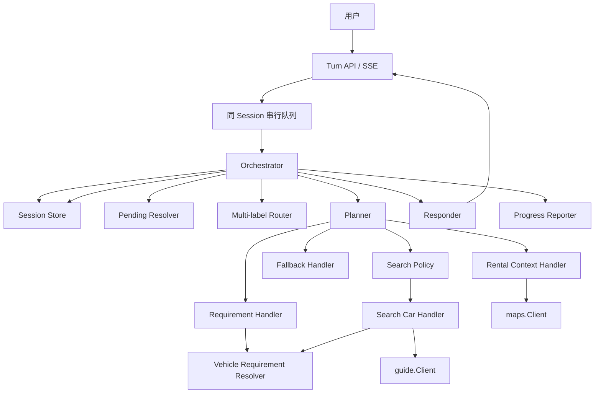

# 租车导购 Agent 完整技术方案

## 1. 文档状态

本文是当前阶段的目标技术方案，用于指导后续实现，不代表仓库现有代码已经全部满足这些约束。

当前阶段的关键选择：

- 使用薄 Orchestrator、顶层多标签 Router 和领域 Handler。
- 同一个用户回合内，各领域按固定顺序串行处理，暂不实现并行调度器。
- Handler 不直接保存 Session，也不直接生成整轮最终业务回复。
- 使用 SessionDraft 合并本轮状态、执行联合校验和驱动自动搜车。
- 搜车由 SearchPolicy 基于最终状态自动决策，不只依赖用户是否明确说出“搜一下”。
- 一个 Session 同时只允许一个 Active Pending；其他歧义只登记为待重新验证动作，不缓存可能过期的第二个问题。
- Guide 菜单缓存只接受完全无筛选的基线响应，并与同一次响应的 `context_id`、租赁条件指纹和有效期整体绑定。
- 车辆诉求先做别名归一、实体层级和包含关系消解，再编译为最小 FilterPlan；不能把所有车辆词语无脑映射成 filter code。
- TripContext 只描述本次出行情境，不能自动推导 SUV、豪华车、舒适性等车辆条件。

## 2. 目标与非目标

### 2.1 目标

- 支持同地取还的时间、地点修改和多级地点消歧。
- 支持多意图输入，例如同一轮修改地点、修改车辆诉求并触发搜车。
- 支持动态 Guide 菜单、报价字段过滤、车辆实体别名和父子关系。
- 支持硬诉求、普通诉求、软诉求、不可验证诉求和临时放宽。
- 支持状态驱动的自动搜车、首次无诉求询问、默认搜索和显式刷新。
- 支持 Pending、延后动作、Session 乐观锁、幂等请求和进度事件。
- 支持价格信息、车辆对比、闲聊、能力说明和无法路由内容的兜底处理。
- 所有地点、菜单、报价和车辆结论都能追溯到真实 API 响应或用户明确输入。

### 2.2 当前非目标

- 不支持异地取还。
- 不实现下单、支付或其他有外部写副作用的操作。
- 不实现自由循环调用工具的 ReAct Agent。
- 不实现通用 DAG 或 Handler 并行调度器。
- 不根据 LLM 训练知识推断车辆安全性、舒适性、空间、油耗或品牌档次。
- 不支持按供应商搜索、筛选、排序或偏好归一；供应商仅作为报价事实展示和车辆对比维度。
- 不自动构建长期用户画像；长期偏好只作为后续可选能力。

## 3. 外部 API 能力边界

### 3.1 Maps

`maps.Client.Search` 接收地点关键词并返回 provider 生成的 POI ID、名称、地址、城市、经纬度。

约束：

- Agent 始终按地点文本做全国搜索；Maps Client 不暴露城市筛选入口，并固定传递 `is_nation_search=1`。
- 已确认城市只用于 Agent 对响应候选做城内收窄，不作为地图请求城市参数。
- POI ID、城市 ID、坐标必须来自地图响应，LLM 不得生成。
- 地图没有置信度、行政区层级和地点类别时，Agent 不得虚构这些字段。
- 跨城重名、同城多 POI 或信息不足时进入 Pending，不固定选择第一个。

### 3.2 Guide

`guide.Client.SearchQuotes` 请求包含取还车城市、地点名、时间、坐标、筛选码、排序码、分组码、分页和可选 `context_id`。

响应包含：

- `context_id`；
- 动态 `menu_group`；
- `veh_rates` 报价。

可直接使用的报价事实包括供应商、车辆名称/编码、品牌、车辆分组、座位数、燃料类型、变速器类型、已有金额字段、免押类型和 `reference_id`。

约束：

- 当前 DTO 没有独立车系、年款、配置版本字段。这些语义只有在动态菜单或受控车辆实体目录提供真实依据时才能执行。
- `supplier_code/supplier_display_name` 只允许用于报价展示、引用和对比，不进入 Requirement Facet，不映射菜单 code，也不参与搜索、过滤或排序。
- `daily_deduction_amount` 的准确业务口径必须由接口方确认，不能仅凭字段名认定为完整日均租金。
- 当前没有完整费用明细接口，不得生成保险、税费、服务费等不存在的拆分。
- API 错误不等于正常空结果，不能触发诉求放宽。

## 4. 总体架构



### 4.1 顶层职责

| 组件 | 负责 | 不负责 |
|---|---|---|
| Orchestrator | 控制整轮顺序、SessionDraft、提交、进度、最终结果 | 不判断具体领域事实 |
| PendingResolver | 解析用户是否在回答、取消或绕过当前 Pending | 不执行业务筛选 |
| Router | 给出一个或多个候选 Action 及原文证据 | 不生成领域 ID、菜单 code 或完整领域 Command |
| Planner | 校验候选 Action、排序、建立依赖、选择 Pending | 不做语言理解 |
| Domain Handler | 提取和验证本领域信息、返回 Delta、事实和 PendingProposal | 不直接保存 Session |
| SearchPolicy | 根据最终 Draft 决定是否问诉求、自动搜索或不动作 | 不理解原始自然语言 |
| Responder | 将已批准事实组织成一条最终回复 | 不增加事实或改写业务决定 |
| Store | 持久化、TTL、版本比较 | 不做领域判断 |

## 5. 串行回合处理流程

```text
1. 接收请求并发送 accepted
2. 按 session_id 进入串行队列
3. Load AgentSession，并检查 request_id 幂等记录
4. 创建 SessionDraft
5. 若有 Active Pending，先交给 PendingResolver
6. Router 继续处理用户完整输入；对同一字段使用 PendingResolver 的消费区间避免重复应用
7. Planner 校验并按固定顺序生成 ActionPlan
8. 串行执行 RentalContext Handler
9. 串行执行 Requirement Handler
10. 收集与搜车无依赖的闲聊、能力说明等独立结果
11. SearchPolicy 基于最终 Draft 只判断一次是否搜车
12. 必要时执行 SearchCar Handler
13. 串行执行依赖最新报价的价格、车辆对比等动作
14. 选择本轮可提交 Delta、Pending、缓存和结果快照
15. 生成但暂不发送最终回复草稿
16. 以 Base.Version 乐观锁保存 Session 和幂等结果
17. 保存成功后发送最终 result；冲突则丢弃旧草稿并按冲突策略处理
```

同一轮同时修改地点、时间、品牌和座位时，所有变更处理完后只搜一次。

## 6. Turn、Action 与领域返回契约

### 6.1 Turn 输入

```go
type TurnInput struct {
    RequestID string
    SessionID string
    ClientSeq int64
    UserText  string
    ReceivedAt time.Time
}
```

`ReceivedAt` 是本轮相对时间解析的固定基准。版本冲突重试时不得重新取当前时间导致“明天下午”漂移。

### 6.2 Router 输出

```go
type RouteCandidate struct {
    Action       ActionType
    EvidenceText string
    Confidence   float64
}

type RouteResult struct {
    Candidates     []RouteCandidate
    UnassignedText string
}
```

Router 使用多标签候选，不强制把整句话分类成单一领域。同一段文本可以同时为多个候选提供证据。

### 6.3 ActionPlan

```go
type Action struct {
    ID           string
    Type         ActionType
    EvidenceText string
    DependsOn    []string
    Source       ActionSource
}

type ActionPlan struct {
    Actions []Action
}
```

固定顺序：

```text
Pending
  → RentalContext
  → Requirements
  → SearchPolicy派生SearchCar
  → 依赖最新结果的Price/Compare
  → Conversation和统一回复
```

### 6.4 DomainResult

```go
type DomainResult struct {
    Status           DomainStatus
    ConfirmedChanges []StateDelta
    TentativeChanges []StateDelta
    Pending          []PendingProposal
    DeferredActions  []DeferredAction
    Facts            []Fact
    Warnings         []Warning
}
```

Handler 不得直接操作 Store，不得把暂定字段写入正式业务状态。

## 7. SessionDraft 与统一提交

```go
type TurnState struct {
    Base  *session.AgentSession
    Draft *session.AgentSession

    ConfirmedChanges []StateDelta
    TentativeChanges []StateDelta
    PendingProposals []PendingProposal
    DeferredActions  []DeferredAction
    Facts            []Fact
    Warnings         []Warning
}
```

`Base` 在本轮内视为不可变；`Draft` 是依次应用已确认 Delta 后的工作状态。

用途：

- 联合校验取还时间；
- 合并同轮多个 Domain 的修改；
- 让 SearchPolicy 读取本轮最新地点、时间和诉求；
- Pending 时只提交独立确认信息；
- 搜车失败时保留已确认修改并将搜索标记为 Dirty；
- 版本冲突时整体丢弃旧 Draft。

初期可以实现显式深拷贝 `Clone()`，但必须正确复制 Slice、Map、指针、Pending、诉求、菜单和报价快照。长期可改为不可变 Reducer：`next = Apply(base, delta)`。

## 8. AgentSession 模型

```go
type AgentSession struct {
    SessionID string
    Version   int64
    UpdatedAt time.Time
    ExpiresAt time.Time

    Goal    SearchGoal
    Pending PendingState
    Memory  ConversationMemory

    CompletedRequests []CompletedRequest
    StateChanges      []StateChange
}
```

### 8.1 SearchGoal

```go
type SearchGoal struct {
    GoalID string
    Status SearchGoalStatus

    Rental       RentalContextState
    Trip         TripContext
    Requirements []RequirementState
    Search       SearchState
}
```

只有用户明确开始新任务、明确重置或 Goal 过期时才创建新 Goal。修改地点或时间不自动创建新 Goal，因此已记录车辆诉求和 `HasSearched` 可以在同一任务内继续使用。

### 8.2 租赁条件

```go
type RentalContextState struct {
    Location   *LocationRef
    PickupTime *time.Time
    ReturnTime *time.Time
}

type LocationRef struct {
    ProviderID string
    CityID     int
    CityName   string
    Name       string
    Address    string
    Latitude   float64
    Longitude  float64
}
```

必须满足：

```text
return_time > pickup_time > ReceivedAt
```

### 8.3 审计和幂等

`StateChanges` 是有限审计尾部，不是事件溯源日志，建议最多保留 50 条并保存稳定值，不保存可变指针。

```go
type CompletedRequest struct {
    RequestID string
    Result    TurnResult
    CreatedAt time.Time
}
```

建议只保留最近有限数量并随 Session TTL 过期。

## 9. Pending 模型

一个 Session 同时只允许一个 Active Pending：

```go
type PendingState struct {
    Active          *PendingInteraction
    DeferredActions []DeferredAction
    History         []PendingInteraction
}
```

`DeferredActions` 保存的是需要基于最新 Session 重新执行的领域动作、原始证据和依赖指纹，不保存固定问题或旧候选列表。当前 Active Pending 被回答、覆盖、取消或过期后，Planner 使用用户完整新输入和最新 Draft 重新执行这些动作；新输入已经解决的歧义不得再次询问。

### 9.1 Pending 类型

```text
select_location
clarify_pickup_time
clarify_return_time
clarify_requirement
clarify_menu_mapping
collect_search_requirements
select_vehicle_reference
```

### 9.2 Pending 优先级

```text
1. 上一轮仍有效的 Active Pending
2. 地点、取车时间、还车时间
3. 不可执行或冲突的硬诉求
4. 动态菜单映射歧义
5. 普通诉求歧义
6. 软诉求歧义
7. 结果引用等非核心问题
```

优先级由 Planner 根据依赖关系决定，不由 Handler 完成顺序决定。

### 9.3 回答 Pending 的结果

Planner 在 Resolver 候选和 Domain 校验完成后，才生成最终结果：`resolved`、`partially_resolved`、`not_addressed`、`cancelled` 或 `superseded`。其中 `partially_resolved` 仍保持 Active，只更新剩余缺失字段；其他终态按照生命周期规则迁移。

若用户没有回答 Pending，例如在等待车辆偏好时问“你能提供价格明细吗”，PendingResolver 返回 `not_addressed`，普通 Router 继续处理能力咨询，原 Pending 保留。

只统计实际提交成功、且用户确实有机会回答的用户回合；请求重试、SSE 事件和系统内部回合不计数。普通澄清连续两次 `not_addressed` 后转为 `suspended` 并移出 Active，停止重复追问。以下情况立即退出 Active：

- 用户回答：`resolved`；
- 用户提供新条件替代原问题：`superseded`；
- 用户明确“算了、不用了、先不搜了”：`cancelled`；
- 候选 TTL 或依赖上下文失效：`expired`；
- 连续达到未回答上限：`suspended`。

终态 Pending 从 Session 的 Active 区移除，只在有限 History 或 Turn/Event Log 中保留审计记录。普通澄清默认最多遗漏 2 个用户回合；地点或 Guide 候选还必须服从各自候选 TTL，不能因为用户后来回答而复用过期 ID 或 code。

### 9.4 PendingResolver 的职责边界

PendingResolver 是逻辑组件，不等于必须单独调用一次 LLM。它负责判断当前用户话术是否在回答、部分回答、取消或替代 Active Pending，并标记相关证据；它不负责：

- 直接修改 Session 或 SessionDraft；
- 直接确认地点、时间、车型或筛选 code；
- 生成 provider ID、POI ID、`filter_code`、`context_id` 或车辆引用；
- 阻止 Router 理解同一句话中的其他领域信息；
- 根据低置信度猜测强行关闭 Pending。

对上层暴露统一接口，内部可以组合规则和 LLM：

```go
type PendingResolver interface {
    Resolve(context.Context, *PendingResolverInput) (*PendingResolveResult, error)
}
```

最终状态变化必须经过：

```text
PendingResolver产生回答假设
  → 对应Domain Handler做字段解析和业务校验
  → Planner确认依赖关系和状态迁移
  → Reducer写入SessionDraft
```

例如当前询问还车时间，用户回答“下午三点，另外要七座 SUV”：

- PendingResolver 只标记“下午三点”可能回答 `return_time`；
- RentalContext Handler 使用 `ReceivedAt`、时区和当前取车时间解析、校验还车时间；
- Requirement Handler 继续提取“七座 SUV”；
- 两部分都成功后 Pending 才转为 `resolved`，SearchPolicy 再决定是否搜索。

### 9.5 输入契约

```go
type PendingResolverInput struct {
    UserText   string
    ReceivedAt time.Time
    Timezone   string

    Active         PendingView
    SessionSummary PendingSessionSummary
}

type PendingView struct {
    ID                    string
    Type                  PendingType
    Question              string
    Options               []PendingOptionView
    RequiredFields        []string
    MissingFields         []string
    Attempt               int
    MaxAttempts           int
    MissedUserTurns       int
    CreatedAt             time.Time
    ExpiresAt             time.Time
    BaseVersion           int64
    DependencyFingerprint string
}

type PendingOptionView struct {
    OptionKey   string
    Label       string
    Description string
}

type PendingOptionBinding struct {
    OptionKey string
    Kind      PendingOptionKind

    Location      *LocationRef
    Requirement   *RequirementCandidate
    MenuSelection *MenuSelectionRef
    Vehicle       *VehicleResultRef
}

type PendingSessionSummary struct {
    RentalContext  RentalContextSummary
    Requirements   []RequirementSummary
    SearchLifecycle SearchLifecycleSummary
}
```

约束：

- `OptionKey` 使用本次 Pending 内的临时序号或随机键，例如 `option_1`，不得把真实 POI ID、车辆引用或菜单 code 放进 LLM Prompt；
- `PendingInteraction` 在服务端保存 `PendingOptionBinding`，LLM 只看到由它派生的 `PendingOptionView`；Domain Handler 通过 OptionKey 回查绑定对象，禁止把模型输出当作真实业务 ID；
- OptionKey 只在当前 Pending ID、版本和 TTL 内有效；候选刷新后必须生成新的绑定，旧 OptionKey 不得跨 Pending 复用；
- `PendingView.ID` 只供服务端关联和版本检查，构造 LLM Prompt DTO 时必须剔除；模型输出中的 `PendingID` 由服务端在解析成功后补入，不相信模型回传的 ID；
- `Question`、候选和上下文必须来自当前 Active Pending，不能从历史消息重新拼出一个旧 Pending；
- 只提供完成当前判断所需的最小 Session 摘要；
- 时间解析必须固定使用本轮 `ReceivedAt` 和 Session 时区；
- 调用前先校验 `ExpiresAt`、`BaseVersion` 和 `DependencyFingerprint`，失效 Pending 不进入语言模型判断。

不同 Pending 类型需要携带不同最小上下文：

| Pending 类型 | 必要上下文 |
|---|---|
| `select_location` | 临时 OptionKey、名称、地址、城市展示信息 |
| `clarify_pickup_time` | 当前还车时间、原始模糊表达、时区 |
| `clarify_return_time` | 当前取车时间、原始模糊表达、时区 |
| `clarify_requirement` | Facet、原始诉求、冲突或缺失字段 |
| `clarify_menu_mapping` | 临时 OptionKey、展示名称、Facet，不含 filter code |
| `collect_search_requirements` | 当前已确认诉求、询问次数、SearchLifecycle |
| `select_vehicle_reference` | 展示序号、车辆展示名、报价快照指纹和有效期 |

### 9.6 输出契约

```go
type PendingResolveStatus string

const (
    PendingResolvedCandidate          PendingResolveStatus = "resolved_candidate"
    PendingPartiallyResolvedCandidate PendingResolveStatus = "partially_resolved_candidate"
    PendingNotAddressed               PendingResolveStatus = "not_addressed"
    PendingCancelCandidate            PendingResolveStatus = "cancel_candidate"
    PendingSupersedeCandidate         PendingResolveStatus = "supersede_candidate"
    PendingInconclusive               PendingResolveStatus = "inconclusive"
    PendingResolverFailed             PendingResolveStatus = "resolver_failed"
)

type PendingResolveResult struct {
    PendingID string // server-attached; excluded from model output schema
    Status    PendingResolveStatus

    AnswerKind   AnswerKind
    OptionKeys   []string
    FieldAnswers []PendingFieldAnswer

    Evidence     []EvidenceQuote
    Confidence   float64
    ResolverPath ResolverPath
    ReasonCode   string
}

type PendingFieldAnswer struct {
    Field    string
    RawValue string
}

type EvidenceQuote struct {
    Text       string
    Occurrence int // zero-based occurrence in UserText
}

type ResolverPath string

const (
    ResolverDeterministic ResolverPath = "deterministic"
    ResolverLLM           ResolverPath = "llm"
)
```

`AnswerKind` 至少支持：

```text
select_option
provide_value
confirmed_empty
default_search
explicit_search
cancel
replace
```

输出中的 `resolved_candidate` 只是“疑似已回答”，不是最终 `PendingResolved`。只有 Domain Handler 验证通过后才能关闭 Pending。

LLM 不直接输出字符下标。它输出必须原样存在于 `UserText` 中的 `EvidenceQuote`，服务端使用确定性 EvidenceAligner 将其转换成 UTF-8 字节区间：

```go
type TextSpan struct {
    Start int // inclusive UTF-8 byte offset
    End   int // exclusive UTF-8 byte offset
}
```

若证据无法在原文唯一定位、Occurrence 越界或区间重叠，则该证据无效；不能相信模型自行计算的 offset。

`ReasonCode` 使用稳定枚举，初期至少包括：

```text
exact_ordinal
exact_option_label
explicit_cancel
explicit_control_phrase
semantic_answer
semantic_replacement
unrelated_intent
ambiguous_evidence
invalid_option_key
evidence_alignment_failed
stale_pending
resolver_error
```

### 9.7 识别流程

```text
读取Active Pending
  → 校验TTL、BaseVersion和DependencyFingerprint
  → 确定性规则解析
  → 命中则生成PendingResolveResult
  → 未命中且需要语义理解时执行Pending-aware TurnUnderstanding
  → EvidenceAligner校验证据区间
  → Router继续做多标签识别
  → Domain Handler验证Pending回答和其他字段
  → Planner决定resolved/partial/not_addressed/cancelled/superseded
```

确定性规则优先处理：

1. 明确取消：“算了”“不用了”“先不搜了”；必须结合 Pending 类型，不能因为“我不是要取消”而取消；
2. 序号选择：“1”“第一个”“选 2”；序号必须在候选范围内；
3. 候选名称或地址的唯一精确匹配；匹配多个候选时不得自动选择；
4. `collect_search_requirements` 的明确控制词：“都行/没要求”“看着办/按默认”“直接搜”；
5. Pending 类型约束下的明确结构化值，例如当前只缺 `return_time` 且用户提供完整 RFC3339 时间的内部命令。

需要 LLM 的场景：

- 省略回答：“机场那个”“下午三点”“就刚才便宜的”；
- 同义表达：“随便”“你推荐”“按常规来”；
- 部分回答多个缺失字段；
- 回答 Pending 的同时修改其他领域信息；
- 用户提供了替代条件而非直接回答原候选。

### 9.8 与 Router 的调用策略

PendingResolver 是逻辑层，初期不建议无条件增加一次独立 LLM 调用：

```text
无Active Pending
  → 正常多标签Router/TurnUnderstanding

有Active Pending且确定性规则命中
  → 生成Pending结果
  → 正常Router继续识别其他意图

有Active Pending且确定性规则未命中
  → 一次Pending-aware TurnUnderstanding
  → 同时输出pending_resolution和route_candidates
```

推荐统一模型输出：

```go
type TurnUnderstandingResult struct {
    PendingResolution *PendingResolveResult
    Routes            []RouteCandidate
    UnassignedEvidence []EvidenceQuote
}
```

这样可以避免 PendingResolver 和 Router 各调用一次 LLM、分别对同一句话得出冲突判断。Domain Handler 仍然独立执行确定性校验，因此合并模型调用不等于合并业务职责。

模型输入 Prompt 必须明确：

- 用户可能同时回答 Pending、修改其他条件并提出咨询问题；
- 不得把整句话强制归入 Pending；
- 每个结论必须引用用户原文证据；
- 不得生成输入中不存在的候选键、字段、ID 或 code；
- `not_addressed` 不代表拒绝处理本轮其他意图。

### 9.9 消费区间与多意图处理

不能简单地从字符串中删除 Pending 回答后再把剩余文本交给所有 Handler。推荐保留完整原文并附加语义标注：

```go
type EvidenceAnnotation struct {
    Span       TextSpan
    Consumer   ActionType
    Field      string
    PendingID  string
    Exclusive  bool
}
```

处理规则：

- Router 始终可以看到完整用户输入，防止漏掉跨领域信息；
- 同一证据允许支持多个非互斥意图，例如“七座”既可以解决诉求收集 Pending，也可以成为 Requirement；
- `Exclusive=true` 只阻止同一字段被重复应用，不阻止其他 Domain 阅读上下文；
- Planner 按 `Domain + Field + Span` 去重，而不是按整句去重；
- Pending 回答以外的新条件正常生成 Delta；
- 同一字段同时出现旧回答和明确新值时，按照文本中的修改关系以及 Domain 规则决定 replace，不能只看出现顺序。

示例：

```text
Active Pending：虹桥机场还是虹桥火车站？
用户：虹桥机场，每天300，时间改成后天下午
```

处理结果：

```text
“虹桥机场”      → 解决select_location
“每天300”       → Requirement.price
“后天下午”      → RentalContext.pickup_time或待领域确认的目标时间
完整Draft校验后 → 判断是否自动搜车
```

### 9.10 各 Pending 类型的领域确认

| Pending 类型 | Resolver 只允许输出 | Domain 最终校验 |
|---|---|---|
| 地点选择 | OptionKey、原文证据 | Pending 未过期、候选成员、真实 POI 信息、城市与依赖指纹 |
| 取车/还车时间 | 对应字段的原始回答 | 时区解析、`return > pickup > ReceivedAt`、目标字段正确 |
| 诉求澄清 | Facet 相关原始值、回答类型 | Facet/Operator/Operation、归一化、冲突和 hard/soft |
| 菜单映射 | OptionKey | Baseline TTL、菜单版本、OptionKey 到 code 的服务端映射 |
| 搜车诉求收集 | confirmed_empty/default_search/explicit_search 或原始诉求 | Requirement 提取及 SearchPolicy 前置条件 |
| 车辆引用 | 展示序号或展示名 | 报价快照有效、序号唯一、指纹一致、引用来自 API |

特殊规则：

- “都行、没要求、随便” → `confirmed_empty`，不是软诉求；
- “看着办、你推荐、按默认来” → `default_search`，不生成隐式硬条件；
- “直接搜、先看看” → `explicit_search`，不代表用户确认了模型推断的偏好；
- “先不搜了” → 只取消当前搜车相关 Pending 和 Deferred Search，不删除已确认租赁条件和诉求；
- 用户明确提出新地点、新车型或新预算替代旧问题时，先由对应 Domain 验证新值，再将旧 Pending 标记为 `superseded`。

### 9.11 置信度、失败和状态迁移

置信度只用于决定是否需要进一步确认，不能越过领域校验。建议初始阈值：

| 条件 | 处理 |
|---|---|
| 确定性规则唯一命中 | 进入 Domain 校验 |
| 回答候选 `confidence >= 0.85` 且证据有效 | 进入 Domain 校验 |
| `not_addressed` 且 `confidence >= 0.85` | 其他意图照常执行；本轮成功提交后才累计一次未回答 |
| `0.60 <= confidence < 0.85` | `inconclusive`，保留 Pending，可生成更具体的追问，不累计未回答 |
| `confidence < 0.60` | `inconclusive` 或安全兜底，不提交暂定字段、不累计未回答 |

阈值必须通过真实会话集校准，并按 Pending 类型分别配置，不能假设模型置信度天然可比较。

状态迁移：

```text
resolved_candidate + Domain通过
  → resolved

partially_resolved_candidate + 部分字段通过
  → 更新Pending剩余字段，不累计missed_user_turns

cancel_candidate + 控制意图确认
  → cancelled

supersede_candidate + 新值通过Domain校验
  → superseded，并应用新值或创建新Pending

not_addressed
  → 其他Action照常执行；提交成功后missed_user_turns + 1

inconclusive
  → 保留Active Pending，不累计用户未回答次数

resolver_failed
  → 保留Active Pending，不累计用户未回答次数
```

以下错误不得算作用户未回答：

- LLM 超时、限流或结构化输出解析失败；
- EvidenceAligner 无法校验证据；
- Session 版本冲突；
- Maps、Guide 或其他外部服务失败；
- 请求被取消或属于同一 `request_id` 重试。

版本冲突重试时，只有最新 Session 的 Active Pending ID、类型和依赖指纹仍与原输入一致，才允许重新使用确定性解析结果；LLM 结果默认重新规划一次，旧 OptionKey 不得映射到新候选。

### 9.12 可观测性与测试

每次解析记录结构化摘要：

```text
pending_id
pending_type
resolver_path
resolve_status
reason_code
confidence_bucket
evidence_span_count
domain_validation_result
final_transition
duration_ms
```

日志不记录完整地点、完整用户原文、provider ID 或候选内部映射；必要时记录脱敏摘要或 Hash。

测试至少覆盖：

- 序号、中文序号、候选名称和唯一地址匹配；
- 越界序号、多候选同时命中和无匹配；
- “我不是要取消”不得误取消，“算了，改杭州”应取消旧 Pending 并处理新地点；
- 回答 Pending 的同时修改时间、预算、车型和提出咨询问题；
- `confirmed_empty/default_search/explicit_search/cancel` 的区别；
- 时间回答缺少日期、目标字段错误和取还时间非法；
- 过期候选、菜单 TTL 过期、报价引用过期；
- LLM 证据不在原文、重复证据和非法 OptionKey；
- 部分回答不累计 missed，连续两次真正 `not_addressed` 后 suspended；
- Resolver、Domain 或外部服务失败不计入用户忽略轮次；
- Pending 解决时，已被本轮最新输入解决的 DeferredAction 不再追问；
- 版本冲突后 Active Pending 已变化时丢弃旧解析结果。

## 10. RentalContext Handler

流程：

```text
提取地点与时间原文
  → 校验提取结果
  → 地图全国搜索
  → 使用已确认城市收窄响应候选
  → 检测跨城或同城歧义
  → 联合校验取还时间
  → 返回确认Delta或PendingProposal
```

规则：

- 地点只接受原始文本或从当前 Pending 候选映射得到的序号。
- Command 中不得信任任意外部 `LocationID`；选择必须验证 Active Pending、过期时间和候选成员关系。
- Pending 必须保存完整规范化地点候选，不只保存 ID 和展示文案。
- 地点确认后同时作为取车点和还车点。
- 地点或任一时间变化立即使旧 Guide Baseline、筛选结果和展示引用失效，但不删除用户诉求。

## 11. TripContext

TripContext 描述本次出行情境，不等于可执行筛选条件：

```go
type TripContext struct {
    Purpose    TripPurpose
    Companions []CompanionInfo
    Luggage    *LuggageContext
    Usage      []TripUsage
    Notes      []TripContextNote
    UpdatedAt  time.Time
}
```

用途：

- 记录本次出差、旅游、家庭、机场等场景；
- 生成更有针对性的澄清问题；
- 将用户明确、可量化事实转换为 Requirement；
- 优化结果话术和能力边界说明；
- 决定询问顺序，而不是改变用户硬诉求优先级。

例如“带老人和孩子”只记录同行情境，不自动生成 `vehicle_type=SUV`。`soft` 代表用户明确表达的弱偏好，不是系统推断的不确定性。

儿童座椅若为本次真实菜单项：

- “带孩子”只产生是否需要儿童座椅的建议问题；
- “需要儿童座椅”生成普通 Requirement；
- “最好有儿童座椅”生成软 Requirement；
- “必须有儿童座椅”生成硬 Requirement。

系统主动建议使用 `ProposedRequirement`，用户确认后才能转成 Active Requirement。

## 12. Requirement 模型

```go
type RequirementState struct {
    ID string

    RawText  string
    Facet    RequirementFacet
    RawValue string

    NormalizedValue RequirementValue
    Operator        ComparisonOperator
    Importance      RequirementImportance
    Source          RequirementSource
    Scope           RequirementScope
    Status          RequirementStatus

    CreatedAt       time.Time
    UpdatedAt       time.Time
    LastMentionedAt time.Time
    SupersededBy    string
}
```

### 12.1 Facet

核心语义槽位：

```text
brand
vehicle_series
vehicle_model
vehicle_type
seat_num
energy_type
transmission
price_preference
car_age
comfort_preference
custom
```

`custom` 保留白名单外诉求，防止静默丢失。语义 Facet 存在不代表当前接口一定可执行，例如 `vehicle_series` 仍需菜单或真实报价值支持。

用户提出“只看某供应商、优先某供应商”等要求时，不创建供应商 Requirement，也不退化为本地供应商过滤；应返回当前不支持按供应商搜索，并允许用户改按品牌、车型、座位、价格等受支持维度筛选。

### 12.2 Operation 与 Operator

Operation 表示如何修改诉求状态：

```text
add
replace
remove
```

Operator 表示如何比较：

```text
eq, not_eq, gt, gte, lt, lte, in, not_in, contains
```

“不要 SUV”是 `operation=add, operator=not_eq`，不是 `operation=exclude`。

### 12.3 强弱和置信度

- Importance 表示用户重要性：hard、normal、soft。
- ExtractionConfidence 只用于判断本轮解析是否需要澄清，不随轮次衰减。
- 显式诉求在当前 SearchGoal 内持续有效，直到替换、删除或 Goal 重置。
- 只有未确认推断、临时上下文和结果引用可以按 Scope 失效。

### 12.4 同 Facet 更新

没有“也、一起、都看看”等并集信号时，同 Facet 新值默认替换旧值。

```text
上一轮：丰田、七座
下一轮：看一下小米
结果：品牌=小米，座位>=7
```

旧品牌标记为 `superseded`，不直接删除历史。

“也看看小米”表示品牌 `IN(丰田, 小米)`；只有执行层支持同 Facet OR 时才能一次搜索，否则拆分搜索或澄清。

## 13. 两阶段诉求处理

### 13.1 第一阶段：语义提取

LLM 输入用户原话、当前诉求摘要和受限 Schema，只输出：

- Facet；
- 原始值；
- Operation；
- Operator；
- Importance；
- TripContext 变化；
- 无法归类的 custom 原文。

LLM 不输出菜单 code、`context_id`、车辆事实或 provider ID。

### 13.2 第二阶段：运行时能力解析

取得无筛选 Baseline 菜单和实际报价字段后，按顺序解析：

```text
确定性数值和否定规则
  → 受控别名目录
  → 车辆实体目录
  → 实际报价字段精确匹配
  → 无筛选Baseline菜单精确匹配
  → 受限LLM从临时候选序号中选择
  → 澄清或不可验证
```

受限 LLM 只看到临时候选序号、名称和必要描述，不看到也不返回真实 filter code。

## 14. 车辆实体归一和包含关系

### 14.1 实体目录

```go
type VehicleEntity struct {
    ID            string
    Type          VehicleEntityType
    CanonicalName string
    Aliases       []string
    ParentID      string
    BrandID       string
    EvidenceSource string
    Version       string
}
```

受控层级：

```text
品牌 → 子品牌 → 车系 → 年款 → 配置版本
车型大类 → 细分类别
动力大类 → 具体动力类型
变速器大类 → 具体变速器类型
通用服务能力 → 具体服务方式
```

关系只能来自 Provider、产品配置或版本化目录，不能让 LLM 根据常识生成。

### 14.2 “特斯拉 Model Y”

归一后若目录确认 `Model Y` 属于特斯拉，应生成一个具体车系约束。若 Baseline 菜单同时有特斯拉品牌 code 和 Model Y 车系 code，最终只保留 Model Y code，删除父级品牌 code。

如果菜单没有 Model Y code：

- 不得用特斯拉品牌 code 替代 Model Y 硬诉求；
- 若报价 `vehicle_name/group_name` 和分页完整性支持可靠本地过滤，可以无品牌预筛后过滤；
- 无法可靠验证时，标记为不可执行。

### 14.3 最小化规则

对于父级 P 和子级 C：

| 条件 | 处理 |
|---|---|
| P 且 C | 保留 C，删除正向父级 P |
| 非 P 且非 C | 保留非 P |
| P 且非 C | 两者保留，表示 P 中排除 C |
| 非 P 且 C | 确定性冲突 |

只在同一个 AND 分支内剪枝，不跨 OR 分支剪枝。

还需要处理：

- 座位数上下界交集，例如 `>=5` 与 `>=7` 合并为 `>=7`；
- 价格区间交集和空交集；
- 新能源与纯电等父子关系；
- 自动挡与具体变速器类型；
- 免押与具体免押方式；
- 硬筛选和软排序分离；
- 正负条件冲突；
- 同义重复 code 去重；
- 服务端同组和跨组 AND/OR 语义。

### 14.4 FilterPlan

```go
type FilterPlan struct {
    MenuFilters   []MenuFilter
    QuoteFilters  []QuoteFilter
    RankFactors   []RankFactor
    Verifications []Verification
    Unresolved    []RequirementResolution
}
```

编译流程：

```text
别名归一
  → 合并相同实体
  → 构建RequirementGraph
  → 检测父子、互斥、OR和冲突
  → 合并数值范围
  → 区分硬筛选和软偏好
  → 删除会扩大语义的父级code
  → 生成最小MenuFilter
  → 添加报价二次验证
```

在 Guide 同组/跨组 code 装配规则未确认前，不得假设多个 code 是 AND 或 OR。

## 15. Guide Baseline 菜单缓存

### 15.1 缓存模型

```go
type SearchState struct {
    Baseline           *GuideBaselineCache
    LastFilteredResult *FilteredSearchSnapshot
    LastDisplayed      []VehicleQuoteSnapshot
    Lifecycle          SearchLifecycle
}

type GuideBaselineCache struct {
    RentalFingerprint string
    ContextID         string
    Menu              []MenuGroupSnapshot
    BaseQuotes        []VehicleQuoteSnapshot

    FirstReceivedAt time.Time
    ServiceExpiresAt time.Time
    SafeExpiresAt    time.Time

    Source   MenuSource
    Complete bool
}
```

Baseline 的 `context_id`、菜单、指纹和时间必须来自同一次完全无筛选响应，并整体替换，禁止分别更新。

### 15.2 完全无筛选请求

基线请求必须满足：

```text
ContextID = ""
FilterCodes = nil/empty
SortCode = ""
GroupCode = ""
```

不能携带品牌、车型、座位、价格等用户条件。这里的“全量菜单”指无任何筛选条件下得到的完整菜单；报价是否全量仍受分页约束，不能将第一页报价当作完整车辆全集。

### 15.3 筛选响应隔离

筛选响应即使返回 `menu_group`，也只能保存报价和筛选计划，禁止覆盖 `Baseline.Menu`。

```go
type FilteredSearchSnapshot struct {
    RentalFingerprint string
    BaseContextID     string
    ResponseContextID string
    FilterPlanHash    string
    AppliedCodes      []string
    Quotes            []VehicleQuoteSnapshot
    ReceivedAt        time.Time
}
```

### 15.4 15 分钟 TTL

服务名义 TTL 为 15 分钟，Agent 使用 14 分钟安全有效期：

```text
ServiceExpiresAt = FirstReceivedAt + 15min
SafeExpiresAt    = FirstReceivedAt + 14min
```

业务请求只在 `now < SafeExpiresAt` 时复用。相同 `context_id` 在筛选响应中再次出现不更新 `FirstReceivedAt`，也不续期。

### 15.5 失效条件

- 地点或任一时间变化；
- 租赁条件指纹不一致；
- 超过安全 TTL；
- Baseline 菜单、context 或快照缺失；
- 服务明确返回 context 无效；
- 影响报价的环境字段变化；
- SearchGoal 重置；
- 筛选响应返回无法解释的新 context。

若筛选响应返回不同 `context_id`，本轮结果可保存到 FilteredSnapshot，但不得把新 ID 与旧 Baseline 菜单拼接。下一次需要重新筛选时执行新的无筛选 Baseline。

品牌、车型、座位、价格等用户诉求变化不会使 Baseline 失效；它们只会触发使用同一份仍有效的完整菜单重新编译 FilterPlan。只有租赁条件、上下文有效性或报价环境变化才使 Baseline 失效。

## 16. SearchLifecycle 与自动搜索

```go
type SearchLifecycle struct {
    HasSearched bool

    PreferencePromptCount int
    PreferencePromptState PreferencePromptState
    PreferenceMode        SearchPreferenceMode

    Dirty        bool
    DirtyReasons []SearchDirtyReason

    LastSearchFingerprint  string
    LastRequirementVersion int64
    LastSearchedAt         *time.Time
}
```

Dirty 原因：地点、取车时间、还车时间、诉求、显式刷新。

### 16.1 搜车前置条件

- 地点已确认；
- 取还时间存在且合法；
- 没有阻塞型 Active Pending；
- 没有不可验证或冲突的硬诉求；
- 本轮存在显式搜索信号、确认空诉求或影响搜索的有效变化。

### 16.2 SearchPolicy 决策表

| 当前状态 | 动作 |
|---|---|
| 前置条件不完整 | 追问缺失字段，不搜车 |
| 有阻塞 Pending | 等待确认，不搜车 |
| 用户明确“直接搜/刷新” | 搜车 |
| 用户确认“都行/没要求” | 标记空诉求并搜车 |
| 当前 Goal 搜过，地点/时间/诉求变化 | 自动重新搜索 |
| 当前 Goal 未搜过，条件完整且有有效诉求 | 直接搜索 |
| 当前 Goal 未搜过，条件完整但无诉求 | 使用 `PreferenceAskCount` 做 1 次普通询问，不创建 Blocking Pending；达到上限后按默认搜索 |
| 纯闲聊或能力咨询且无搜索变化 | 不搜车 |

### 16.3 首次无诉求询问

首次无诉求询问是普通 SearchPolicy 回复，不创建 Pending。`SearchGoal.PreferenceAskCount` 默认最多询问 1 次。

回答处理：

- “七座 SUV” → Requirement Handler，成功后直接搜索；
- “都行、随便、没要求、直接搜” → `NoPreference=true` 并搜索；
- “看着办、你推荐、按默认来” → `default_search`，不创造隐式硬条件，按 Guide 默认搜索；
- “先不搜了” → 取消 Pending 和 Deferred Search；
- 无关问题 → 普通 Router/GeneralReply 处理，不累计 Blocking Pending 未回答轮次。

达到最大询问次数后，只有当用户仍明确处于找车流程但没有给出可解析偏好时才按默认搜索；不能因为用户任意闲聊而自动搜车。

## 17. SearchCar Handler

```text
校验Draft租赁条件
  → 计算RentalFingerprint
  → Ensure有效无筛选Baseline
  → 使用Baseline.Menu和实际字段编译FilterPlan
  → 处理硬诉求阻断或映射澄清
  → 使用Baseline.ContextID调用筛选搜索
  → 本地QuoteFilter和Verification
  → 排序
  → 保存FilteredSnapshot和展示引用
  → 清除Dirty并更新HasSearched
```

若 FilterPlan 没有菜单筛选，但需要基线报价且 Baseline 的分页结果足够用于当前展示，可以复用；若本地过滤要求完整数据，必须明确分页策略，不能把第一页空结果当作全量空结果。

报价缺少 Vehicle、ReferenceInfo 或所需金额字段时，不用于相应展示、引用或比较。

## 18. 诉求冲突和空结果

### 18.1 冲突分类

```text
same_facet
logical
menu_exclusive
no_results
```

- 同 Facet 新值且没有并集信号：最新明确值替换旧值。
- 确定性区间空交集：若是明确替换则替换，否则询问。
- 两个硬诉求冲突且没有用户取舍：询问。
- “经济型、SUV、七座”不能仅靠车型常识判为冲突；先判断“经济型”是车型分类还是低价偏好，再依据菜单和数据验证。

### 18.2 空结果临时放宽

仅当 Guide 正常返回但菜单筛选或本地过滤后无结果时：

1. 保留 Session 中完整真实诉求；
2. 选择最低优先级的可放宽项；
3. 构建仅本轮有效的 SearchOverlay；
4. 最多自动放宽一项；
5. 重新搜索或基于完整报价重算；
6. 明确告诉用户原条件无结果和本轮放宽内容。

API 超时、业务错误、解析错误不进入此流程。

## 19. 结果引用、价格和车辆对比

最近展示结果保存：

```text
展示序号
reference_id
vehicle_code/name
supplier_code
当前报价快照
RentalFingerprint
FilteredSnapshot标识
有效期
```

用户说“第二辆”时必须通过当前有效映射定位，不由 LLM 恢复 ID。

价格和对比只使用真实共同字段：总金额、已确认口径的金额字段、品牌、车辆名称/分组、座位、正式枚举语义、供应商和免押类型。过期快照可作为“上次报价”回顾，但“现在多少钱”必须刷新。

## 20. Fallback 与历史对话

Fallback 处理：

- 纯闲聊；
- 能力说明；
- 无法路由的输入；
- 不支持的任务；
- 上下文省略和需要澄清的指代；
- 提出一次受控重新路由建议。

输入只包含最近有限对话、Session 摘要、Active Pending、有效车辆引用、系统能力清单和其他 Domain 的拒绝原因。

Fallback 不得修改租赁条件、调用 Maps/Guide、生成业务 ID 或根据车型常识补充事实。若它发现业务意图，只能返回 SuggestedAction，由 Planner 校验；最多重新路由一次。

当前出行情境用 TripContext；跨 Session 长期偏好属于未来独立 UserPreferenceProfile。未经用户明确要求，不从历史行为自动生成长期画像。

## 21. 最终回复与进度事件

### 21.1 Domain 返回事实

```go
type ResponseFacts struct {
    CommittedChanges []StateChange
    Trip             TripContextView
    Requirements     []RequirementResult
    Vehicles         []VehicleView
    Pending          *PendingInteraction
    Warnings         []Warning
    FailedActions    []FailedAction
    Conversation     *ConversationContent
}
```

Responder 统一合成整轮回复，避免多个 Domain 的成功/失败文案互相冲突。

为了幂等，可以在保存前基于拟提交事实生成并缓冲最终回复，将结构化结果和文案写入 CompletedRequest；只有保存成功后才向用户发送。版本冲突时丢弃旧草稿。

### 21.2 SSE

推荐事件：

```text
accepted
progress: understanding
progress: location_search
progress: requirement_matching
progress: vehicle_search
progress: result_preparing
result/error
```

进度码由真实步骤触发，客户端可在约 300～500ms 后再显示，避免短请求闪烁。进度文案只表达任务阶段，不暴露思维链、内部 ID 或未经验证结论。

Pending 结果是本轮最终 `waiting_user` 事件，不是持续“思考中”。

## 22. Session Store、串行队列和版本冲突

```go
type Store interface {
    Load(ctx context.Context, sessionID string) (*AgentSession, error)
    Save(ctx context.Context, session *AgentSession, expectedVersion int64, ttl time.Duration) error
    Delete(ctx context.Context, sessionID string) error
}
```

### 22.1 当前并发策略

- 同一个 `session_id` 的请求在应用层串行；
- 不同 Session 可以并行；
- Version 乐观锁用于多实例、重复投递、锁失效和后台慢响应保护。

### 22.2 冲突处理

```text
Save发现VersionConflict
  → Load最新Session
  → 若request_id已完成，返回保存结果
  → 判断本轮Delta是否仍满足前提
  → 独立Delta重新校验后可重放
  → 同字段冲突、Active Pending变化、指纹变化则重新规划
  → 旧菜单、旧报价、旧展示引用不得直接回写
  → 最多自动重试一次
  → 仍冲突则返回可重试错误
```

未来若增加下单或支付，外部写操作必须有下游幂等键，不能像只读搜索一样直接重放。

## 23. 错误分类

```text
user_input
needs_clarification
capability_limit
external_retryable
version_conflict
internal
```

- 用户输入不完整或需要确认返回结构化业务结果，不作为内部异常。
- Maps 错误保留旧地点，不能描述成“地点不存在”。
- Guide 错误保留已确认地点、时间和诉求，将搜索保持 Dirty，允许重试。
- 正常空候选与 API 错误分开。
- 内部错误记录 trace ID，用户回复不暴露内部细节。

## 24. 可观测性与安全

- 每个入站请求在入口注入 trace ID 和 request ID。
- 每个外部调用记录一次结构化摘要、耗时、状态和错误类型。
- 不记录 bearer token、acc key 或其他密钥。
- LLM 请求、用户地点、完整报价等敏感业务内容不应以原始 body 无限制写日志；使用字段白名单和截断摘要。
- 记录 Router 候选、最终 ActionPlan、RequirementResolution、FilterPlan Hash、缓存命中/失效原因和版本冲突结果。
- 所有 provider 标识只在内部结构传递，不进入自由文本 Prompt，除非使用临时候选索引隔离。

## 25. 推荐代码布局

```text
internal/
  agent/
    orchestrator.go
    turn.go
    router.go
    pending_resolver.go
    evidence_aligner.go
    planner.go
    search_policy.go
    progress.go
    responder.go
    fallback.go

  domain/
    rentalcontext/
      handler.go
      extractor.go
      validator.go
      pending.go

    requirement/
      handler.go
      extractor.go
      merger.go
      normalizer.go
      entity_catalog.go
      graph.go
      filter_plan.go

    searchcar/
      handler.go
      baseline.go
      cache.go
      filter.go
      verify.go
      rank.go

    price/
    compare/

  session/
    model.go
    draft.go
    reducer.go
    pending.go
    store.go
    conflict.go
```

外部服务继续隔离在 `api/maps`、`api/guide` 和 `api/llm`。

## 26. 实施阶段

### 阶段一：状态与编排骨架

- 新 AgentSession、SearchGoal、SessionDraft、Reducer；
- Orchestrator 串行流程；
- Store Version、request_id 幂等和同 Session 串行队列；
- 单 Active Pending 和 DeferredActions。
- PendingResolver 确定性规则、EvidenceAligner 和领域确认契约。

### 阶段二：租赁条件和自动搜索

- 地点全国搜索与完整候选 Pending；
- 时间联合校验；
- SearchLifecycle、Dirty 和 SearchPolicy；
- 非 Pending 的 `PreferenceAskCount` 询问，以及“都行/看着办/直接搜”的立即搜索规则。
- Pending-aware TurnUnderstanding，用一次结构化 LLM 输出同时提供 Pending 回答假设和多标签路由。

### 阶段三：动态菜单和车辆诉求

- 无筛选 Baseline 菜单缓存；
- 15 分钟 TTL 和安全余量；
- Requirement Schema、两阶段解析、custom；
- 实体别名目录、RequirementGraph、最小 FilterPlan 和报价验证。

### 阶段四：体验与扩展

- SSE 进度；
- TripContext、ProposedRequirement；
- Fallback、价格、车辆对比；
- 空结果单诉求临时放宽；
- 完整可观测性和安全日志。

## 27. 验收标准

- 多意图按租赁条件、诉求、自动搜车顺序串行执行，同一轮最多搜索一次。
- 用户修改已搜索任务的地点、时间或诉求后，无需再次说“搜一下”即可自动刷新。
- 首次条件完整且无诉求时只询问配置的 1～2 次；“都行/看着办/直接搜”能从 Pending 正确恢复搜索。
- 一个 Session 永远不出现两个 Active Pending，其他歧义只进入 DeferredActions 并在 Active 结束后重新验证。
- PendingResolver 不直接写 Session、不输出业务 ID；所有回答均有可校验原文证据并经过对应 Domain Handler 确认。
- 用户回答 Pending 的同时修改其他领域条件时，Pending 和其他有效 Delta 都能提交，且同一字段不会重复应用。
- Resolver 或外部服务失败不会被计为用户忽略；只有真正的 `not_addressed` 才累计轮次。
- Pending 时已确认且独立的诉求不会丢失，暂定地点或时间不会写入正式字段。
- 所有地图 ID、坐标、菜单 code、context 和报价引用都来自 API 或 Pending 候选映射。
- 菜单缓存只来自完全无筛选 Baseline；筛选响应菜单不会覆盖它。
- Baseline 菜单、context、指纹和接收时间始终来自同一次请求；同 context 不续期。
- 14 分钟安全期后不再发送旧 context；租赁条件变化立即失效。
- “特斯拉 Model Y”等父子实体只生成不扩语义的最小 FilterPlan，不用品牌 code 替代具体车系硬诉求。
- 同 Facet 替换和硬冲突有确定性处理；未确认的多值 OR、负向菜单和区间组合会明确阻断或标记不可执行，不猜测 Guide 语义。
- TripContext 不会自动推导 SUV、豪华、舒适或安全属性；儿童座椅只有用户明确要求后才成为筛选条件。
- Guide/Maps 错误与正常空结果分离，API 错误不会触发自动放宽。
- 最终成功文案只在 Session 保存成功后发送；版本冲突不会回写旧报价或旧 Pending。

## 28. 需要接口或产品确认的契约

1. Guide `context_id` 精确 TTL、续期规则和筛选响应返回新 ID 的语义。
2. 动态菜单同组多个 code、跨组 code 的 AND/OR 组合规则。
3. `group_type/group_code/filter_codes/sort_code` 的正式装配契约。
4. 无筛选请求返回的菜单是否保证与报价分页无关且为完整菜单。
5. `daily_deduction_amount`、抵扣字段、币种和精度的正式含义。
6. `fuel_type`、`transmission_type`、`free_deposit_type` 的正式枚举。
7. 品牌、子品牌、车系、年款、配置版本的 Provider 目录和别名来源。
8. 儿童座椅等服务筛选项的准确菜单语义和报价核验字段。
9. 本地车系过滤需要的分页完整性或是否存在全量查询方式。
10. 当前是否存在价格明细、车辆详情或额外配置接口。
