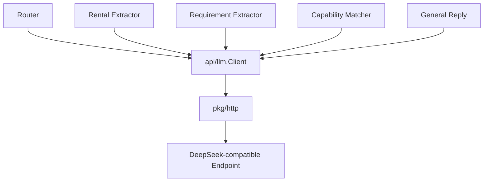
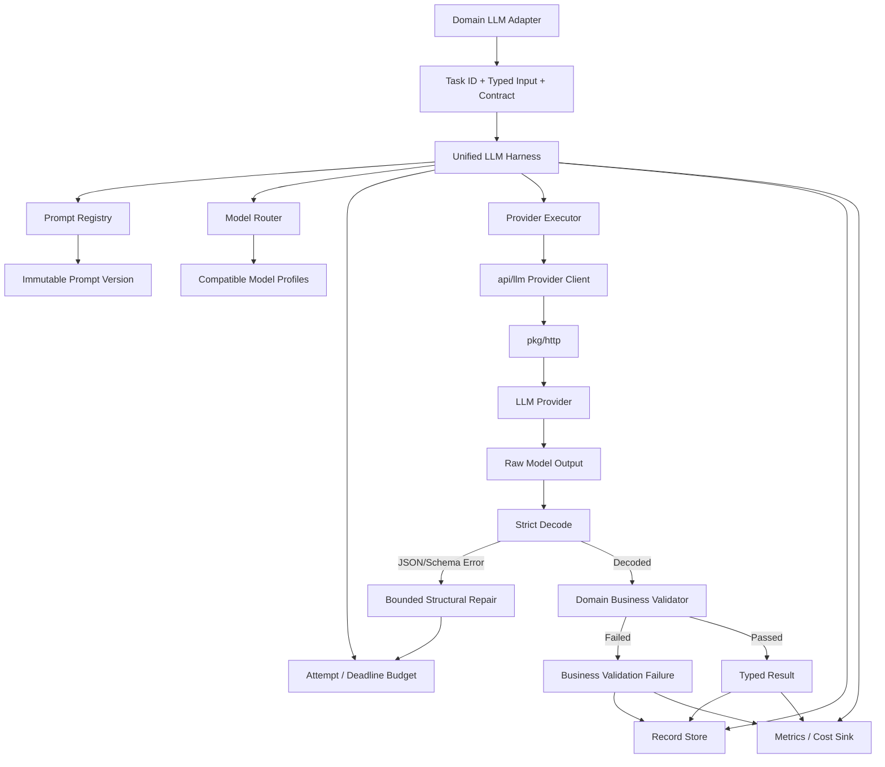
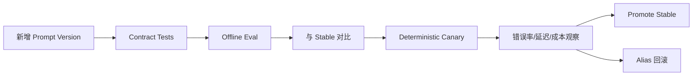
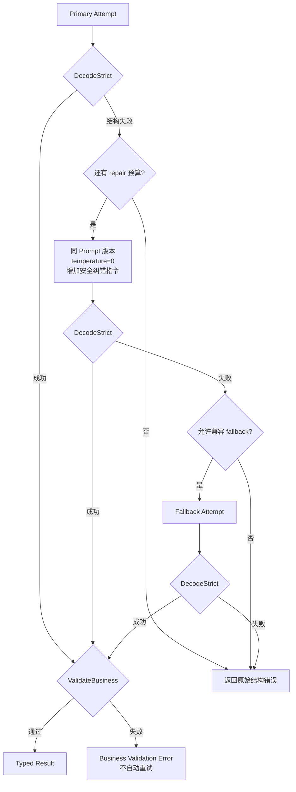

# 统一 LLM Harness 设计与落地方案

## 1. 文档定位

- 文档类型：现状评估 + 目标设计 + 分阶段实施方案。
- 核对日期：2026-07-29。
- 适用范围：Router、租车条件提取、车辆诉求提取、Capability Matcher、通用回复五类 LLM 调用。
- 本文只提出方案，不包含本轮代码实现。

本文回答：

1. 当前是否已经有统一 LLM Harness；
2. Prompt 版本、模型路由、降级、Schema 重试、错误分类、Token/延迟/成本、请求回放和离线评测分别支持到什么程度；
3. 是否有必要增加这些能力；
4. 应该如何设计，避免 Harness 变成新的“大一统业务模块”；
5. 如何迁移现有五类调用，如何测试和上线。

## 2. 结论

当前项目**没有统一 LLM Harness**。

现有 [`api/llm`](../api/llm) 是一个 OpenAI-compatible 传输 Client，负责发送 Chat 请求并解析供应商响应；它不是完整 Harness。五个调用点分别在业务包内：

- 自己保存 Prompt 常量；
- 自己指定模型；
- 自己构造请求；
- 自己解析模型输出；
- 自己返回普通 error。

建议增加统一 Harness，而且已经有现实必要性。优先级如下：

| 能力 | 当前状态 | 是否必要 | 建议优先级 |
|---|---|---:|---:|
| 统一 LLM Harness | 未支持 | 必要 | P0 |
| Prompt 版本管理 | 未支持 | 必要 | P0 |
| 错误类型和重试边界 | 未统一支持 | 必要 | P0 |
| Schema/解析错误自动重试 | 未支持 | 必要，限结构化任务 | P0 |
| Token、延迟、成本统计 | 部分有原始数据，但未统一统计 | 必要 | P0 |
| 单模型 Route 抽象 | 未支持 | 必要，为后续路由提供稳定入口 | P0 |
| 多模型路由策略 | 未支持 | 有必要，但应先建立指标和评测 | P1 |
| 实际多模型/多供应商降级 | 未支持 | 有必要，但应在指标和评测之后启用 | P1 |
| LLM 请求记录和精确回放 | 未支持 | 有必要 | P1 |
| 离线评测和发布门禁 | 未支持 | 有必要 | P1 |
| 在线自适应选模、复杂 LLMOps 平台 | 未支持 | 当前没必要 | P2 |

不建议一次性建设完整平台。正确顺序是：

```text
统一入口和版本
  → 错误分类与有限重试
  → Token/延迟/成本观测
  → 回放与离线评测
  → 基于数据启用模型路由和降级
```

## 3. 当前实现审计

### 3.1 当前调用链



当前所有调用都共用 `api/llm.Client`，但“共用传输 Client”不等于“共用 Harness”。

### 3.2 七项能力现状

#### 3.2.1 是否有统一 LLM Harness

结论：**没有**。

证据：

- [`api/llm/interface.go`](../api/llm/interface.go) 只有 `Chat` 和 `ChatStream`；
- [`api/llm/client.go`](../api/llm/client.go) 只负责 HTTP 请求、供应商响应解析；
- 每个业务调用点直接调用 `client.Chat`；
- 没有统一的 Task ID、PromptRef、SchemaRef、Route、Attempt、错误分类、记录器和指标事件。

#### 3.2.2 是否支持 Prompt 版本管理

结论：**不支持**。

当前 Prompt 是业务文件内的字符串常量：

- Router：[`internal/router/router.go`](../internal/router/router.go)
- 租车条件：[`internal/domain/rentalcontext/extractor.go`](../internal/domain/rentalcontext/extractor.go)
- 车辆诉求：[`internal/domain/vehiclerequirement/extractor.go`](../internal/domain/vehiclerequirement/extractor.go)
- Capability Matcher：[`internal/capability/matcher.go`](../internal/capability/matcher.go)
- 通用回复：[`internal/domain/generalreply/handler.go`](../internal/domain/generalreply/handler.go)

Git 能追踪代码修改，但当前请求和响应里没有：

- Prompt ID；
- Prompt Version；
- Prompt 内容哈希；
- Schema Version；
- 发布通道；
- 回滚指针。

因此无法可靠回答“某次线上结果具体使用了哪一版 Prompt”。

#### 3.2.3 是否有模型路由和降级

结论：**没有**。

当前：

- 结构化任务和通用回复都硬编码 `llm.ModelConversation`；
- `ModelReasoning` 虽然定义，但当前业务调用没有使用；
- 配置只有一个 endpoint、一个 API key、一个 timeout；
- 没有按任务选择模型；
- 没有同供应商模型 fallback；
- 没有多供应商 fallback；
- 没有按错误类型判断是否降级。

#### 3.2.4 Schema 错误是否自动重试

结论：**不会**。

当前结构化调用取得模型文本后，直接进入各自的严格 Decoder。JSON 语法、缺字段、额外字段、枚举错误或领域约束错误都会直接返回，整个 LLM 调用不会重新生成。

已有严格 Contract 是很好的基础，但目前只负责“拒绝错误输出”，不负责“有限修复重试”。

#### 3.2.5 是否区分超时、解析失败和业务校验失败

结论：**代码局部能产生不同错误，但没有统一、稳定、可统计的错误分类**。

当前问题：

- 超时通常从 `http.Client` 或 Context 原样返回；
- HTTP 非 200 被格式化成普通 error；
- 供应商 API error 是普通 error；
- 供应商响应 JSON 解析失败是普通 error；
- 模型输出 JSON 解析失败是普通 error；
- Schema 错误和业务不变量错误经常发生在同一个 Decoder 中；
- 上层没有统一 `FailureKind`；
- 无法稳定决定某类错误是否应该重试或 fallback。

#### 3.2.6 是否统计 Token、延迟和调用成本

结论：**部分有数据，未形成能力**。

已经具备：

- [`api/llm/dto.go`](../api/llm/dto.go) 接收 `prompt_tokens`、`completion_tokens`、`total_tokens`、`cache_hit_tokens`；
- [`pkg/http/client.go`](../pkg/http/client.go) 记录 HTTP 请求耗时。

尚未具备：

- 调用方没有汇总 `Usage`；
- 没有按 Task、Prompt Version、Model、错误类型统计；
- 没有端到端 LLM logical-call latency；
- 没有区分每次 Attempt；
- 没有模型价格表和价格版本；
- 没有成本计算；
- 没有预算、告警或看板；
- HTTP 原始响应中即使包含 Usage，也不能替代结构化指标。

#### 3.2.7 是否支持请求回放和离线评测

结论：**不支持 LLM 级别的回放和离线评测**。

当前 WebChat 的 `request_id` 幂等缓存只能重放已经完成的**整轮业务响应**。它不能：

- 重放某一次 LLM 输入；
- 固定 Prompt Version 和 Model 重新执行；
- 使用新 Prompt 对历史输入做对比；
- 对两个模型进行离线 A/B；
- 计算 Router、Requirement 或 Schema 的准确率；
- 复现一次 fallback 的完整 Attempt 链。

## 4. 为什么现在需要统一 Harness

当前只有五类 LLM 调用，数量看起来不大，但已经同时出现：

- 四个结构化输出任务；
- 一个自然语言任务；
- 多套严格业务 Contract；
- 相同模型被不同任务使用；
- Prompt 修改会影响 Router、状态提取和搜索结果；
- LLM 失败会进入不同的 Orchestrator 分支；
- Capability Matcher 的权限比普通生成更敏感。

如果继续由各业务模块自行增加重试、选模和日志，会形成以下问题：

1. 每个模块重试规则不同；
2. 总重试次数不可控，容易放大延迟和费用；
3. 错误类型不一致，无法做正确 fallback；
4. Prompt 修改无法关联线上效果；
5. Token 和成本只能人工查供应商；
6. 线上问题无法精确复现；
7. 模型升级只能直接在线试；
8. 业务校验失败可能被误认为临时故障反复重试；
9. 原始 Prompt 和用户上下文可能继续进入通用 HTTP body 日志。

因此，需要统一 Harness，但 Harness 只负责横切能力，不能接管领域业务。

## 5. 设计目标和非目标

### 5.1 设计目标

- 所有 LLM 调用使用稳定 Task ID；
- 每次调用解析为精确 Prompt Version 和 Schema Version；
- Prompt 版本不可原地修改；
- 模型路由由配置和任务策略决定；
- retry、fallback 共享一个总 Attempt 和时间预算；
- 自动修复 JSON/Schema 错误，但不盲目重试业务拒绝；
- 错误在产生层就带有可识别类型；
- Harness 记录每个 Attempt 和最终 logical call；
- 统一统计 Token、延迟、缓存命中和估算成本；
- 支持安全的记录、精确回放和重新运行；
- 支持离线对比 Prompt/Model；
- 领域代码仍拥有输入构造、输出 Schema 和业务 Validator；
- `api/llm` 仍然只是供应商传输层。

### 5.2 当前非目标

- 不建设通用 Agent 工具调用框架；
- 不让 Harness 理解租车、地点、车辆和 Capability 业务；
- 不做无限自修复循环；
- 不因业务校验失败自动换模型直到“通过”；
- 不默认保存全部用户原文和完整模型输出；
- 不在 Session 中保存大型 LLM 调用记录；
- 不引入 Kafka、向量数据库或独立 LLMOps 微服务；
- 不做在线强化学习或实时自动调权；
- 不让模型路由绕过任务兼容性和 Schema 约束；
- 不把 fallback 当作供应商高可用的唯一方案。
- 首版只统一当前实际使用的非流式 `Chat`；`ChatStream` 保留在传输层，等出现真实业务调用后再接入同一套版本、路由和观测契约。

## 6. 目标架构



核心边界：

```text
业务包
  负责：Task 输入、输出 Contract、业务 Validator、结果使用

LLM Harness
  负责：版本、路由、Attempt、重试、分类、观测、记录

api/llm
  负责：供应商请求和响应传输

pkg/http
  负责：HTTP 构造、认证、超时、状态码、单次 HTTP 日志
```

## 7. 推荐代码布局

```text
api/
  llm/
    interface.go              # Provider transport interface
    dto.go
    client.go
    errors.go                 # Provider/API response typed errors

internal/
  llmharness/
    harness.go                # logical call orchestration
    task.go                   # TaskID, PromptRef, SchemaRef
    contract.go               # decode/validate abstraction
    registry.go               # immutable prompt registry
    route.go                  # task-aware model routing
    retry.go                  # bounded retry policy
    failure.go                # classification only; does not wrap errors
    attempt.go                # attempt metadata and budget
    metrics.go                # metrics event/sink
    pricing.go                # versioned pricing catalog
    record.go                 # call/attempt record and store interface
    redact.go                 # recording redaction policy

  llmprompts/
    register.go
    router/
      v1.0.0.system.txt
    rental_extract/
      v1.0.0.system.txt
    vehicle_requirement/
      v1.0.0.system.txt
    capability_match/
      v1.0.0.system.txt
    general_reply/
      v1.0.0.system.txt

  llmeval/
    dataset.go
    runner.go
    compare.go
    report.go
    evaluators/

cmd/
  llmeval/
    main.go
```

Prompt Registry 和 Harness 不导入任何租车领域包。领域 Contract 通过接口传给 Harness，避免依赖反转错误。

## 8. 核心任务模型

### 8.1 稳定 Task ID

建议定义：

| Task ID | 当前调用 | 输出类型 |
|---|---|---|
| `router.route` | 顶层多标签路由 | structured |
| `rental_context.extract` | 地点和时间提取 | structured |
| `vehicle_requirement.extract` | 车辆 Requirement 提取 | structured |
| `capability.match` | 受限候选匹配 | structured |
| `general_reply.generate` | 只读通用回复 | text |

Task ID 一旦使用就不随 Go package 重命名而改变。

### 8.2 PromptSpec

概念结构：

```go
type PromptSpec struct {
    TaskID           string
    Version          string
    SchemaVersion    string
    ValidatorVersion string
    ContentHash      string
    System           string
    OutputMode       string
    DefaultRoute     string
}
```

`Version` 必须解析成确定版本，例如 `1.2.0`。线上记录中禁止只保存 `latest`、`stable` 这类别名。

### 8.3 Contract

结构化任务必须把以下两步分开：

```go
type Contract[T any] interface {
    SchemaID() string
    DecodeStrict(content string) (*T, error)
    ValidateBusiness(value *T, source InputEvidence) error
}
```

- `DecodeStrict`：负责 JSON 语法、字段、类型、枚举、单 JSON 值等结构规则；
- `ValidateBusiness`：负责原文证据、领域不变量、字段组合和业务边界。

当前部分 Decoder 把两类错误混在一起，需要迁移时拆开。

### 8.4 Logical Call 与 Attempt

一次业务调用是一个 Logical Call，一个 Logical Call 可以包含有限多个 Attempt：

```text
LogicalCall call-123
  Attempt 1: primary model
  Attempt 2: same model structural repair
  Attempt 3: compatible fallback model
```

所有 Attempt 共享：

- 同一个 Task ID；
- 同一个精确 Prompt Version；
- 同一个 Schema Version；
- 同一个输入哈希；
- 同一个总截止时间；
- 同一个最大 Attempt 数；
- 同一个 Trace ID。

## 9. Prompt 版本管理

### 9.1 版本规则

建议采用“不可变语义版本 + 内容哈希”：

```text
Task: router.route
Version: 1.3.0
SchemaVersion: router-output/2
ContentHash: sha256:...
```

规则：

1. 同一 Task + Version 的 Prompt 内容不可修改；
2. 任何内容变化都创建新版本；
3. Prompt 文件通过 `go:embed` 进入构建产物，保证发布可复现；
4. Registry 启动时校验重复版本和内容哈希；
5. Schema 不兼容变化必须提升 SchemaVersion；
6. 线上配置可以使用 `stable/canary` 别名，但执行前必须解析为精确版本；
7. CallRecord 保存精确版本和内容哈希；
8. 旧版本不能因为发布新版本就删除，否则历史请求无法重放；
9. Prompt 不直接读取运行时可变文件，避免实例之间漂移；
10. 回滚只修改版本映射，不覆盖旧文件。
11. Structural repair 使用的纠错指令本身也必须是不可变、可版本化的 Harness Prompt；
12. 每个 Attempt 记录最终组装请求的哈希，不能只记录基础 System Prompt 的哈希。

### 9.2 发布方式



Canary 分流使用稳定哈希，例如 `request_id + task_id`，不能使用每次随机数，否则同一请求重试可能跨版本。

### 9.3 为什么 Git 版本不够

Git 能回答“代码何时修改”，但不能直接回答：

- 某次请求实际使用了哪个 Prompt；
- 配置别名当时解析到了哪个版本；
- 某个 fallback Attempt 是否仍使用同一 Prompt；
- 线上多个实例是否完全一致；
- 新旧 Prompt 在同一数据集上的差异。

因此需要运行时 PromptRef。

## 10. 模型路由与降级

### 10.1 模型 Profile

模型路由不能只按模型名称，而要按能力 Profile：

```go
type ModelProfile struct {
    Provider            string
    Model               string
    SupportsJSONObject  bool
    SupportsJSONSchema  bool
    SupportsTools       bool
    SupportsStreaming   bool
    MaxContextTokens    int
    PricingVersion      string
}
```

结构化任务只能进入支持对应输出模式的 Profile。不能因为备用模型“更强”就默认认为它支持 JSON Schema 或相同参数。

### 10.2 建议路由

| Task | Route | 重点 |
|---|---|---|
| `router.route` | `structured_fast` | 低延迟、稳定 JSON、原文证据 |
| `rental_context.extract` | `structured_temporal` | JSON、中文时间理解 |
| `vehicle_requirement.extract` | `structured_semantic` | JSON、开放语义保持 |
| `capability.match` | `structured_restricted` | 候选约束、低温度 |
| `general_reply.generate` | `text_fast` | 自然语言、较宽输出 |

第一阶段可以让这些 Route 都指向当前 `deepseek-chat`，先完成抽象和观测，不需要立即增加供应商。

### 10.3 可以触发 fallback 的错误

- 单次 Attempt 超时，但 Logical Call 总截止时间仍有余量；
- 连接失败；
- HTTP 429；
- HTTP 5xx；
- 供应商临时不可用；
- 模型输出解析/Schema 修复重试后仍失败；
- `finish_reason=length` 且备用 Profile 有合适的输出上限策略。

### 10.4 不允许触发 fallback 的错误

- 调用方主动取消；
- Logical Call 总截止时间已经到期；
- 配置错误；
- 401/403 等认证授权错误；
- 400 类明确无效请求；
- Prompt 或 Schema 未注册；
- 业务校验失败；
- 用户需求本身不属于该领域；
- Capability 业务上不允许执行；
- Attempt 或成本预算已经耗尽。

### 10.5 时间和 Attempt 预算

禁止每层各自重试。所有 retry 和 fallback 必须共享一个预算，例如：

```text
Total timeout: 15s
Max attempts: 3

Attempt 1: primary, max 7s
Attempt 2: structural repair, max 4s
Attempt 3: fallback, 使用剩余时间
```

这里的数值只是配置示例，最终应根据实测 P95 设置。

必须满足：

- Caller Context 是最高优先级；
- 单 Attempt 使用子 Context；
- Caller 取消后立即停止；
- 总 Attempt 数包含 Schema repair 和 fallback；
- 重试等待也计入总时间；
- fallback 不能重新获得一份新的完整超时。

Route 和 Retry Policy 自身也需要版本或内容哈希。CallRecord 不能只保存 `structured_fast` 这个可变名称，还应保存当时解析后的候选顺序、超时、Attempt 上限和策略哈希。

### 10.6 是否现在就需要多供应商

不建议第一阶段立即接多个供应商，原因是：

- 当前没有质量基线；
- 没有成本观测；
- 没有兼容性矩阵；
- 不知道备用模型是否维持业务 Contract；
- 多供应商会引入数据合规、价格和语义差异。

先建立 Route 抽象，配置当前单模型；离线评测通过后再增加真实 fallback。

## 11. Schema 错误自动重试

### 11.1 适用范围

自动结构修复只适用于：

- `router.route`
- `rental_context.extract`
- `vehicle_requirement.extract`
- `capability.match`

`general_reply.generate` 是自由文本，不做 Schema 重试。

### 11.2 可重试的结构错误

- 输出不是合法 JSON；
- 输出了多个 JSON 值；
- 缺少必填字段；
- 出现未知字段；
- 字段类型不符；
- 枚举值不在 Schema 中；
- 数值超出 Schema 范围；
- Provider 没有遵守 `json_object/json_schema`。

### 11.3 不自动重试的业务错误

- `domain_matched` 与真实输入领域不一致；
- Router evidence 不是用户原文；
- 时间虽然格式正确但已经过期；
- 地点候选不存在；
- Requirement 发生不允许的语义扩写；
- Capability ID 虽合法但业务关系只是 `relevant`；
- hard 条件当前没有执行能力。

这些错误需要业务层处理、澄清或失败，不能通过不断换模型“撞到一个通过结果”。

### 11.4 重试流程



建议首版：

- 每个 Logical Call 最多一次 structural repair；
- repair 使用同一精确 Prompt Version；
- repair 使用精确的 `repair_prompt_version`，并记录最终组装请求哈希；
- temperature 强制为 0；
- 不把完整 Decoder error、堆栈或内部实现发送给模型；
- 只发送白名单化的纠错提示，例如“缺少 requirements 字段，请重新生成完整 JSON”；
- 默认不回传上一次完整错误输出，避免上下文膨胀和二次 Prompt 注入；
- 若供应商支持真正 JSON Schema，优先使用 JSON Schema，而不仅是 `json_object`。

### 11.5 为什么业务校验失败不默认重试

业务校验错误往往表示：

- Prompt 边界设计有问题；
- 输入本身需要澄清；
- 当前能力确实不支持；
- 模型做了语义推断。

自动重试可能偶然生成一个“看起来能过”的结果，却改变用户原意。首版应记录并进入离线评测，不应在线盲目修复。

## 12. 统一错误分类

### 12.1 FailureKind

建议至少定义：

| FailureKind | 含义 | 默认重试 |
|---|---|---:|
| `cancelled` | 调用方主动取消 | 否 |
| `deadline_exceeded` | Logical Call 总超时 | 否 |
| `attempt_timeout` | 单 Attempt 超时，总预算仍存在 | 是 |
| `transport` | DNS、连接、TLS、连接重置 | 是 |
| `rate_limited` | HTTP 429 | 是 |
| `provider_unavailable` | HTTP 5xx 或临时服务错误 | 是 |
| `provider_auth` | 401/403 | 否 |
| `invalid_request` | 400 或不兼容参数 | 否 |
| `provider_response_parse` | 供应商协议响应无法解析 | 可 fallback |
| `output_parse` | 模型内容不是合法 JSON | 结构修复 |
| `schema_validation` | JSON 不符合输出 Schema | 结构修复 |
| `business_validation` | 结构正确但业务不变量失败 | 否 |
| `empty_output` | 模型无有效输出 | 可有限重试 |
| `truncated_output` | 输出因 token 限制截断 | 可按策略重试 |
| `configuration` | Task、Prompt、Route、价格配置错误 | 否 |
| `internal` | 未分类内部错误 | 否 |

### 12.2 遵守当前仓库的错误传播规则

当前仓库要求下层 error 原值传播，不能通过 `%w` 或格式化副本添加上下文。统一 Harness 应这样实现：

1. 错误在**产生层**创建为可识别的具体类型；
2. `pkg/http` 在产生 HTTP 状态错误时返回 typed error；
3. `api/llm` 在产生供应商协议错误时返回 typed error；
4. Contract Decoder 在产生输出解析/Schema 错误时返回 typed error；
5. 业务 Validator 在产生业务校验错误时返回 typed error；
6. Harness 使用 `Classify(err)` 读取类型；
7. Harness 记录分类后，仍然 `return err` 原值；
8. Harness 不包装、不改写下层 error。

Attempt、Task、Prompt、Model 等上下文放在 CallRecord/Metrics Event 中，不塞进错误字符串。

### 12.3 Schema 和业务校验如何拆分

以 Requirement 为例：

Schema 层：

- `requirements` 和 `domain_matched` 必须存在；
- 字段类型正确；
- `canonical_type` 属于枚举或 null；
- `confidence` 在 0～1；
- `value.kind` 和字段结构匹配；
- 不允许额外字段。

业务层：

- `domain_matched=false` 时不能存在 Requirement；
- 开放需求必须有 `semantic_label`；
- Category 与 CanonicalType 业务上兼容；
- remove 与 value 的关系合法；
- 原文和操作没有发生不允许的语义扩张；
- 搜索控制词不能变成车辆 Requirement。

具体边界可以逐任务调整，但错误类型必须稳定。

## 13. Token、延迟与成本统计

### 13.1 两层指标

需要同时记录：

#### Attempt 指标

- provider；
- model；
- attempt number；
- attempt type：primary/repair/fallback；
- HTTP/模型耗时；
- failure kind；
- finish reason；
- prompt/completion/cache hit tokens；
- 单 Attempt 估算成本。

#### Logical Call 指标

- task ID；
- prompt version；
- schema version；
- route；
- 最终模型；
- 总 Attempt 数；
- 是否发生 repair/fallback；
- 端到端延迟；
- 总 Token；
- 总成本；
- 最终 outcome。

### 13.2 指标事件

建议事件字段：

```text
trace_id
call_id
task_id
prompt_version
prompt_hash
schema_version
validator_version
route
route_version
retry_policy_version
provider
model
attempt
attempt_type
outcome
failure_kind
finish_reason
prompt_tokens
completion_tokens
cache_hit_tokens
total_tokens
latency_ms
estimated_cost_micros
currency
pricing_version
repair_prompt_version
record_id
```

指标事件不包含：

- API key；
- Authorization；
- 完整 System Prompt；
- 完整用户原文；
- 完整 Session；
- 完整模型输出；
- Maps/Guide provider ID。

### 13.3 成本计算

使用版本化 Pricing Catalog：

```go
type Price struct {
    Provider                 string
    Model                    string
    Currency                 string
    InputPerMillionMicros    int64
    CachedPerMillionMicros   int64
    OutputPerMillionMicros   int64
    Version                  string
}
```

概念公式：

```text
uncached_input = max(prompt_tokens - cache_hit_tokens, 0)

cost =
  uncached_input × input_price
  + cache_hit_tokens × cached_input_price
  + completion_tokens × output_price
```

所有价格按百万 Token 换算，内部使用整数最小货币单位，避免浮点累计误差。

如果：

- 供应商不返回 Usage；
- 模型价格未配置；
- `cache_hit_tokens` 语义不明确；

则成本状态应为 `unknown`，不能当作 0。

### 13.4 首批看板

按 Task 和 Prompt Version 展示：

- 调用量；
- 成功率；
- output_parse/schema_validation 比例；
- business_validation 比例；
- repair 成功率；
- fallback 比例和成功率；
- P50/P95/P99 latency；
- 平均/总 Token；
- 平均/总成本；
- 各模型质量与成本对比；
- 每个请求的 Attempt 放大倍数。

### 13.5 当前 HTTP 日志需要同步调整

当前 `pkg/http.PostJSON` 会记录请求和响应 body。对 LLM 来说，这可能包含：

- System Prompt；
- 用户原文；
- Session 摘要；
- 模型完整输出。

建议给共享 HTTP Client 增加日志策略：

```text
normal: 记录允许的请求/响应摘要
sensitive: 只记录 URL、状态、字节数、耗时和错误
```

LLM Provider Client 使用 `sensitive`。需要排查时使用受控 CallRecord，而不是依赖无限制原始 HTTP 日志。

## 14. 请求记录与回放

### 14.1 CallRecord

建议记录：

```go
type CallRecord struct {
    RecordID           string
    CallID             string
    TraceID            string
    TaskID             string
    PromptVersion      string
    PromptHash         string
    SchemaVersion      string
    ValidatorVersion   string
    Route              string
    RouteVersion       string
    RetryPolicyVersion string
    RepairPromptVersion string
    BuildVersion       string
    InputHash          string
    Input              []byte
    Attempts           []AttemptRecord
    FinalOutput        []byte
    Outcome            string
    FailureKind        string
    CreatedAt          time.Time
}
```

AttemptRecord 记录选中的 provider/model、输入参数摘要、原始输出或输出引用、Usage、耗时、错误分类和 fallback 原因。

`BuildVersion` 用于定位当时的 Go Decoder、Validator 和 Reducer 实现。仅保存 Schema Version 并不能保证以后还能完全复现历史业务代码。

如果目标是复现“当时完整业务行为”，还必须能取得对应 BuildVersion 的构建产物；否则只能把历史模型输出交给当前 Contract 做兼容性回放。

### 14.2 三种回放模式

#### Exact Replay

不访问供应商，直接返回历史最终输出，再执行当前或历史 Contract。

用途：

- 复现下游业务流程；
- 验证 Decoder/Validator 修改；
- 排查“相同 LLM 输出为什么产生不同业务结果”。

#### Re-run

使用历史精确 Prompt Version、历史输入和指定模型重新请求。

用途：

- 检查模型漂移；
- 验证供应商相同模型是否稳定；
- 复现 schema failure。

#### Compare Replay

相同历史输入同时运行 stable 和 candidate Prompt/Model。

用途：

- Prompt 升级；
- 模型升级；
- fallback 候选评估；
- 成本/延迟/质量对比。

### 14.3 记录策略

建议配置：

```text
off
metadata_only
sampled
failure_only
all
```

生产默认建议：

- Metadata：全量；
- 完整输入/输出：失败全量 + 成功采样；
- 高敏字段：默认脱敏；
- 保存期限：明确限制；
- 访问：只允许内部评测和排障；
- 删除：支持按用户/Session/时间清理；
- 存储：生产环境加密。

每条记录还应标记 `replayability`：

- `exact`：安全存储了完整必要输入，可以精确回放；
- `redacted`：字段已脱敏，只能做有限评测；
- `metadata_only`：只能分析指标，不能重新生成。

### 14.4 可回放与隐私的平衡

精确回放需要输入，但不能直接无限保存原始 Session。建议：

1. 为每个 Task 定义字段级记录策略；
2. provider ID、API key、Authorization 永不记录；
3. user/session 标识使用内部不可逆哈希；
4. 对手机号、精确地址等字段脱敏；
5. Prompt 本体通过 Version + Hash 获取，不在每条记录重复保存；
6. 旧 Prompt 版本必须保留；
7. CallRecord 不进入对话 Session；
8. 评测导出数据再次脱敏。

### 14.5 Store 抽象

```go
type RecordStore interface {
    Save(context.Context, *CallRecord) error
    Get(context.Context, string) (*CallRecord, error)
    Query(context.Context, Query) ([]RecordSummary, error)
}
```

首版可以提供：

- `NoopRecordStore`：默认关闭；
- 本地 JSONL Store：开发和离线评测；
- 后续生产数据库/对象存储适配。

记录失败不能让正常 LLM 调用失败，但必须产生独立指标和告警。

## 15. 离线评测

### 15.1 评测数据集

建议 JSONL：

```json
{
  "case_id": "router-mixed-001",
  "task_id": "router.route",
  "input": {},
  "expected": {},
  "tags": ["mixed_intent", "pending"],
  "fixed_now": "2026-07-29T10:00:00+08:00"
}
```

数据来源：

- 人工编写的边界用例；
- 当前单元测试中的典型输入；
- 脱敏后的线上失败记录；
- Prompt 变更引发的回归案例；
- 用户真实表达的语言变体。

每个失败案例修复后应进入长期回归集。

### 15.2 各任务评测指标

#### Router

- Action Set exact match；
- evidence 必须为原文子串；
- 混合意图召回率；
- 重复 Action 比例；
- 搜索控制误判率；
- Schema pass rate。

#### Rental Context

- location query 准确率；
- pickup/return 字段准确率；
- resolved/ambiguous/absent 准确率；
- 固定 now/timezone 下的时间解析准确率；
- provider ID 幻觉率必须为 0；
- Schema pass rate。

#### Vehicle Requirement

- 标准/开放需求分类准确率；
- canonical_type、category、operation、operator、importance 准确率；
- typed value 和单位准确率；
- 删除/替换语义准确率；
- 场景语义扩写率；
- FilterCode/ID 幻觉率必须为 0；
- Schema pass rate。

#### Capability Matcher

- 非候选 ID 比例必须为 0；
- exact/relevant 判断准确率；
- 空匹配准确率；
- 单候选约束；
- 不创建执行参数。

#### General Reply

- 不声称已修改状态；
- 不声称已调用外部服务；
- 不编造报价和 provider ID；
- 对当前问题的相关性；
- 语言简洁度。

通用回复可以使用人工评分或 LLM Judge 作为补充，但关键安全规则必须使用确定性检查。

### 15.3 发布门禁

候选 Prompt/Model 至少满足：

- Schema pass rate 不低于 stable；
- 关键业务准确率不退化；
- 禁止项违规数为 0；
- P95 延迟不超过设定阈值；
- 平均成本不超过预算；
- business_validation failure 不显著上升；
- 新增 repair/fallback 没有导致 Attempt 放大失控。

评测报告必须同时展示质量、延迟和成本，不能只比较模型回答看起来是否更好。

### 15.4 评测运行模式

建议提供：

```text
go run ./cmd/llmeval \
  -dataset testdata/llmeval/router.jsonl \
  -baseline router.route@1.0.0 \
  -candidate router.route@1.1.0 \
  -route structured_fast \
  -report output/llmeval/router-1.1.0.json
```

离线评测：

- 不修改真实 Session；
- 不调用 Maps/Guide；
- 不触发业务外部写操作；
- 使用固定 now/timezone；
- 明确是否允许真实 LLM 网络调用；
- 记录本次模型、Prompt、价格和评测器版本。

## 16. 配置方案

示例只表达结构，实际超时和价格应通过测试确定：

```yaml
llm:
  providers:
    deepseek_primary:
      endpoint: https://api.deepseek.com
      api_key: ${DEEPSEEK_API_KEY}
      timeout_sec: 20

  profiles:
    deepseek_chat_json:
      provider: deepseek_primary
      model: deepseek-chat
      supports_json_object: true
      supports_json_schema: false
      pricing_version: deepseek-2026-07

  routes:
    structured_fast:
      version: structured-fast/1
      retry_policy_version: structural-retry/1
      total_timeout_ms: 15000
      max_attempts: 3
      structural_repair_attempts: 1
      candidates:
        - profile: deepseek_chat_json
          per_attempt_timeout_ms: 7000

    text_fast:
      version: text-fast/1
      retry_policy_version: no-structural-retry/1
      total_timeout_ms: 20000
      max_attempts: 2
      structural_repair_attempts: 0
      candidates:
        - profile: deepseek_chat_json
          per_attempt_timeout_ms: 15000

  tasks:
    router.route:
      prompt_version: 1.0.0
      schema_version: router-output/1
      validator_version: router-validator/1
      route: structured_fast

    rental_context.extract:
      prompt_version: 1.0.0
      schema_version: rental-output/1
      validator_version: rental-validator/1
      route: structured_fast

    vehicle_requirement.extract:
      prompt_version: 1.0.0
      schema_version: requirement-output/2
      validator_version: requirement-validator/2
      route: structured_fast

    capability.match:
      prompt_version: 1.0.0
      schema_version: capability-match/1
      validator_version: capability-validator/1
      route: structured_fast

    general_reply.generate:
      prompt_version: 1.0.0
      schema_version: text/1
      validator_version: general-reply-validator/1
      route: text_fast

  structural_repair:
    prompt_version: structural-repair/1

  recording:
    mode: failure_only
    sample_success_rate: 0.01
    retention_days: 14

  metrics:
    enabled: true
```

配置校验在进程启动时完成：

- Task 引用的 Prompt 必须存在；
- Schema Version 必须与 Contract 匹配；
- Route 必须至少有一个兼容 Profile；
- 结构化任务不能路由到不支持 JSON 的 Profile；
- Pricing Version 不存在时允许启动，但成本状态必须为 unknown 并告警；
- API key 只允许从环境变量或安全配置注入。

## 17. 现有调用点迁移

### 17.1 迁移前

```text
Domain Extractor
  → json.Marshal(input)
  → client.Chat(model + prompt + response_format)
  → decode result
```

### 17.2 迁移后

```text
Domain Extractor
  → build typed input
  → harness.Execute(task_id, input, contract)
  → typed result
```

Domain Extractor 不再决定：

- 具体模型；
- Prompt 字符串；
- ResponseFormat；
- retry 次数；
- fallback；
- Token/成本统计；
- CallRecord。

Domain Extractor 继续决定：

- 输入投影；
- Domain Contract；
- 业务 Validator；
- 如何使用结果；
- `ErrDomainMismatch` 等业务语义。

### 17.3 五个任务的迁移顺序

1. `capability.match`
   - 输入输出最小；
   - 候选约束明确；
   - 适合验证 Harness 主流程。
2. `router.route`
   - 调用量最高、影响面最大；
   - 迁移后立即获得 Prompt 版本和 Schema 指标。
3. `rental_context.extract`
   - 需要固定时间和时区评测。
4. `vehicle_requirement.extract`
   - Contract 最复杂；
   - 需要先拆 Schema 与业务 Validator。
5. `general_reply.generate`
   - 最后迁移；
   - 不启用 Schema repair。

## 18. 分阶段实施方案

### 阶段 0：建立基线

目标：

- 给五个任务分配稳定 Task ID；
- 统计当前调用量、错误和延迟；
- 整理最小离线数据集；
- 确认哪些信息允许被记录。

交付：

- Task 清单；
- 初始评测集；
- 数据分级和脱敏规则；
- 当前 Prompt 内容哈希。

### 阶段 1：Harness Core 与 Prompt Registry（P0）

实现：

- `internal/llmharness`；
- Prompt Registry；
- Task/Prompt/Schema 引用；
- 单模型静态 Route；
- LogicalCall/Attempt；
- 无重试的统一执行；
- Usage、延迟和基础 Metrics；
- Pricing Catalog；
- typed failure 分类；
- 敏感 HTTP 日志策略。

先迁移 `capability.match`，确认稳定后迁移 Router。

验收：

- 每次调用能定位 Task、Prompt、Schema、Model；
- 成功和失败都有指标；
- 下层 error 原值不被包装；
- 业务结果与迁移前一致。

### 阶段 2：结构化重试和全部结构化任务迁移（P0）

实现：

- `output_parse/schema_validation` 分类；
- 一次 structural repair；
- 总 Attempt/Deadline 预算；
- Router、Rental、Requirement、Capability 全部迁移；
- Schema 与业务 Validator 拆分；
- repair/failure 指标。

验收：

- 非法 JSON 可自动修复一次；
- business_validation 不自动重试；
- Caller cancel 不重试；
- 总时间和 Attempt 不超预算；
- 失败链可观测。

### 阶段 3：记录、回放和离线评测（P1）

实现：

- RecordStore；
- metadata/failure/sample 策略；
- Exact Replay；
- Re-run/Compare Replay CLI；
- 任务专属 Evaluator；
- Prompt 发布对比报告。

验收：

- 可通过 Record ID 复现一次结构化输出；
- 可用同一输入比较两个 Prompt Version；
- 敏感字段不会进入默认记录；
- 评测不会修改 Session 或调用 Maps/Guide。

### 阶段 4：模型 fallback 与 Canary（P1）

前提：

- 已有至少一个经过离线评测的兼容 Profile；
- 已有错误率、P95、成本基线；
- 已明确数据合规和供应商配置。

实现：

- 多候选 Route；
- retryable failure fallback；
- Prompt/Model deterministic canary；
- fallback 质量、延迟和成本看板；
- 快速回滚。

验收：

- 只有允许的 FailureKind 触发 fallback；
- business validation 不触发；
- fallback 不突破总预算；
- fallback 输出通过相同 Contract；
- 可按配置一键关闭。

## 19. 测试方案

### 19.1 纯逻辑测试

- Prompt Registry 重复版本拒绝；
- 内容哈希稳定；
- Route 兼容性校验；
- FailureKind 分类；
- Attempt budget；
- Pricing 计算；
- Recording redaction；
- Canary 稳定哈希；
- CallRecord clone/serialization。

### 19.2 Contract 测试

- 非法 JSON；
- 多 JSON 值；
- 缺字段；
- 未知字段；
- 类型错误；
- 枚举错误；
- 结构正确但业务错误；
- 验证 SchemaError 和 BusinessValidationError 不混淆。

### 19.3 Harness 行为测试

- primary 一次成功；
- parse failure → repair 成功；
- schema failure → repair 仍失败；
- business failure → 不重试；
- Attempt timeout → fallback；
- caller cancelled → 立即停止；
- 429/5xx → fallback；
- 401/400 → 不 fallback；
- max attempts 生效；
- total deadline 生效；
- record/metrics 失败不影响主结果。

### 19.4 真实远程集成测试

按照仓库约束，远程 LLM 集成测试继续通过 `conf/dev.yaml` 配置真实 Client，并由环境开关显式运行。重点验证：

- Provider Usage 字段；
- JSON Object/JSON Schema 兼容性；
- timeout 行为；
- finish reason；
- Prompt Version 到真实调用的完整链路；
- 备用模型是否真的满足相同 Contract。

离线回放测试不是伪造远程 API 响应，而是对已经记录的 LLM 输出执行 Contract 和 Evaluator。

## 20. 验收标准

统一 Harness 上线后应满足：

1. 业务代码中不再直接硬编码模型名称；
2. 五类调用都有稳定 Task ID；
3. 每次调用都有精确 Prompt Version、Schema Version、Validator Version 和内容哈希；
4. 四个结构化任务统一使用 Contract；
5. JSON/Schema 错误最多自动修复一次；
6. 业务校验错误默认零重试；
7. 超时、取消、传输、Provider、解析、Schema、业务校验可以稳定区分；
8. Harness 返回下层原始 error，不违反仓库错误传播规则；
9. 每个 Attempt 都有 Token、延迟、结果和错误分类；
10. 每个 Logical Call 都有总 Token、总延迟和估算成本；
11. 缺少价格或 Usage 时显示 unknown，不记为 0；
12. fallback 只在兼容模型和允许错误类型间发生；
13. retry + fallback 不超过统一 Attempt 和 Deadline 预算；
14. 支持 metadata、failure、sampled recording；
15. 支持 Exact Replay 和 Prompt/Model Compare；
16. Prompt 发布前可以生成质量、延迟、Token 和成本对比报告；
17. 默认日志不包含完整 Prompt、用户上下文、API key 和模型完整输出；
18. 可以按 Task、Prompt Version、Model 快速回滚和关闭 fallback。

## 21. 风险与取舍

| 风险 | 说明 | 控制方式 |
|---|---|---|
| 重试放大延迟 | Schema repair 和 fallback 会增加尾延迟 | 总 Deadline、MaxAttempts、指标告警 |
| 重试放大费用 | 一个业务调用可能产生多次模型计费 | 成本预算、Attempt 统计、限一次 repair |
| fallback 语义漂移 | 不同模型对 Prompt 的理解不同 | 兼容 Profile、相同 Contract、离线评测 |
| 业务失败被隐藏 | 反复重试可能偶然产出可过结果 | business_validation 默认不重试 |
| Prompt Registry 过度集中 | 容易变成业务大杂烩 | Registry 只管版本和内容，Contract 留在领域 |
| 记录泄露隐私 | 回放需要保存输入输出 | 脱敏、采样、加密、保留期、访问控制 |
| 指标与日志重复 | HTTP 和 Harness 都记录调用 | HTTP 记录传输摘要，Harness 记录 logical call |
| 成本不准确 | 不同 Provider Usage 和价格语义不同 | Provider-specific calculator、Pricing Version |
| 离线集偏差 | 只覆盖人工样例会高估质量 | 持续加入脱敏线上失败案例 |
| Harness 成为单点 | 所有 LLM 调用都经过它 | 保持无状态、接口化 Sink、失败降级 |

## 22. 最终建议

### 22.1 必须先增加

- 统一 Harness 入口；
- Task ID；
- Prompt Version + Hash；
- Schema Version；
- typed FailureKind；
- Schema/解析错误一次修复；
- Logical Call/Attempt 预算；
- Token/延迟/成本指标；
- 敏感日志策略。

这些能力直接解决当前可复现性、错误治理和成本不可见问题。

### 22.2 紧接着增加

- Failure/sample CallRecord；
- Exact Replay；
- 最小离线评测集；
- Prompt 版本对比；
- Canary 和回滚。

如果没有评测，Prompt 版本管理只能解决“用了哪一版”，无法解决“哪一版更好”。

### 22.3 有条件增加

- 多模型 fallback；
- 多供应商；
- 根据任务选择更强模型；
- 成本/延迟驱动的路由。

这些能力必须建立在真实指标和离线评测上，不能仅凭模型宣传参数配置。

### 22.4 当前不要增加

- 无限制自修复；
- 业务校验失败自动循环；
- 在线动态 Prompt 改写；
- 未评测模型自动进入 fallback；
- 全量长期保存原始 Prompt 和用户输入；
- 独立 LLMOps 微服务和复杂调度平台。

最终推荐的首版形态是：

```text
一个进程内、无状态、可测试的 Unified LLM Harness
  + 不可变 Prompt Registry
  + 单模型 Route 抽象
  + 一次结构修复
  + 统一错误分类
  + Token/延迟/成本观测
  + 失败记录和离线回放
```

先把“每一次调用发生了什么、为什么失败、用了多少钱、能否复现”解决清楚，再逐步增加真正的模型路由和降级。
