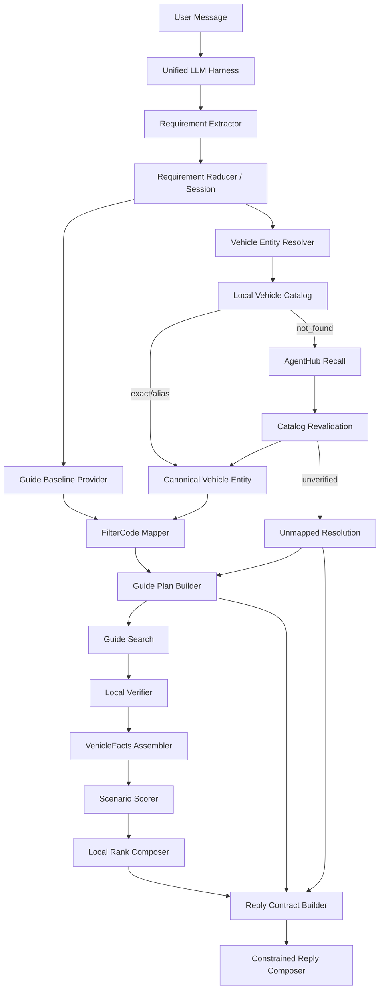

# 租车导购搜车技术方案 V2

## 1. 文档定位

本文重新统一租车导购的搜车架构，覆盖以下已经确认的产品和技术决策：

1. 非探索性诉求优先映射为真实 Guide FilterCode，由 Guide 完成全量库存过滤；
2. 部分非探索性 hard 诉求在远程过滤后增加 Local Verifier，防止 Provider 返回与条件不一致；
3. 探索性诉求不做硬过滤，基于可验证事实计算多个加权因子，在严格候选集内执行 Local Rank；
4. 探索性排序只能表达“从这些维度看可能更适合”，不能声称车辆已经满足诉求；
5. 无法满足、无法验证或无法映射的 hard 诉求默认不阻塞搜车，不进入 `waiting_user`，但必须逐条明确告知；
6. 品牌、车系、车型必须先进行名称统一和实体解析，本地车型库优先，AgentHub 只做长尾候选召回；
7. LLM 不得生成 FilterCode、车型库 ID、Provider ID、车辆事实或评分结果；
8. 搜索执行、验证、探索评分和用户告知必须保留独立状态，不能用一个 `resolved=true/false` 混合表示。

本文是新的目标方案。与以下旧文档发生执行语义冲突时，以本文为准：

- `docs/requirement-filter-mapping-and-search-degradation-design.md`
- `docs/exploratory-requirement-scoring-design.md`
- `docs/tyche-vehicle-catalog-agenthub-reference.md`

旧文档中的背景分析、Tyche 参考和已经确认的 Guide 契约仍然有效。

---

## 2. 核心结论

目标搜车链路不是“Guide 搜索”和“本地搜索”二选一，而是四层顺序执行：

```text
语义诉求
  → Guide Remote Filter / Remote Sort
  → Local Verifier
  → VehicleFacts
  → Exploratory Local Rank
  → Disclosure-aware Reply
```

四层职责必须严格分离：

| 层 | 解决的问题 | 不能做什么 |
|---|---|---|
| Remote Filter | 从 Guide 全量库存召回满足确定条件的报价 | 不能使用不存在的 code |
| Local Verifier | 检查 Guide 返回是否确实符合已经下发的硬条件 | 不能替代未映射条件进行本地全量搜索 |
| Local Rank | 在严格候选集内比较探索性适配程度 | 不能让不满足硬条件的车辆重新进入结果 |
| Reply Disclosure | 告知哪些已过滤、已验证、仅排序、未映射 | 不能把推荐依据改写成“已经满足” |

最终原则：

> 确定条件交给 Guide，Provider 结果用 Verifier 兜底；不确定但可比较的诉求用于排序；无法处理的诉求继续保留并明确告知。

---

## 3. 当前状态与目标差距

### 3.1 当前已经具备

当前代码已经实现：

- `seat_num` 根据 Guide Baseline 菜单无损映射 `filter/seat_num/*`；
- 总价根据菜单无损映射 `filter/total_fee/*`；
- 日均价根据菜单无损映射 `filter/price/*`；
- 品牌映射 `filter/brand/{canonical brand}`；
- 车型映射 `filter/vehicle_name/{brand + canonical model}`；
- 车系通过车型库展开成多个 `filter/vehicle_name/*`；
- 品牌、车系、车型生成 `VehicleVerifier`；
- 搜索结果暴露 `remote_filter` 和 `local_verifier`；
- Requirement Handler 和 SearchPlan Compiler 复用同一个车型目录实例。

### 3.2 当前尚未完整具备

以下是本文需要继续落地的目标：

| 能力 | 当前情况 | 目标 |
|---|---|---|
| hard unmapped 非阻断 | 当前仍可能返回 `capability_limit` 并停止搜索 | 继续执行其他 mapped 条件 |
| Local Verifier 注册表 | 目前重点覆盖车辆实体 | 扩展座位、价格等可靠硬条件 |
| Provider mismatch 处理 | 目前主要删除未通过车辆 | 增加三态结果、刷新重试和结构化告知 |
| 探索性评分 | 只有少量基础 RankFactor | 建立版本化 ScoreDefinition 和 VehicleFacts |
| 多探索诉求组合 | 未完整实现 | 支持去重、覆盖率、置信度和解释 |
| AgentHub 车型召回 | 尚未接入 | 本地 not_found 后有界召回并回 Catalog 复验 |
| 告知契约 | 已有 Requirement Resolution 基础 | 强制区分 filtered、verified、ranked、unmapped |
| 离线评测 | LLM Harness 已有基础 | 增加搜车 Plan、评分和回复回放数据集 |

---

## 4. 需求分类模型

### 4.1 两个独立维度

每条诉求至少有两个独立维度：

```text
Importance：hard / soft
Executability：deterministic / exploratory / unresolved
```

`hard` 不等于“系统一定能验证”，`exploratory` 也不等于 `soft`。

例如：

| 用户表达 | Importance | Executability |
|---|---|---|
| 必须 7 座 | hard | deterministic |
| 总价必须 500 元以内 | hard | deterministic |
| 最好便宜一点 | soft | deterministic preference |
| 最好适合老人 | soft | exploratory |
| 必须适合老人 | hard | exploratory but unverified |
| 必须很安静，但没有 NVH 数据 | hard | unresolved |

### 4.2 目标执行意图

```go
type ExecutionIntent string

const (
    IntentRemoteFilter    ExecutionIntent = "remote_filter"
    IntentRemoteSort      ExecutionIntent = "remote_sort"
    IntentLocalVerifier   ExecutionIntent = "local_verifier"
    IntentExploratoryRank ExecutionIntent = "exploratory_rank"
    IntentAdvisory        ExecutionIntent = "advisory"
    IntentUnmapped        ExecutionIntent = "unmapped"
)
```

一条 Requirement 可以产生多个执行意图。

例如：

```text
车型必须是 Model Y
  → RemoteFilter(filter/vehicle_name/特斯拉Model Y)
  → LocalVerifier(vehicle_model == model:tesla:model-y)
```

```text
带老人和小孩，希望乘坐方便
  → ExploratoryRank(elderly_friendly)
  → ExploratoryRank(child_friendly)
  → Disclosure(not_strictly_verified)
```

### 4.3 非探索性诉求

非探索性诉求具有明确、可比较的事实语义，例如：

- 品牌；
- 车系；
- 车型；
- 座位数；
- 车辆类型；
- 能源类型；
- 变速箱；
- 车龄；
- 总价或日均价；
- 明确的价格排序。

处理优先级：

```text
精确 RemoteFilter
  > 安全 RemotePrefilter + LocalVerifier
  > Unmapped
```

不能再使用：

```text
FilterCode 未命中
  → 随便取几页 Guide 结果
  → 本地过滤
  → 声称已经搜索全部库存
```

### 4.4 探索性诉求

探索性诉求通常是开放场景或体验目标，例如：

- 适合老人；
- 适合儿童；
- 长途舒适；
- 空间大；
- 行李多；
- 上下车方便；
- 高速安静；
- 驾驶轻松；
- 冬季使用更方便。

这类诉求不能直接推导为单一硬条件：

```text
带老人和小孩
  ≠ 必须7座
  ≠ 必须SUV
```

它们可以由多个真实因子共同表达相对适配程度，但不能用于证明“满足”。

---

## 5. 总体架构



### 5.1 模块职责

| 模块 | 职责 |
|---|---|
| Requirement Extractor | 提取用户语义，不生成执行参数 |
| Requirement Reducer | 把增量合并到 Session，保存 hard/soft 和逻辑关系 |
| Vehicle Entity Resolver | 品牌、车系、车型名称统一 |
| Guide Baseline Provider | 获取当前租期和地点下真实菜单及 `context_id` |
| FilterCode Mapper | 将确定诉求映射为真实 Guide 参数 |
| Guide Plan Builder | 处理 AND、同组 OR、跨 Facet OR 和分页计划 |
| Local Verifier | 对返回报价验证可靠的硬条件 |
| VehicleFacts Assembler | 合并 Guide 报价事实和车型库事实 |
| Scenario Scorer | 计算单个探索诉求的多因子得分 |
| Local Rank Composer | 组合多个探索诉求并稳定排序 |
| Reply Contract Builder | 生成不可被 LLM 篡改的告知事实 |
| Reply Composer | 把结构化事实转成自然语言 |

---

## 6. Requirement 提取与 Session

### 6.1 LLM 只提取语义

Requirement Extractor 允许输出：

- 原始证据文本；
- category；
- canonical facet 或开放 semantic label；
- typed value；
- hard/soft；
- add/replace/remove；
- 正向或负向；
- 品牌和车系提示；
- 用户表达的 AND/OR 关系；
- extraction confidence。

LLM 禁止输出：

- FilterCode；
- SortCode；
- Guide `context_id`；
- Catalog EntityID；
- Provider EntityID；
- 车型是否真实存在；
- 车辆事实；
- 权重；
- 最终得分。

### 6.2 Operation 与比较语义

两个概念必须分开：

```text
Operation：如何修改 Session
  add / replace / remove

Predicate：搜索条件的比较语义
  eq / in / gte / lte / range / negative
```

不能用 `replace` 表示“等于”，也不能用 `lte` 表示“替换旧需求”。

实现上可以让 LLM 输出 typed value，由确定性 Normalizer 生成 Predicate，减少 LLM 协议复杂度。

### 6.3 Session 保存原始诉求

即使诉求当前无法映射，也必须保留：

```go
type RequirementState struct {
    ID              string
    RawText         string
    SemanticLabel   string
    CanonicalFacet  string
    Value           RequirementValue
    Importance      string
    Negative        bool
    BranchID        string

    EntityResolution *VehicleEntityResolution
    LastResolution   *RequirementResolution
}
```

原因：

- Catalog 升级后可以重新解析；
- Guide 菜单变化后可以重新编译；
- 用户补充品牌或车系后可以解除歧义；
- 回复层必须知道哪些 hard 诉求没有执行。

### 6.4 人数和座位数边界

```text
“两个人出行”
  → passenger_context
  → 不生成 seat_num=2

“要7座车”
  → seat_num=7

“两个人，但想要2座跑车”
  → passenger_context=2
  → seat_num=2
  → vehicle_type=跑车
```

探索评分可以使用同行画像，但不能偷偷产生新的硬 FilterCode。

---

## 7. 品牌、车系、车型名称统一

### 7.1 权威关系

车辆实体链路采用：

```text
Local Vehicle Catalog：权威实体与 Provider Binding
AgentHub：长尾候选召回
LLM：候选内选择
Guide：库存和报价
```

AgentHub 不是第二套权威车型库，LLM 也不是车型库。

### 7.2 本地车型库数据模型

```go
type VehicleEntity struct {
    ID            string
    Type          EntityType
    CanonicalName string
    Aliases       []string

    BrandID string
    ParentID string

    ProviderBindings []ProviderBinding
    Facts            VehicleCatalogFacts
    DataVersion      string
}

type ProviderBinding struct {
    Provider     string
    ProviderID   string
    ProviderName string
    ValidFrom    time.Time
    ValidTo      *time.Time
}
```

生产车型库不能长期依赖少量手写静态数据，应来自：

- Guide/Tyche 权威车辆索引；
- 版本化车型主数据同步；
- Provider Binding 同步；
- 经过审核的别名表。

### 7.3 本地解析顺序

```text
1. CanonicalName 精确匹配
2. Alias 精确匹配
3. 品牌提示过滤
4. 车系提示过滤
5. 类型一致性检查
6. 父子关系检查
```

结果状态：

```text
exact
alias
ambiguous
not_found
conflict
```

优先级：

```text
vehicle_model > vehicle_series > brand
```

同一个 AND 分支中，如果已经确认具体车型，删除冗余父级品牌和车系条件，避免意外扩大范围。

### 7.4 AgentHub 触发条件

只有同时满足以下条件时才能调用 AgentHub：

1. facet 是 `brand/vehicle_series/vehicle_model`；
2. 本地 Catalog 结果是 `not_found`；
3. 原始文本非空；
4. 当前没有可靠唯一实体；
5. AgentHub 已配置且未熔断；
6. 没有命中相同 query + CatalogVersion 的短期空结果缓存。

以下情况不调用：

- 本地 exact；
- 本地 alias；
- 本地 ambiguous；
- 本地已确认冲突；
- 非车辆名称诉求；
- 用户只表达 SUV、7座、便宜等普通筛选维度。

### 7.5 AgentHub 候选协议

AgentHub 只返回候选证据：

```go
type VehicleRecallCandidate struct {
    CandidateID   string
    Name          string
    EntityType    string
    BrandHint     string
    SeriesHint    string
    Evidence      string
    RecallScore   float64
    SourceVersion string
}
```

候选选择 LLM 只能输出：

```json
{
  "candidate_id": "candidate-3",
  "confidence": 0.91
}
```

禁止输出：

- 自由生成的车型名；
- FilterCode；
- Provider ID；
- Catalog ID；
- 候选列表以外的 ID。

### 7.6 Catalog 复验

```text
AgentHub候选
  → CandidateID白名单校验
  → 候选名称重新进入Catalog
  → 类型、品牌、车系关系校验
  → 唯一实体
  → 可执行
```

如果候选在 Catalog 中不存在：

```text
status=unmapped
reason=agenthub_candidate_unverified
```

不能直接把 AgentHub 名称拼成 FilterCode。

### 7.7 超时、缓存和降级

建议：

| 项 | 建议 |
|---|---|
| 单次预算 | 2～4 秒 |
| TopK | 5～10 |
| 正结果缓存 | query + type + hints + CatalogVersion |
| 空结果缓存 | 短 TTL |
| 超时 | 继续按其他条件搜索 |
| 熔断 | 错误率或超时率超过阈值后短时关闭 |

失败原因：

```text
agenthub_timeout
agenthub_error
agenthub_empty
agenthub_candidate_invalid
agenthub_candidate_unverified
```

这些失败都不阻塞其他条件搜车。

### 7.8 FilterCode 映射

```text
brand
  → filter/brand/{canonical brand}

vehicle_model
  → Catalog确认品牌与车型
  → filter/vehicle_name/{provider canonical vehicle}

vehicle_series
  → Catalog完整展开全部标准车型
  → 多个filter/vehicle_name/*
  → 同组OR
```

车系展开必须有完整性状态：

```go
type SeriesExpansion struct {
    SeriesID       string
    Models         []VehicleEntity
    Complete       bool
    CatalogVersion string
}
```

如果 `Complete=false`：

```text
status=unmapped
reason=series_expansion_incomplete
```

不能只展开前 5 个车型后声称已经筛选整个车系。

---

## 8. Guide Baseline 与 FilterCode Mapper

### 8.1 Baseline

每个租期和地点先获取无筛选 Baseline：

```text
pickup/dropoff/location
  → Guide无筛选请求
  → context_id
  → menu_group
  → base quotes
```

Baseline 绑定：

- rental fingerprint；
- `context_id`；
- menu fingerprint；
- received time；
- safe expiry；
- Guide service expiry。

FilterCode 必须和生成它的 Baseline `context_id` 一起使用。

### 8.2 非探索性映射表

| Requirement | Guide 参数 | Local Verifier |
|---|---|---|
| brand | `filter/brand/*` | 必须 |
| vehicle_model | `filter/vehicle_name/*` | 必须 |
| vehicle_series | 多个 `filter/vehicle_name/*` | 必须 |
| seat_num | `filter/seat_num/*` | hard 条件建议启用 |
| vehicle_type | `filter/vehcle_choice/*` | 返回字段可靠时启用 |
| total price | `filter/total_fee/*` | hard 条件建议启用实际总价 |
| daily price | `filter/price/*` | 有可靠日均价字段时启用 |
| energy_type | `filter/fuel/*` | Provider 枚举稳定后启用 |
| transmission | `filter/transmission/*` | Provider 枚举稳定后启用 |
| car_age | `filter/car_age/*` | 当前缺少可靠返回字段时不启用 |
| cheaper first | Guide SortCode | 不需要 hard verifier |

### 8.3 无损 RemoteFilter

用户语义和菜单语义完全一致：

```text
7座
  → Guide“7座”

总价500元以内
  → Guide“500元以下”
```

这类条件直接生成 `RemoteFilter`。

### 8.4 安全 RemotePrefilter + LocalVerifier

Guide 条件可以形成用户诉求的完整超集时，可以先缩小范围，再精确验证。

例如：

```text
至少9座
  → Guide“8座及以上”
  → LocalVerifier(vehicle.seats >= 9)
```

```text
总价不超过450
  → Guide价格档位完整覆盖到500
  → LocalVerifier(total_amount <= 450)
```

必须满足：

1. 远程条件是用户条件的超集；
2. 超集不会漏掉符合条件的车辆；
3. 本地返回字段能够严格验证；
4. 分页策略知道结果经过二次验证；
5. 回复只声称最终通过 Verifier 的结果满足确定条件。

禁止使用更窄条件：

```text
用户 <=450
  → 只搜索 <=300
```

这会产生召回缺失。

### 8.5 无法形成完整超集

如果：

- 没有等价 FilterCode；
- 没有安全完整超集；
- 返回字段不能严格验证；

则：

```text
status=unmapped
```

继续执行其他 mapped 条件，不回退成有限分页 Local Filter。

### 8.6 AND 与 OR

已确认的 Guide 语义：

```text
同一filter group多个值：OR
不同filter group：AND
```

例如：

```text
特斯拉或比亚迪
  → 一个Guide Plan
  → 两个filter/brand/*
```

```text
特斯拉 + 7座
  → 一个Guide Plan
  → brand AND seat_num
```

跨 Facet OR：

```text
奥迪或Model Y
```

必须生成两个 Guide Plan：

```text
Plan A: filter/brand/奥迪
Plan B: filter/vehicle_name/特斯拉Model Y
```

分别搜索、稳定合并、按报价 ID 去重。

---

## 9. Local Verifier

### 9.1 定位

Local Verifier 是远程硬条件的后验校验，不是搜索能力 fallback。

正确：

```text
RemoteFilter
  → Guide候选
  → LocalVerifier
```

错误：

```text
没有FilterCode
  → 默认搜索三页
  → LocalVerifier
  → 声称已经搜完市场
```

### 9.2 三态验证

```go
type VerificationStatus string

const (
    VerificationMatch    VerificationStatus = "match"
    VerificationMismatch VerificationStatus = "mismatch"
    VerificationUnknown  VerificationStatus = "unknown"
)
```

语义：

| 状态 | 含义 | 严格结果处理 |
|---|---|---|
| match | 返回事实明确满足 | 保留 |
| mismatch | 返回事实明确不满足 | 从严格结果排除 |
| unknown | 字段缺失或实体无法唯一关联 | 不声称满足，可进入未验证参考集合 |

### 9.3 Verifier 注册表

```go
type VerifierDefinition struct {
    ID             string
    Facet          string
    RequiredFields []string
    SupportedOps   []string
    Version        string
}
```

首批：

| Verifier | 字段/数据 | 规则 |
|---|---|---|
| brand | `vehicle.brand_name` + Catalog | 标准品牌一致 |
| vehicle_model | `vehicle_code/name` + Catalog | 唯一车型一致 |
| vehicle_series | 返回车型 + Catalog parent | 车型属于目标车系 |
| seat_num | `vehicle.seats` | 数字比较 |
| total_price | `total_charge.total_amount` | 同币种、同订单口径比较 |

品牌、车型、车系不能仅依赖裸字符串 `contains`：

```text
优先：
VehicleCode → ProviderBinding → Catalog EntityID

其次：
Brand + CanonicalName唯一匹配

最后：
受控Alias唯一匹配
```

无法唯一匹配时返回 `unknown`。

### 9.4 系统性 mismatch

如果大量结果违反已经下发的 Guide code：

1. 记录 `provider_validation_mismatch`；
2. 检查 Baseline 和 `context_id` 是否过期；
3. 刷新 Baseline；
4. 重新编译 SearchPlan；
5. 重试一次；
6. 仍失败时不声称该条件已可靠执行；
7. 返回 Provider 条件异常说明。

不能把 Provider 异常伪装成“市场无车”。

### 9.5 分页

Verifier 排除当前页部分结果时，可以继续获取下一页补齐展示数量，但必须：

- 保持同一个 SelectedPlan；
- 保持同一个 PlanHash；
- 复用正确 continuation context；
- 设置最大扫描页数和时间预算；
- 只有 Provider 明确耗尽时才能说“没有更多”；
- 有原始结果但都未通过验证时返回 `verification_limit`，不是普通 `no_results`。

---

## 10. VehicleFacts

### 10.1 为什么需要统一事实层

探索评分不能直接到处读取 DTO 字段，否则会出现：

- 同一字段单位不一致；
- 缺失值被当成 0；
- 不同 Provider 枚举不一致；
- Catalog 版本与报价车型不一致；
- LLM 根据车型名臆测配置。

建议新增 provider-neutral 模型：

```go
type FactSource string

const (
    FactSourceGuide   FactSource = "guide"
    FactSourceCatalog FactSource = "catalog"
)

type Fact[T any] struct {
    Value       T
    Available   bool
    Source      FactSource
    Confidence  float64
    DataVersion string
    Unit        string
}

type VehicleFacts struct {
    QuoteID     string
    VehicleCode string
    CatalogID   string
    BrandID     string
    SeriesID    string

    Seats          Fact[int]
    TotalPrice     Fact[float64]
    DailyPrice     Fact[float64]
    FuelType       Fact[string]
    Transmission   Fact[string]

    RearLegroomMM  Fact[float64]
    RearDoorWidth  Fact[float64]
    StepInHeightMM Fact[float64]
    ISOFIXCount    Fact[int]
    TrunkVolumeL   Fact[float64]
    SeatFoldable   Fact[bool]
    NVHScore       Fact[float64]
    RideScore      Fact[float64]
}
```

### 10.2 事实关联顺序

```text
1. VehicleCode → ProviderBinding
2. Provider EntityID → Catalog EntityID
3. Brand + Model CanonicalName唯一匹配
4. 受控Alias唯一匹配
5. 无法唯一匹配则不补全Catalog事实
```

LLM 不能自由判断某条 Guide 报价属于哪个车型。

### 10.3 缺失数据

缺失事实必须保持：

```text
Available=false
```

禁止：

```text
后排腿部空间未知
  → 当成0
```

也禁止：

```text
SUV
  → 自动认为老人上下车方便
```

---

## 11. 探索性 ScoreDefinition

### 11.1 注册表

每个探索性语义只能映射到版本化 ScoreDefinition：

```go
type ScoreDefinition struct {
    ID             string
    Version        string
    SemanticLabels []string
    Factors        []FactorDefinition
    MinCoverage    float64
    Explanation    string
}

type FactorDefinition struct {
    ID            string
    Field         string
    Direction     string
    Normalization string
    Weight        float64
    Required      bool
}
```

LLM 可以在候选 ScoreDefinition 中选择 ID，但不能生成：

- 新因子；
- 新字段；
- 新阈值；
- 新权重；
- 车辆得分。

### 11.2 老人友好示例

```text
elderly_friendly_v1

step_in_height       0.25  越适中越好
rear_door_width      0.20  越大越好
rear_legroom         0.20  越大越好
ride_comfort         0.20  越高越好
seat_support         0.15  越高越好
```

这些维度只能表示相对推荐依据，不能表示医疗、安全或无障碍认证。

### 11.3 儿童友好示例

```text
child_friendly_v1

isofix_count         0.30
rear_door_width      0.20
rear_row_width       0.20
trunk_volume         0.15
rear_air_vent        0.15
```

不能把“有 ISOFIX”改写成“保证适合所有儿童座椅”。

### 11.4 行李装载示例

```text
luggage_friendly_v1

trunk_volume         0.45
seat_foldable        0.25
tailgate_opening     0.20
load_floor_height    0.10
```

如果只有车型大类，没有真实行李厢数据，不应给出高置信得分。

### 11.5 长途舒适示例

```text
long_trip_comfort_v1

ride_comfort         0.25
seat_support         0.25
nvh_score            0.20
rear_legroom         0.15
cruise_capability    0.15
```

没有 NVH 数据时不能根据品牌或价格臆测“安静”。

---

## 12. 探索得分计算

### 12.1 单因子归一化

所有因子先归一到 `[0,1]`：

```text
larger_is_better
smaller_is_better
target_range
boolean
enum_lookup
```

归一化参数属于 ScoreDefinition 版本，不能写在 Prompt 中。

### 12.2 单诉求得分

只对 Available 的因子计算：

```text
raw_score =
  Σ(factor_weight × normalized_value × fact_confidence)
  / Σ(available_factor_weight)

coverage =
  Σ(available_factor_weight)
  / Σ(all_factor_weight)

scenario_score =
  raw_score × coverage^α
```

建议首版：

```text
α = 0.5～1.0
```

这样缺失数据不会直接当成 0，但会通过 Coverage 降低最终得分。

### 12.3 最低覆盖率

如果：

```text
coverage < ScoreDefinition.MinCoverage
```

则：

```text
status=insufficient_data
```

该诉求不参与排序，并进入用户告知。

### 12.4 多诉求组合

```text
final_exploratory_score =
  Σ(requirement_weight × scenario_score)
  / Σ(active_requirement_weight)
```

建议：

```text
soft exploratory weight = 1.0
hard but unverified exploratory weight = 1.2～1.5
```

提高 hard 探索诉求的排序权重不代表它已经被验证，状态仍然必须是：

```text
unverified_hard_ranked
```

### 12.5 相关因子去重

“老人友好”和“长途舒适”可能同时使用 `rear_legroom`、`ride_comfort`。

需要 RankComposer 做因子贡献上限：

```text
同一事实字段的总贡献不超过configured cap
```

避免用户一句话被拆成多个相近语义后重复加分。

### 12.6 稳定排序

排序键：

```text
1. final_exploratory_score DESC
2. coverage DESC
3. Guide原始顺序 ASC
4. stable quote ID ASC
```

Guide 原始顺序必须作为稳定 tie-break，避免同一 Plan 翻页或回放时随机变化。

### 12.7 排序作用域

Local Rank 只能对已经获取并通过严格验证的候选排序。

必须保存：

```text
ranking_scope=fetched_candidate_pool
candidate_pool_size=N
```

不能声称：

```text
“这是整个市场最适合你的车”
```

可以表达：

```text
“在当前返回的候选中，这几款按相关维度排序更靠前”
```

---

## 13. hard 探索诉求与 hard unmapped

### 13.1 最新默认策略

无法严格满足、无法验证或无法映射的 hard 诉求：

```text
不创建Blocking Pending
不进入waiting_user
不停止其他条件搜索
不静默删除
必须逐条告知
```

### 13.2 hard 探索诉求

例如：

```text
必须适合老人
```

如果有可靠 ScoreDefinition 和足够 VehicleFacts：

```text
继续按其他严格条件搜索
→ 对老人友好维度做Local Rank
→ 标记unverified_hard_ranked
→ 明确“不代表已确认满足”
```

如果没有足够事实：

```text
继续搜索
→ 不参与排序
→ 标记unmapped_hard
→ 明确当前没有可靠数据验证
```

### 13.3 非探索 hard unmapped

例如：

```text
必须带某个Guide不支持且返回数据也没有的配置
```

处理：

```text
省略该条件
→ 使用其他mapped条件搜索
→ ResultStatus=partial
→ Disclosure=hard_requirement_not_applied
```

### 13.4 全部条件都 unmapped

租期和地点完整时：

```text
执行Guide默认搜索
→ 返回参考结果
→ 明确没有按这些hard条件完成筛选
```

不能把默认结果说成“最符合需求”。

### 13.5 真正允许阻止搜索的情况

只有无法安全构造 Guide 请求的基础上下文才阻止：

- 缺少取车地点；
- 地点存在跨城市歧义；
- 缺少取车时间；
- 缺少还车时间；
- 时间顺序非法；
- 用户明确要求“无法精确确认就不要搜索”。

最后一种不是 `waiting_user`，而是尊重用户策略返回：

```text
exact_only_no_search
```

用户之后可以主动选择是否放宽。

### 13.6 “无法映射”和“严格无结果”必须区分

```text
unmapped：
  编译阶段无法生成可靠执行参数

strict_no_results：
  条件成功映射并调用Guide，但严格组合没有结果
```

两者不能使用同一个 reason code。

### 13.7 严格无结果后的自动备选搜索

在用户没有声明 `exact_only` 时，可以执行：

```text
StrictPlan
  → Guide无结果
  → RelaxationPlanner
  → AlternativePlan
  → Guide备选结果
  → 强制告知已放宽条件
```

自动备选不是把 hard 改成 soft，也不是声称原条件已经满足。必须同时保存：

```go
type PlanAttempt struct {
    Type                  string
    FilterCodes           []string
    RelaxedRequirementIDs []string
    ResultCount           int
}
```

建议顺序：

1. 先执行全部 mapped hard 的 StrictPlan；
2. 如果严格无结果，优先做同一语义内的可解释范围放宽，例如价格上限逐档增加；
3. 再考虑移除低放宽成本的确定条件；
4. 品牌、车系、车型等高语义成本条件放在最后；
5. 每次只改变一个维度，便于解释无结果原因；
6. 设置最大尝试次数、总延迟预算和去重；
7. 所有放宽都生成 `relaxed_hard` Disclosure。

放宽成本必须由配置决定，不能由 LLM 临时决定：

```go
type RelaxationPolicy struct {
    Facet          string
    Cost           int
    Strategy       string
    MaxSteps       int
    UserDisclosure string
}
```

示例：

```text
严格条件：
  Model Y + 7座 + 总价<=500

严格无结果后：
  AlternativePlan A：Model Y + 7座，移除价格上限
  AlternativePlan B：7座 + 总价<=500，移除车型
```

回复必须说明：

```text
严格条件下暂时没有结果。下面是放宽“总价500元以内”后的备选，
这些车辆不代表满足原预算要求。
```

禁止：

```text
自动放宽后仍回复“已满足全部要求”
```

### 13.8 hard 条件的“降权”含义

hard 条件不能通过降低权重继续当作已验证条件。所谓降权只能表示：

```text
从StrictPlan移除
→ 标记relaxed_hard
→ 如果存在可靠相似度定义，可在AlternativePlan结果中作为排序偏好
→ 强制告知未满足原hard条件
```

例如价格可以按距离预算上限的差值排序；品牌、车型通常只适合 exact match，不建议构造没有业务意义的名称相似度。

---

## 14. SearchPlan 数据结构

```go
type SearchExecutionPlan struct {
    RequirementVersion int64

    RemoteFilters    []RemoteFilter
    RemoteSort       *RemoteSort
    LocalVerifiers   []LocalVerifier
    ExploratoryRanks []ExploratoryRank
    Resolutions      []RequirementResolution
    Disclosures      []Disclosure
    RelaxationPolicy []RelaxationPolicy

    Branches []GuideBranchPlan

    CatalogVersion         string
    MenuFingerprint        string
    ScoreDefinitionVersion string
    RuntimeFingerprint     string
    PlanHash               string
}
```

### 14.1 RequirementResolution

```go
type RequirementResolution struct {
    RequirementID string
    RawText       string
    Importance    string

    MappingStatus     string
    VerificationMode  string
    RankingMode       string
    ExecutionStatus   string

    FilterCodes []string
    VerifierIDs []string
    ScoreIDs    []string

    ReasonCode string
    Reason     string
}
```

### 14.2 推荐状态

```text
mapped_remote
mapped_remote_with_verifier
ranked_exploratory
unverified_hard_ranked
unmapped_hard
unmapped_soft
ambiguous_non_blocking
provider_mismatch
insufficient_fact_coverage
relaxed_with_disclosure
```

### 14.3 Disclosure

```go
type Disclosure struct {
    RequirementID string
    Severity      string
    Code          string
    UserMeaning   string
    Evidence      []string
    MustMention   bool
}
```

所有 hard unmapped、hard relaxed、hard unverified 必须：

```text
MustMention=true
```

---

## 15. 完整搜车流程

```text
1. LLM提取本轮Requirement增量
2. Normalizer校验类型、数值、单位和人物/车辆边界
3. RequirementReducer合并到Session
4. 车辆名称进入VehicleEntityResolver
   4.1 本地Catalog exact/alias
   4.2 ambiguous保留候选但不阻塞
   4.3 not_found时可选AgentHub
   4.4 AgentHub候选回Catalog复验
5. 获取或复用Guide Baseline
6. RequirementClassifier区分deterministic/exploratory/unresolved
7. FilterCodeMapper生成RemoteFilter/RemotePrefilter
8. VerifierRegistry为可靠hard条件生成LocalVerifier
9. ScoreRegistry为探索诉求生成ScoreExecution
10. GuidePlanBuilder处理AND/OR、父级去重和分支
11. 执行Guide严格搜索
    11.1 严格无结果且非exact-only时，由RelaxationPlanner构造有限备选Plan
12. LocalVerifier执行match/mismatch/unknown
13. 组装Strict Candidate Set
14. VehicleFacts补全
15. ScenarioScorer计算单诉求得分、coverage和confidence
16. RankComposer组合并稳定排序
17. ResultContract生成filtered/verified/ranked/unmapped事实
18. ReplyComposer生成用户回复
19. 保存SearchSnapshot供翻页和回放
```

伪代码：

```go
func Search(ctx context.Context, state *Session) SearchResult {
    baseline := baselineProvider.GetOrFetch(ctx, state.Rental)
    plan := compiler.Compile(ctx, state.Requirements, baseline)

    raw := guideExecutor.Execute(ctx, plan.Branches)
    verified, verificationReport := verifier.Verify(raw, plan.LocalVerifiers)

    facts := factsAssembler.Build(verified)
    ranked, scoreReport := ranker.Rank(facts, plan.ExploratoryRanks)

    return resultBuilder.Build(
        plan,
        ranked,
        verificationReport,
        scoreReport,
    )
}
```

---

## 16. 用户回复契约

### 16.1 回复顺序

最终回复必须按以下顺序：

1. 已经严格应用的条件；
2. 已经本地复验的条件；
3. 探索性排序依据；
4. 无法验证或未参与搜索的 hard 诉求；
5. 数据不足的探索诉求；
6. 结果作用域；
7. 可选的非阻断补充问题。

### 16.2 允许使用的词

严格条件：

```text
已按“7座”和“总价500元以内”筛选。
返回车型也经过品牌和车型一致性校验。
```

探索条件：

```text
“适合老人和小孩”目前不能作为已确认满足的条件。
我根据后排空间、上下车便利、儿童座椅接口和行李厢数据，
在当前候选中做了参考排序。
```

未映射 hard：

```text
你要求的“高速必须非常安静”目前没有可靠数据可以严格验证，
这个条件没有参与硬筛选；以下结果仍按其他已确认条件搜索。
```

### 16.3 禁止使用的词

探索评分不能生成：

```text
完全满足老人需求
保证适合儿童
安全性最高
100%适合长途
已经满足安静要求
```

### 16.4 混合示例

用户：

```text
想要Model Y，必须7座，总价500以内，带老人和小孩，
行李多，最好高速安静。
```

可能结果：

```text
已按“Model Y”“7座”和“总价不超过500元”进行Guide筛选，
其中车型结果还经过了本地车型一致性校验。

“适合老人和小孩”“行李多”目前不能作为已确认满足的硬条件；
我只根据当前有数据的后排空间、上下车便利、ISOFIX和行李厢容量，
对严格候选进行了参考排序。

“高速安静”缺少可靠NVH数据，没有参与筛选或排序。
因此下面的顺序表示在当前候选中从这些可验证维度看可能更适合，
不代表车辆已经满足全部场景诉求。
```

### 16.5 LLM 回复边界

Reply Composer 可以润色，但必须输入结构化事实：

```go
type ReplyContract struct {
    AppliedStrict      []RequirementDisclosure
    VerifiedStrict     []RequirementDisclosure
    ExploratoryRanked  []RequirementDisclosure
    UnmappedHard       []RequirementDisclosure
    UnmappedSoft       []RequirementDisclosure
    ProviderMismatches []RequirementDisclosure
    RankingScope       string
}
```

服务端必须在 LLM 调用后检查：

- 所有 `MustMention` 是否出现；
- 是否把 exploratory 写成 satisfied；
- 是否遗漏 hard unmapped；
- 是否出现不存在的车辆事实；
- 是否引用不存在的 FilterCode。

失败时使用确定性模板降级。

---

## 17. Prompt、Context 与 Harness 工程

### 17.1 Prompt 工程

需要 LLM 的任务只有：

| Task | 允许职责 |
|---|---|
| requirement.extract | 提取语义增量 |
| capability.match | 在注册能力候选中匹配 semantic label |
| vehicle_entity.select_candidate | 在 AgentHub 候选 ID 内选择 |
| reply.compose | 基于 ReplyContract 生成自然语言 |

Prompt 必须版本化：

```text
vehicle_requirement.extract.v3
vehicle_entity.select_candidate.v1
vehicle_search.reply.v2
```

### 17.2 Context 工程

不同任务只获得最小必要上下文：

```text
Requirement Extractor：
  当前用户消息 + 当前有效Requirement摘要

Vehicle Candidate Selector：
  原始车辆文本 + 类型/品牌/车系提示 + 有限候选

Reply Composer：
  ReplyContract + 最终车辆卡片事实
```

不能把完整 Guide 菜单交给 Requirement Extractor 让它生成 code。

### 17.3 Harness 工程

所有 LLM 调用经过统一 Harness：

- Prompt 版本；
- 模型路由和降级；
- Schema 错误自动重试；
- timeout / parse_error / validation_error 区分；
- Token、延迟和成本；
- trace_id；
- 请求回放；
- 离线评测数据导出；
- 敏感字段脱敏。

AgentHub 候选选择失败时不能影响其他 mapped 条件。

---

## 18. SearchSnapshot 与分页

Snapshot 必须保存：

```go
type SearchSnapshot struct {
    SearchID              string
    RequirementVersion    int64
    RentalFingerprint     string
    BaselineContextID     string
    ContinuationContextID string

    SelectedPlan SearchExecutionPlan

    CurrentPage int
    NextPage    int

    SeenQuoteIDs     map[string]struct{}
    SeenVehicleCodes map[string]struct{}

    CandidatePoolSize int
    RankingScope      string
    CreatedAt         time.Time
    ExpiresAt         time.Time
}
```

PlanHash 至少包含：

- RequirementVersion；
- FilterCodes；
- SortCode；
- Verifier definitions/version；
- CatalogVersion；
- MenuFingerprint；
- ScoreDefinition versions；
- exploration weights；
- OR branches；
- rental fingerprint。

翻页必须复用同一 Plan，不能重新让 LLM 改写条件或权重。

---

## 19. 错误和降级策略

| 场景 | 搜索行为 | 用户告知 |
|---|---|---|
| Catalog exact/alias | 正常映射 | 使用标准名称 |
| Catalog ambiguous | 其他条件继续搜 | 说明该名称未参与，可非阻断询问 |
| AgentHub timeout | 其他条件继续搜 | 说明名称暂未准确识别 |
| Guide菜单无对应项 | 其他条件继续搜 | 说明该条件未用于严格筛选 |
| hard exploratory有评分 | 搜索并排序 | 明确仅为参考排序 |
| hard exploratory无事实 | 搜索、不排序 | 明确无法验证 |
| Verifier少量mismatch | 排除异常候选 | 一般不打扰用户，记录指标 |
| Verifier系统性mismatch | 刷新重试一次 | 仍失败则说明Provider条件异常 |
| Score服务失败 | 保留Guide严格顺序 | 说明未执行场景排序 |
| Guide调用失败 | 返回外部服务错误 | 不伪造结果 |

降级顺序：

```text
探索评分失败
  → 保留严格候选和Guide顺序

AgentHub失败
  → 车辆名称unmapped，其他条件继续

Verifier系统性失败
  → 刷新Baseline重试
  → Provider mismatch结果

Guide失败
  → 整次搜索失败
```

---

## 20. 可观测性

### 20.1 关键事件

```text
requirement_extracted
vehicle_entity_resolved
vehicle_entity_recall_started
vehicle_entity_recall_finished
filtercode_mapped
filtercode_unmapped
guide_search_started
guide_search_finished
local_verification_finished
vehicle_facts_assembled
exploratory_score_computed
local_rank_finished
reply_disclosure_checked
```

### 20.2 关键指标

FilterCode：

- facet mapped rate；
- hard mapped rate；
- unmapped reason 分布；
- menu drift rate；
- code rejected rate。

放宽：

- strict no-result rate；
- relaxation trigger rate；
- relaxed facet 分布；
- AlternativePlan result rate；
- relaxed hard disclosure coverage；
- 用户接受或拒绝备选的比例。

Verifier：

- match/mismatch/unknown 比例；
- Provider mismatch rate；
- Baseline refresh recovery rate；
- 被排除报价数；
- verifier P95 latency。

车型库和 AgentHub：

- local exact/alias/ambiguous/not_found；
- AgentHub trigger rate；
- recall hit rate；
- Catalog revalidation pass rate；
- timeout/error/empty；
- P95/P99 latency；
- 单次成本。

探索评分：

- ScoreDefinition match rate；
- fact coverage；
- insufficient coverage rate；
- average score distribution；
- rank changed rate；
- 用户后续否定率。

回复：

- hard unmapped disclosure coverage，目标 100%；
- hard relaxed disclosure coverage，目标 100%；
- exploratory disclaimer coverage，目标 100%；
- false satisfaction claim rate，目标 0；
- deterministic fallback rate。

---

## 21. 代码改造建议

### 21.1 `internal/domain/vehiclerequirement`

- Requirement 分类保持语义层；
- 保存开放 semantic label；
- 保存 hard/soft；
- 保存 AND/OR branch；
- 接入组合式 VehicleEntityResolver；
- ambiguous/not_found 不创建搜索阻塞。

### 21.2 `internal/vehiclecatalog`

- 从静态演示目录升级到版本化权威目录；
- 增加 ProviderBinding；
- 增加完整车系展开状态；
- 增加 VehicleFacts；
- 提供 EntityByID、ModelsBySeries、ResolveQuote 等确定性接口。

### 21.3 `api/agenthub`

按照仓库 API 包规范新增：

```text
dto.go
interface.go
client.go
```

只负责传输：

- 请求构造；
- 认证；
- timeout；
- response envelope；
- JSON 校验。

候选解析、选择和 Catalog 复验不进入 API 包。

### 21.4 `internal/vehicleentity`

建议新增组合解析器：

```go
type Resolver interface {
    Resolve(context.Context, *ResolveRequest) ResolveResult
}
```

负责：

- Local Catalog first；
- AgentHub bounded recall；
- candidate selection；
- Catalog revalidation；
- cache；
- circuit breaker；
- reason code。

### 21.5 `internal/searchplan`

- 保留 RemoteFilter；
- 增加 RemotePrefilter 类型；
- 扩展 LocalVerifier Registry；
- 删除 hard unmapped blocking；
- 增加 ExploratoryRank execution；
- PlanHash 纳入 verifier 和 score version；
- 支持分支 Plan。

### 21.6 `internal/vehiclefacts`

建议新增：

- Guide DTO → facts adapter；
- Catalog facts adapter；
- entity binding；
- 单位归一；
- fact confidence；
- version compatibility。

### 21.7 `internal/localrank`

建议新增：

- ScoreDefinition Registry；
- factor normalization；
- coverage；
- confidence；
- correlation cap；
- stable rank；
- explanation evidence。

### 21.8 `internal/domain/searchcar`

- hard unresolved 不再提前返回 `capability_limit`；
- 只要租期地点完整，就执行 mapped Plan；
- Verifier 三态；
- Provider mismatch 刷新重试；
- VehicleFacts 和 LocalRank；
- ResultStatus 增加 partial/unverified/provider_mismatch；
- 分页复用 SelectedPlan。

### 21.9 `internal/webchat`

- 暴露 `remote_filter/local_verifier/exploratory_rank/unmapped`；
- ReplyContract；
- MustMention 校验；
- 探索性免责声明；
- 非阻断问题不写 PendingStore。

---

## 22. 分阶段落地

### 阶段 0：hard unmapped 非阻断

工作：

- 修改 `SearchExecutionPlan.FirstBlockingResolution` 使用方式；
- `freshSearch` 不因车辆 hard unmapped 停止；
- 生成 partial result；
- hard unmapped 强制 Disclosure；
- strict no-result 后支持有界 AlternativePlan；
- relaxed hard 强制 Disclosure；
- 保留基础租车上下文阻塞。

验收：

- “必须很安静”没有数据时仍能按其他条件搜车；
- 回复明确该条件未参与；
- 不进入 `waiting_user`。

### 阶段 1：严格执行层统一

工作：

- 完善品牌、车型、车系 Verifier；
- 增加座位和总价 Verifier；
- 引入 RemotePrefilter + LocalVerifier；
- Provider mismatch 刷新重试；
- 去掉有限分页 Local Filter fallback。

验收：

- 车辆实体均为 RemoteFilter + LocalVerifier；
- 价格和座位不会错用更窄 FilterCode；
- mismatch 不被展示成满足。

### 阶段 2：VehicleFacts

工作：

- 建立 provider-neutral facts；
- 关联 ProviderBinding；
- 单位和版本；
- coverage 和 confidence。

验收：

- 缺失值不作为 0；
- 无法唯一关联车型时不补全 Catalog 事实；
- 每个事实可追踪来源和版本。

### 阶段 3：探索评分

工作：

- 首批 ScoreDefinition；
- factor normalization；
- coverage penalty；
- 多诉求组合；
- 稳定排序；
- per-vehicle evidence。

验收：

- 探索评分只发生在严格验证之后；
- 单调性测试通过；
- 无足够事实不评分；
- 回复不声称满足。

### 阶段 4：AgentHub

工作：

- 新增 `api/agenthub`；
- 组合 Resolver；
- CandidateID 白名单；
- Harness candidate selector；
- Catalog revalidation；
- 缓存、超时和熔断。

验收：

- 本地命中不调用 AgentHub；
- AgentHub 失败不阻塞；
- 候选外 ID 被拒绝；
- 未经 Catalog 复验不生成 FilterCode。

### 阶段 5：回放和评测

工作：

- 搜索 Plan 回放；
- scoring replay；
- disclosure evaluator；
- A/B 评分权重；
- 指标看板。

验收：

- 相同版本输入得到稳定 Plan；
- Prompt、Catalog、Menu、Score 版本可追踪；
- false satisfaction claim rate 为 0。

---

## 23. 核心测试用例

### 23.1 FilterCode

| 输入 | 预期 |
|---|---|
| 特斯拉 | `filter/brand/特斯拉` |
| Model Y | Catalog归一后 `filter/vehicle_name/特斯拉Model Y` |
| 宝马3系 | 完整展开为多个车型 code |
| 7座 | 精确 seat code |
| `>=9座`，只有8座以上 | RemotePrefilter 8+ + Verifier >=9，或明确unmapped |
| 总价<=450，有完整<=500超集 | RemotePrefilter + total verifier |
| 总价<=450，只有<=300 | 不映射，不允许漏召回 |
| 总价预算 | 不得映射 daily price code |

### 23.2 Vehicle Entity

| 输入 | 预期 |
|---|---|
| model-y | 本地Alias命中，不调用AgentHub |
| 长尾错别字 | 本地not_found后AgentHub |
| AgentHub返回候选外ID | 拒绝 |
| AgentHub候选Catalog不存在 | unmapped |
| AgentHub超时 | 其他条件继续搜 |
| 车系展开不完整 | unmapped，不声称执行 |

### 23.3 Local Verifier

| 场景 | 预期 |
|---|---|
| 特斯拉Filter返回比亚迪 | mismatch并排除 |
| Model Y字段缺失 | unknown，不声称满足 |
| 宝马3系返回Catalog子车型 | match |
| 7座Filter返回5座 | mismatch |
| 总价Filter返回超预算 | mismatch |
| 大量mismatch | 刷新Baseline重试一次 |

### 23.4 探索评分

- ISOFIX 数量增加时 child score 不应下降；
- 后排空间增加时 elderly/space score 不应无原因下降；
- 行李厢增加时 luggage score 不应下降；
- 缺失因子增加时 coverage 不应上升；
- coverage 低于阈值不参与排序；
- 不满足 strict hard 的车辆不能因探索分高进入结果；
- 相同得分保持 Guide 原始顺序；
- 相关因子不会重复无限加分。

### 23.5 hard unmapped

| 输入 | 预期 |
|---|---|
| 7座 + 必须很安静 | 搜7座，安静条件明确未验证 |
| 必须适合老人 | 默认搜索并探索排序或告知数据不足 |
| 所有需求都unmapped | 默认参考搜索 + 全量告知 |
| mapped hard严格无结果 | 有界放宽后返回明确标记的备选 |
| 地点不明确 | 仍需基础上下文澄清 |
| 用户明确exact-only | 不扩大搜索，返回exact_only_no_search |

### 23.6 回复

测试必须断言：

- filtered 条件使用“已筛选”；
- verified 条件使用“已校验”；
- ranked 条件使用“参考排序”；
- hard unmapped 必须出现；
- exploratory 必须说明“不代表满足”；
- 不出现虚假安全、医疗、认证结论；
- 不引用不存在的事实。

---

## 24. 验收标准

完成本方案后必须满足：

1. 非探索 hard 条件优先通过 Guide FilterCode 执行；
2. FilterCode 必须来自真实菜单或已确认 Provider Contract；
3. 品牌、车系、车型先经过 Catalog，再生成 code；
4. AgentHub 只在本地 not_found 后触发；
5. AgentHub 不能直接生成受信任 FilterCode；
6. 车系必须完整展开；
7. 品牌、车型、车系具备 Local Verifier；
8. 座位和总价可按可靠字段进行 hard Verifier；
9. Verifier 使用 match/mismatch/unknown；
10. 探索评分只作用于严格候选；
11. 每个探索分都有 ScoreDefinition Version；
12. 缺失事实不会被当作 0 或正向证据；
13. hard 探索诉求不会被静默改成 soft；
14. hard unmapped 默认不阻塞其他条件搜车；
15. hard unmapped 告知覆盖率 100%；
16. relaxed hard 告知覆盖率 100%；
17. exploratory disclaimer 覆盖率 100%；
18. Local Rank 明确作用域是当前候选集；
19. 分页复用同一 PlanHash；
20. Prompt、Catalog、Menu、Verifier、Score 版本均可回放；
21. false satisfaction claim rate 为 0。

---

## 25. 最终流程摘要

```text
用户输入
→ LLM只提取语义诉求
→ Session保存原始Requirement
→ 品牌/车系/车型先查本地Catalog
→ 本地not_found时AgentHub有限召回
→ AgentHub候选回Catalog复验
→ 获取Guide Baseline和真实菜单
→ 非探索诉求映射RemoteFilter/RemotePrefilter
→ hard条件生成必要LocalVerifier
→ Guide执行全量库存搜索
→ 严格无结果时按配置生成有限AlternativePlan并记录放宽
→ LocalVerifier形成严格候选
→ 组装VehicleFacts
→ 探索诉求按版本化因子计算得分
→ 仅在严格候选内Local Rank
→ hard unmapped不阻塞，但逐条强制告知
→ 回复明确区分已筛选、已验证、仅排序和未执行
```

一句话总结：

> Guide 决定“哪些车进入严格候选”，Local Verifier 防止错误候选，探索评分决定“当前候选中哪些可能更适合”，回复层负责诚实说明系统到底做到了什么。
